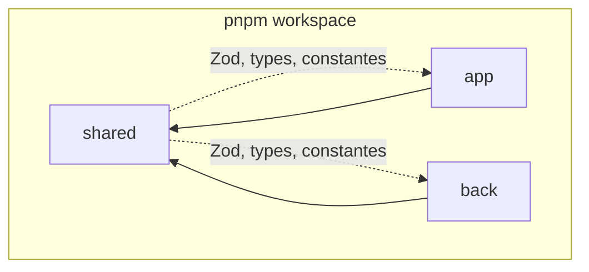
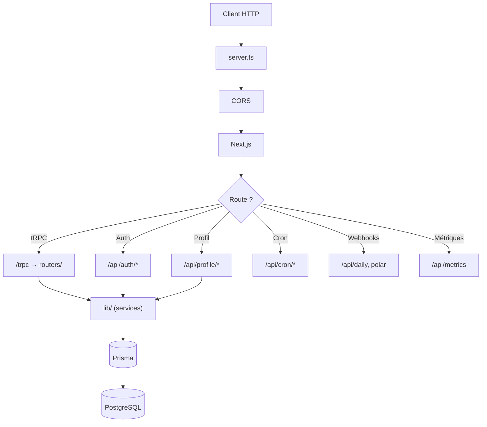
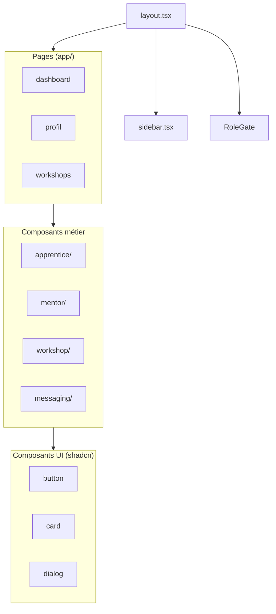
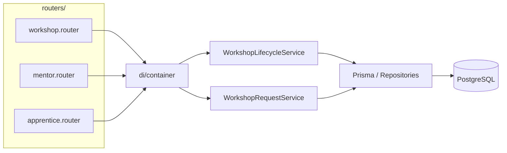

# Arborescence LearnSup

Structure du monorepo : vue macro (niveau projet) et vue micro (détail des dossiers et fichiers).

---

## Sommaire

- [Vue macro](#vue-macro)
- [Légende](#légende)
- [Schéma des dépendances](#schéma-des-dépendances)
- [Schéma système et flux](#schéma-système-et-flux)
- [Vue micro — Racine](#vue-micro--racine)
- [Vue micro — Shared](#vue-micro--shared)
- [Vue micro — App](#vue-micro--app)
- [Vue micro — Back](#vue-micro--back)
- [Index rapide](#index-rapide)
- [Conventions de nommage](#conventions-de-nommage)
- [Liens](#liens)

---

## Légende

| Symbole | Signification |
|---------|---------------|
| `[...]` | Contenu résumé ou non détaillé |
| `[dossier]/` | Dossier avec sous-éléments |
| `# commentaire` | Commentaire explicatif |

---

## Vue macro

```
ls_app/
├── back/                    # Backend Next.js (API, tRPC, Prisma)
├── app/                     # Frontend Next.js (App Router, React)
├── shared/                  # Package partagé (validation Zod, types, constantes)
├── infra/                   # Infrastructure (Docker, Grafana, Prometheus)
├── cypress/                 # Tests E2E Cypress
├── docs/                    # Documentation technique
├── .github/                 # CI/CD (workflows, linters)
├── package.json             # Racine pnpm workspace
├── pnpm-workspace.yaml
├── turbo.json
├── cypress.config.js
└── README.md
```
---

## Schéma des dépendances



---

## Schéma système et flux

### Flux de routage back (entrée requête)



---

## Vue micro — Racine

```
ls_app/
├── back/
├── app/
├── shared/
│   ├── src/
│   │   ├── validation/      # Schémas Zod
│   │   ├── types/           # Types TS partagés
│   │   └── utils/           # Utilitaires (date, etc.)
│   └── dist/
├── infra/
│   └── docker/
│       ├── back/
│       ├── app/
│       ├── grafana/
│       └── prometheus/
├── cypress/
│   ├── e2e/
│   ├── fixtures/
│   └── support/
├── docs/
├── .github/
│   ├── workflows/
│   └── linters/
└── [config: package.json, turbo.json, pnpm-workspace.yaml, ...]
```

### `infra/` — Structure détaillée

```
infra/
└── docker/
    ├── back/
    │   ├── Dockerfile.dev
    │   └── Dockerfile.prod
    ├── app/
    │   ├── Dockerfile.dev
    │   └── Dockerfile.prod
    ├── grafana/
    │   └── provisioning/
    │       ├── dashboards/
    │       └── datasources/
    ├── prometheus/
    │   └── prometheus.yml
    ├── Docker-compose-dev.yml
    └── docker-compose-prod.yml
```

---

## Vue micro — Shared

Package workspace `@ls-app/shared` : source de vérité pour la validation, les types et les constantes partagés entre front et back. **À ne pas confondre** avec `app/src/shared/` (qui n'existe pas) : l'app importe via `@ls-app/shared`.

```
shared/
├── src/
│   ├── validation/          # Schémas Zod (auth, workshop, profile, file, password, etc.)
│   │   ├── auth.schemas.ts
│   │   ├── workshop.schemas.ts
│   │   ├── workshop.constants.ts
│   │   ├── profile.schemas.ts
│   │   ├── profile.constants.ts
│   │   ├── user.schemas.ts
│   │   ├── file.validators.ts
│   │   ├── password.validators.ts
│   │   ├── date.validators.ts
│   │   ├── support.schemas.ts
│   │   ├── community.schemas.ts
│   │   ├── admin.schemas.ts
│   │   ├── notification.schemas.ts
│   │   └── common.schemas.ts
│   ├── types/               # Types TS partagés
│   │   ├── user.ts
│   │   ├── workshop.ts
│   │   └── messaging.ts
│   ├── utils/
│   │   └── date.ts
│   └── index.ts             # Exports publics
├── dist/                    # Build output
├── package.json
└── tsconfig.json
```

---

## Vue micro — App

```
app/
├── public/                  # Assets statiques
│   ├── typo/omnes/          # Police Omnes
│   ├── logo/
│   └── bg/
├── src/
│   ├── app/                 # App Router (routes = dossiers)
│   ├── components/          # Composants React
│   ├── hooks/               # Hooks personnalisés
│   ├── lib/                 # Clients (auth, API), config
│   ├── types/               # Types TS (trpc-router stub, workshop-components)
│   └── utils/               # Utilitaires (trpc.ts)
├── __tests__/
│   └── units/
└── [next.config, package.json, ...]
```

### Schéma : hiérarchie des composants front



### `app/src/lib/`, `hooks/`

> **Note** : Le front n'a pas de dossier `shared/` local. Les schémas Zod, types et constantes sont importés depuis le package `@ls-app/shared` (voir [Vue micro — Shared](#vue-micro--shared)).

```
lib/
├── auth-client.ts           # Better Auth + customAuthClient (signUp, selectRole, uploadPhoto, ...)
├── api-client.ts            # authenticatedFetch, getMentorProfile, getUserRole
└── messaging/               # (si présent)

hooks/
├── useDashboard.ts
├── useMentorProfile.ts
├── useMyWorkshops.ts
├── useChatSocket.ts
├── useOnboarding.ts
├── use-password-form.ts
└── use-photo-upload.ts
```

---

## Vue micro — Back

```
back/
├── server.ts                # Point d'entrée HTTP (CORS, Socket.IO, Next)
├── .prisma/
│   ├── schema/
│   │   └── schema.prisma
│   ├── generated/client/
│   └── migrations/
├── src/
│   ├── app/                 # Routes Next (API, trpc)
│   ├── routers/             # tRPC appRouter
│   └── lib/                 # Services, repositories, DI
├── __tests__/
│   ├── api/                  # Tests routes API REST
│   ├── trpc/                 # Tests procédures tRPC (apprentice.getDashboardData, mentor.getDashboardData, workshop.getById, etc.)
│   ├── units/                # Tests unitaires services/repositories
│   └── integration/          # Tests d'intégration (ex. database.test.ts)
└── [next.config, package.json, ...]
```

### Schéma : flux Router → Service → Repository



### `back/src/app/` — Routes API

```
app/
├── api/
│   ├── auth/
│   │   ├── [...all]/route.ts        # Better Auth
│   │   └── magic-link-callback/route.ts
│   ├── sign-up/route.ts
│   ├── sign-in/route.ts
│   ├── onboarding/select-role/route.ts
│   ├── profile/
│   │   ├── role/route.ts
│   │   ├── role/mentor/route.ts
│   │   ├── upload-photo/route.ts
│   │   ├── photo/[filename]/route.ts
│   │   ├── publish/route.ts
│   │   └── delete/route.ts
│   ├── support-request/
│   │   ├── route.ts
│   │   └── attachments/[filename]/route.ts
│   ├── cron/
│   │   ├── all/route.ts
│   │   ├── generate-video-links/
│   │   ├── cleanup-inactive-rooms/
│   │   ├── process-cashback-queue/
│   │   ├── retry-failed-cashbacks/
│   │   ├── create-feedback-notifications/
│   │   ├── purge-deletions/
│   │   └── check-cashback-integrity/
│   ├── daily/webhook/route.ts
│   ├── polar/webhook/route.ts
│   └── metrics/route.ts
└── trpc/[trpc]/route.ts
```

### `back/src/routers/` — tRPC

```
routers/
├── index.ts                 # appRouter (agrégation)
├── shared/router-helpers.ts
├── auth/auth.router.ts
├── credits/credits.router.ts
├── mentors/mentor.router.ts
├── workshops/
│   ├── workshop.router.ts
│   ├── workshop-attendance.router.ts
│   ├── workshop-video.router.ts
│   ├── workshop-feedback.router.ts
│   └── analytics/cashback-analytics.router.ts
├── social/
│   ├── community.router.ts
│   ├── messaging.router.ts
│   ├── messaging-conversation.router.ts
│   ├── messaging-message.router.ts
│   ├── messaging-presence.router.ts
│   ├── messaging-reaction.router.ts
│   ├── connection.router.ts
│   └── notification.router.ts
├── users/
│   ├── user.router.ts
│   ├── apprentice.router.ts
│   ├── account-settings.router.ts
│   └── moderation/
│       ├── user-block.router.ts
│       └── user-report.router.ts
├── admin/admin.router.ts
└── support/support.router.ts
```

### `back/src/lib/` — Services et infrastructure

```
lib/
├── auth.ts                 # Better Auth config
├── prisma.ts, context.ts, trpc.ts
├── api-helpers/            # getAuthenticatedSession, parseJsonBody, handleRouteError, cron-auth
├── di/container.ts         # DI, ServicesContainer
├── common/                 # prisma, logger, Result, audit-log
├── auth/services/          # signup, signin, onboarding, magic-link
├── users/
│   ├── repositories/       # AppUser, Account, Session, Connection, Moderation
│   └── services/
│       ├── account/        # deletion, profile, security (forgot-password, change-password, change-email)
│       ├── connection/
│       ├── profile/
│       └── moderation/
├── mentors/
│   ├── repositories/       # Mentor, WorkshopRequest
│   └── services/
│       ├── contact/        # MentorContactService
│       ├── feedback/
│       ├── profile/
│       └── workshops/     # WorkshopRequestService, WorkshopForRequestFactory, ...
├── workshops/
│   ├── repositories/       # Workshop, Feedback, Cashback
│   └── services/
│       ├── lifecycle/      # WorkshopLifecycleService (create, publish, cancel, ...)
│       ├── query/         # WorkshopQueryService
│       ├── scheduling/     # WorkshopSchedulingService
│       ├── attendance/     # présence, check-in
│       ├── feedback/       # WorkshopFeedbackService, FeedbackModerationService
│       ├── rewards/        # CashbackCalculator, CashbackQueueProcessor
│       ├── guards/         # WorkshopAccessGuard
│       ├── video/         # WorkshopVideoLinkService
│       └── email/
├── messaging/
│   ├── repositories/       # Conversation, Message, MessageReaction
│   └── services/
│       ├── core/          # MessagingService, MessageOperationsService, ConversationService
│       ├── enrichment/
│       ├── reactions/
│       └── validation/
├── notifications/
│   ├── repositories/
│   └── services/           # SocketNotificationEventEmitter
├── credits/
│   ├── repositories/       # CreditTransaction
│   └── services/          # CreditService
├── payment/services/       # PolarService
├── daily/services/         # DailyService
├── email/
│   ├── services/
│   ├── templates/          # WelcomeEmail, SupportRequestConfirmation, CreditPurchaseConfirmation, ...
│   └── utils/
├── socket/
│   └── handlers/          # SocketMessageHandler
├── admin/services/         # AdminService
├── support/               # SupportRequest
├── maintenance/services/   # MaintenanceService (crons: generateVideoLinks, cleanupRooms, purgeDeletions, ...)
├── rate-limit/
├── metrics/
└── shared/validation/      # Zod, workshop schemas, password
```

---

## Index rapide

### Par besoin

| Besoin | Emplacement |
|--------|-------------|
| Page d'accueil | `app/src/app/page.tsx` |
| Layout global | `app/src/app/layout.tsx` |
| Sidebar | `app/src/components/sidebar.tsx` |
| Client tRPC | `app/src/utils/trpc.ts` |
| Auth client | `app/src/lib/auth-client.ts` |
| Point d'entrée back | `back/server.ts` |
| AppRouter tRPC | `back/src/routers/index.ts` |
| Schéma Prisma | `back/.prisma/schema/schema.prisma` |
| Better Auth | `back/src/lib/auth.ts` |
| Routes API | `back/src/app/api/` |

### Cas d'usage

| Question | Emplacement |
|----------|-------------|
| Où modifier les schémas Zod partagés ? | `shared/src/validation/` |
| Où sont les types partagés ? | `shared/src/types/` |
| Où ajouter une route API ? | `back/src/app/api/` |
| Où ajouter une procédure tRPC ? | `back/src/routers/` |
| Où ajouter une page front ? | `app/src/app/[route]/page.tsx` |
| Où sont les composants UI réutilisables ? | `app/src/components/ui/` |
| Où configurer l'auth ? | `back/src/lib/auth.ts` |

---

## Conventions de nommage

| Type | Convention | Exemple |
|------|------------|---------|
| Route App Router | `page.tsx` dans un dossier | `app/dashboard/page.tsx` |
| Router tRPC | `*.router.ts` | `mentor.router.ts`, `workshop.router.ts` |
| Service backend | `*.service.ts` | `WorkshopLifecycleService` |
| Repository | `*.repository.ts` ou dans `repositories/` | `WorkshopRepository` |
| Composant React | PascalCase | `MentorCard.tsx` |
| Hook | `use*.ts` | `useDashboard.ts` |
| Test unitaire | `*.test.ts` ou `*.test.tsx` | `apprentice.getDashboardData.test.ts` |
| Test E2E Cypress | `*.cy.{ts,tsx}` | `login.cy.ts` |

---

## Liens

- [Architecture](architecture.md) — schémas système détaillés, flux auth, atelier, messagerie, etc.
- [App](app.md)
- [Back](back.md)
- [Référence](reference.md)
