# Architecture LearnSup

Vue d’ensemble du monorepo : front, back et base de données.

---

## Schéma système

### Vue macro (généraliste)

*Client (interface) → trois canaux (tRPC, REST, Socket) → Serveur → Base de données.*

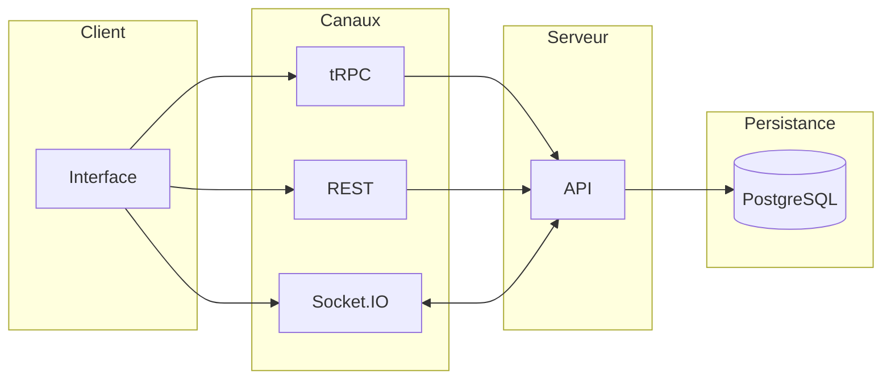

---

### Vue micro (technique)

```mermaid
flowchart LR
  subgraph Front["Front (Next.js :3001)"]
    UI[Pages / UI]
    tRPC_C[tRPC client]
    AUTH_C[Better Auth client]
    FETCH[Fetch API]
    SOCKET_C[Socket.IO client]
  end

  subgraph Back["Back (Next.js :3000/4500)"]
    HTTP[Serveur HTTP + CORS]
    NEXT[Next.js handler]
    TRPC[/trpc]
    AUTH[/api/auth/*]
    API[/api/profile, sign-up, cron…]
    SOCKET_S[Socket.IO]
    PRISMA[Prisma]
    STORAGE[Storage (Cloudinary/Local)]
  end

  subgraph DB[(PostgreSQL)]
  end

  subgraph CLOUD[Cloud Storage]
    CLOUDINARY[Cloudinary]
  end

  UI --> tRPC_C
  UI --> AUTH_C
  UI --> FETCH
  UI --> SOCKET_C
  tRPC_C --> TRPC
  AUTH_C --> AUTH
  FETCH --> API
  SOCKET_C <--> SOCKET_S
  HTTP --> NEXT
  NEXT --> TRPC
  NEXT --> AUTH
  NEXT --> API
  NEXT --> SOCKET_S
  TRPC --> PRISMA
  AUTH --> PRISMA
  API --> PRISMA
  PRISMA --> DB
```

**Correspondance macro → micro** : tRPC (données métier) → `/trpc` ; REST (auth, profil) → `/api/auth/*`, `/api/profile/*`, `/api/sign-up` ; Socket.IO (temps réel) → serveur Socket sur port 5050.

Vue simplifiée (ASCII) :

```
┌──────────────────────────────────────────────────────────────────┐
│  Monorepo (pnpm workspaces + Turborepo)                          │
├──────────────────────────────────────────────────────────────────┤
│  front/                 │  back/                                  │
│  Next.js (port 3001)    │  Next.js (port 3000 ou 4500 en dev)     │
│  App Router             │  Serveur HTTP monte Next + Socket.IO    │
│  tRPC client            ──────────────►  /trpc (API tRPC)         │
│  Better Auth client     ──────────────►  /api/auth/[...all]       │
│  Fetch (onboarding,     ──────────────►  /api/profile/*,           │
│   profile, upload)                      /api/sign-up, etc.        │
│  Socket.IO client       ◄─────────────►  Socket.IO (notifs,       │
│                         │                 messagerie)             │
│                         │  Prisma  ──────────►  PostgreSQL       │
└──────────────────────────────────────────────────────────────────┘
```

- **Front** : application React (Next.js 16), port 3001 en dev. Appels API via tRPC (procédures type-safe) et requêtes HTTP directes pour l’auth, l’onboarding et la gestion de profil (Better Auth + routes custom).
- **Back** : une seule app Next.js servie par un serveur HTTP Node qui ajoute CORS et monte Socket.IO. Routes : `/trpc` (tRPC), `/api/auth/*` (Better Auth), `/api/profile/*`, `/api/sign-up`, `/api/cron/*`, webhooks (Daily, Polar), etc. Prisma pour toute la persistance.
- **Base** : PostgreSQL. Schéma et migrations dans `back/prisma/schema/`.

---

## Ports et URLs en dev

- **Front** : `http://localhost:3001`
- **Back (Next.js)** : `http://localhost:4500` (API tRPC, routes API) - Le front doit pointer 
vers cette URL via `NEXT_PUBLIC_SERVER_URL`.
- **Back (Socket.IO)** : `http://localhost:5050` (serveur custom `server.ts`)
- **Variables front** : `NEXT_PUBLIC_SERVER_URL` (back Next), `NEXT_PUBLIC_SOCKET_URL` (Socket.IO)

---

## Fonctionnalités métier

- **Authentification** : Better Auth (email/mot de passe, magic link, sessions, cookies). Routes custom pour sign-up, onboarding (rôle MENTOR / APPRENANT), profil mentor (photo, bio, publication). Magic link : envoi d’un lien par email via tRPC `auth.requestMagicLink`, callback `/api/auth/magic-link-callback`.
- **Ateliers (workshops)** : création, édition, publication, inscriptions, demandes, feedbacks, cashback, analytics. Visio via Daily.co (liens générés côté back, webhooks).
- **Mentors / Apprenants** : profils mentors, catalogue, demandes d’ateliers, historique, connexions (réseau).
- **Messagerie** : conversations, messages, réactions. Temps réel via Socket.IO.
- **Notifications** : notifs in-app, lien avec Socket.IO et routers tRPC dédiés.
- **Crédits / Paiement** : crédits, achats (Polar), transactions. Webhook Polar côté back.
- **Modération** : blocage d’utilisateurs, signalements (user block, user report). Côté back : routers tRPC + éventuels crons.
- **Support** : formulaire de demande de support, pièces jointes, envoi d'emails (Resend).
- **Hub Communauté** : page `/community` — Events Hub (événements communautaires), ateliers mentorat, bons plans étudiants (student_deal), Spot Finder (lieux recommandés), sondage hebdomadaire (community_poll), annuaire membres. Propositions utilisateurs (events, deals, spots) avec modération admin.
- **Admin** : modération des feedbacks, signalements, support, onboarding, audit logs, notifications, paramètres (interface dédiée `/admin`, rôle ADMIN).
- **Métriques** : endpoint Prometheus (`/api/metrics`) pour monitoring.

---

## Flux général (cycle de données)

*Utilisateur → interface → API → base de données (+ temps réel).*

### Vue macro (généraliste)

L'utilisateur interagit avec l'interface, qui appelle l'API ; le serveur valide la session, lit/écrit en base, et renvoie les données. Un canal temps réel complète pour les mises à jour live.

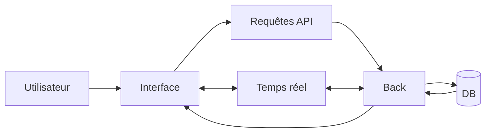

---

### Vue micro (technique)

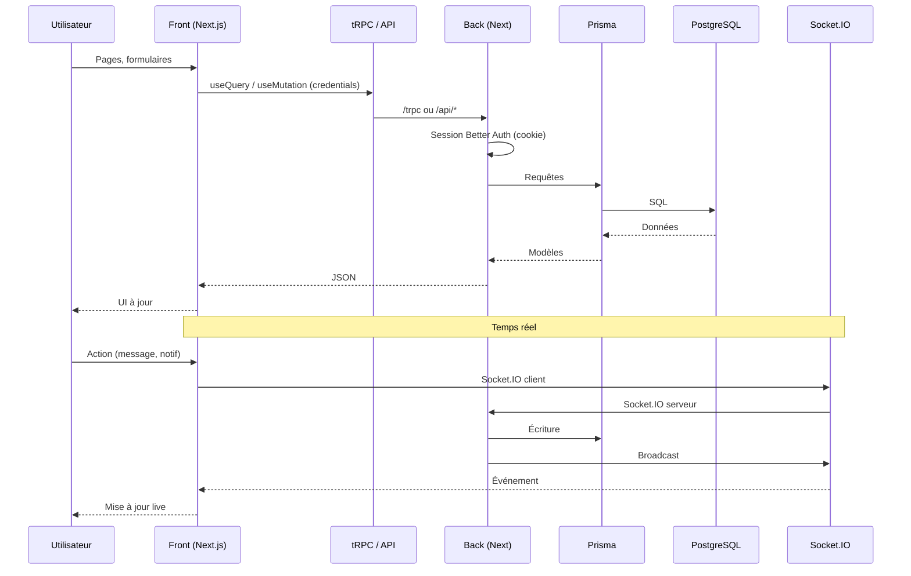

1. **Utilisateur** : consulte et utilise l’app front (pages, formulaires, navigation).
2. **Données** : le front appelle l’API via **tRPC** (hooks `trpc.*.useQuery` / `useMutation`) et reçoit des données typées. Le client tRPC envoie les requêtes vers `NEXT_PUBLIC_SERVER_URL/trpc` avec `credentials: "include"`.
3. **Auth** : login / signup via Better Auth (`/api/auth/*`) et routes custom (`/api/sign-up`, onboarding, profil). La session (cookie) est utilisée par le back pour les procédures protégées.
4. **Temps réel** : le front se connecte au back en Socket.IO pour les notifications et la messagerie.
5. **Back** : exécute les routers tRPC, les routes API et les crons ; lit/écrit avec **Prisma** → PostgreSQL.

---

## Flux d'authentification

### Vue macro (généraliste)

*Utilisateur → Formulaire → API Auth → Session → Dashboard (+ Onboarding si rôle manquant).*

Quatre parcours possibles au formulaire : inscription (création compte + email), connexion (session), récupération (MDP oublié). La session mène au Dashboard ; si le rôle est manquant, redirection vers Onboarding (choix MENTOR/APPRENANT) puis Dashboard.

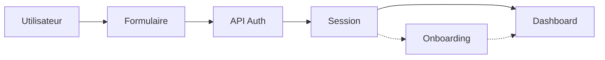

---

### Vue micro (technique)

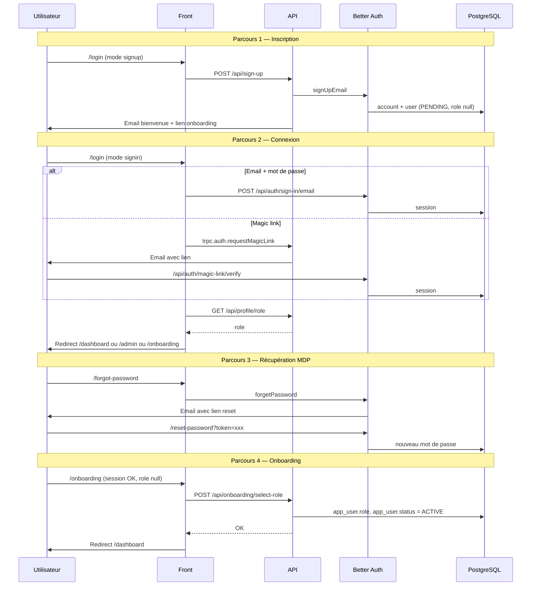

**Routes et procédures** : POST `/api/sign-up`, `/api/auth/sign-in/email`, `/api/auth/magic-link/verify`, `trpc.auth.requestMagicLink`, GET `/api/profile/role`, POST `/api/onboarding/select-role`, `/forgot-password`, `/reset-password`.

Séquences détaillées :

**Inscription** : `/login` (mode signup) → `customAuthClient.signUpEmail` → POST `/api/sign-up` → Better Auth crée `account` + `user` (status PENDING, role null) → email bienvenue avec lien `/onboarding`.

**Connexion** : (1) **Email/mot de passe** : `authClient.signIn.email` → Better Auth `/api/auth/sign-in/email` → session cookie. (2) **Magic link** : `trpc.auth.requestMagicLink` → email avec lien → clic → `/api/auth/magic-link-callback` (redirect legacy) → `/api/auth/magic-link/verify` → session → redirect `/dashboard`.

**Récupération mot de passe** : `/forgot-password` → Better Auth `forgetPassword` → email → `/reset-password?token=xxx` → nouveau mot de passe.

**Changement email** : lien dans email → `/verify-email-change?token=xxx` (Better Auth).

**Onboarding** : si session OK et `app_user.role === null` → redirect `/onboarding` → choix MENTOR ou APPRENANT → POST `/api/onboarding/select-role` → `app_user.role` et `app_user.status = ACTIVE` → redirect `/dashboard`.

---

## Flux utilisateur

### Vue macro (généraliste)

Machine à états : Non connecté → Connexion/Inscription → Session active → (si rôle manquant) Onboarding → Espace selon rôle (Dashboard, Admin, Mentor, Apprenant).

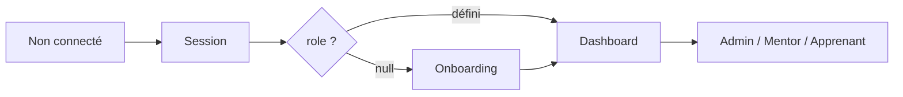

---

### Vue micro (technique)

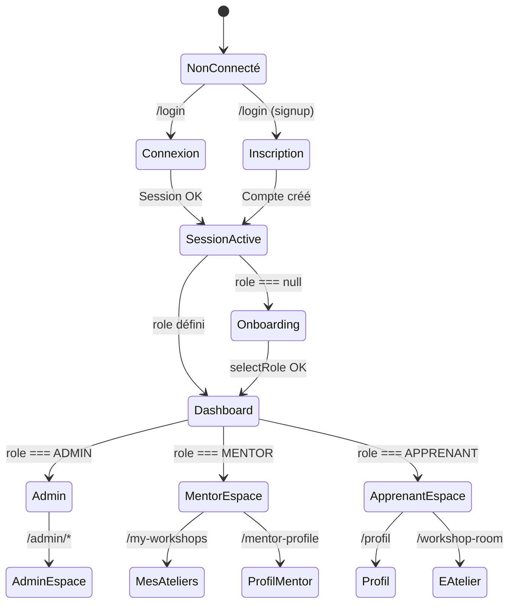

**Redirections selon le rôle** :

| Rôle | Redirection après login | Routes accessibles |
|------|-------------------------|---------------------|
| **ADMIN** | `/admin` | `/admin/*` uniquement (sidebar admin) |
| **MENTOR** | `/dashboard` | `/dashboard`, `/my-workshops`, `/mentor-profile`, `/workshop-editor`, etc. |
| **APPRENANT** | `/dashboard` | `/dashboard`, `/profil`, `/workshop-room`, etc. |
| **Sans rôle** | `/onboarding` | Choix MENTOR ou APPRENANT obligatoire |

**RoleGate** : composant qui redirige ADMIN hors des routes utilisateur (`/dashboard`, `/my-workshops`, etc.) vers `/admin`, et les utilisateurs non-ADMIN hors de `/admin` vers `/dashboard`.

**Sources du rôle** : `getUserRole()` (GET `/api/profile/role`) → cache TanStack Query `["userRole", session.user.id]` → utilisé par `useDashboard`, `RoleGate`, `UserMenu`, page d'accueil.

---

## Flux de données

### Vue macro (généraliste)

Vue d'ensemble applicable à toute architecture client-serveur avec trois canaux de données : requêtes/réponses (CRUD), authentification, temps réel.

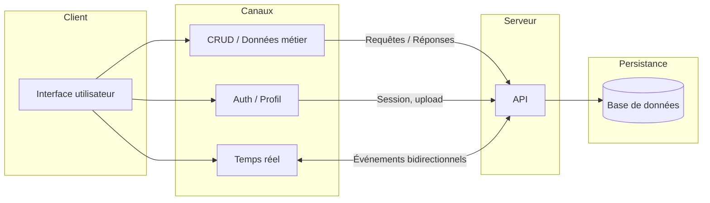

**Principe** : l'interface déclenche les trois types de flux. Le canal CRUD sert aux données métier (lecture/écriture). Le canal Auth gère la session et les opérations sensibles (inscription, profil). Le canal Temps réel assure la synchronisation live (messages, notifications) sans polling.

---

### Vue micro (technique)

Détail des composants et des technologies utilisées dans LearnSup.

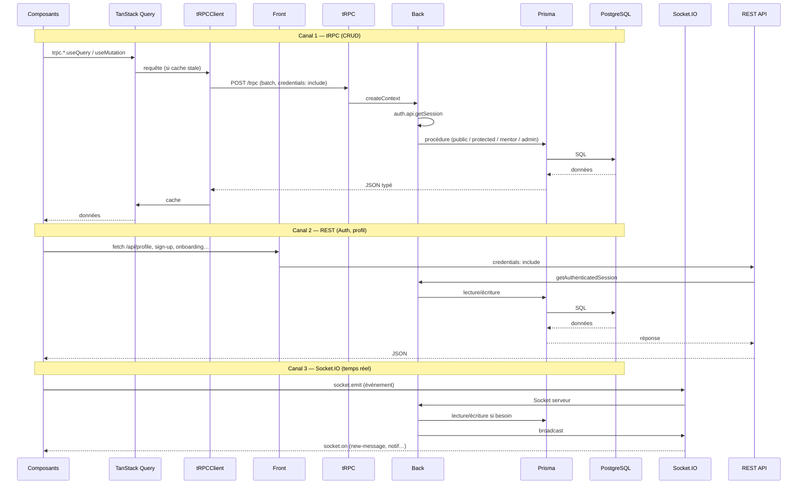

**Correspondance macro → micro** :

| Canal macro           | Implémentation micro      | Technologies                                                       |
| --------------------- | ------------------------- | ------------------------------------------------------------------ |
| CRUD / Données métier | tRPC + TanStack Query     | `trpc.*.useQuery` / `useMutation`, `httpBatchLink`, Prisma         |
| Auth / Profil         | REST + Better Auth       | `fetch` vers `/api/*`, `useSession`, `getAuthenticatedSession`      |
| Temps réel            | Socket.IO                | `socket.emit` / `socket.on`, broadcast serveur                      |

**Données via tRPC** :

1. **Requête** : `trpc.workshop.list.useQuery()` → TanStack Query (cache, `staleTime`, `refetchInterval`) → `httpBatchLink` envoie POST `/trpc` avec `credentials: "include"` (cookie session).
2. **Contexte** : `createContext` appelle `auth.api.getSession({ headers })` → `ctx.session` pour les procédures protégées.
3. **Procédures** : `publicProcedure` (pas de session), `protectedProcedure` (session requise), `mentorProcedure` (role MENTOR + status ACTIVE), `adminProcedure` (role ADMIN + audit log).
4. **Réponse** : JSON typé → cache QueryClient → composants.

**Données via API REST** : `fetch` avec `credentials: "include"` vers `/api/profile/*`, `/api/sign-up`, etc. Session lue via `getAuthenticatedSession(req)`.

**Données temps réel** : Socket.IO connecté au back → événements (messages, notifications) → mise à jour UI. Les écritures passent par tRPC ou API ; Socket.IO sert au broadcast.

**Invalidation** : `queryClient.invalidateQueries({ queryKey: ["userRole"] })` après login, `trpc.useUtils().invalidate()` après mutations. Les toasts d’erreur gèrent les erreurs tRPC (sauf UNAUTHORIZED sur `/login`).

---

## Flux atelier (workshop)

### Vue macro (généraliste)

Cycle mentor-apprenant : création (brouillon) → publication → demande apprenant (débit crédits) → acceptation/rejet mentor → atelier réalisé → feedback → cashback apprenant.

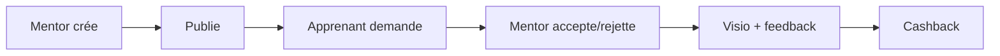

---

### Vue micro (technique)

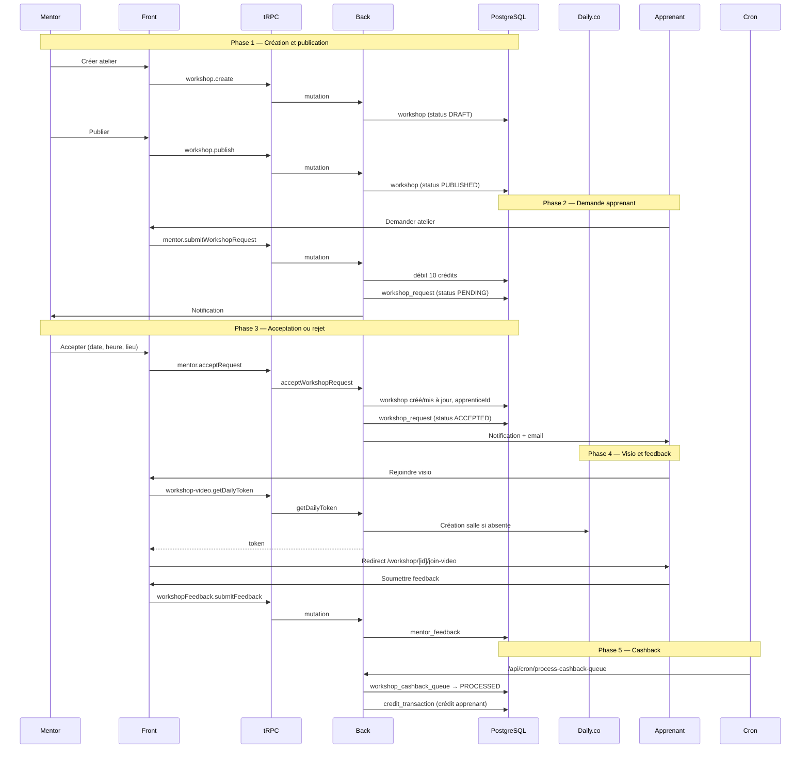

**Procédures tRPC** : `workshop.create`, `workshop.publish`, `mentor.submitWorkshopRequest`, `mentor.acceptRequest`, `mentor.rejectRequest`, `workshop-video.getDailyToken`, `workshopFeedback.submitFeedback`.

**Cycle de vie** : Mentor crée (DRAFT) → publie (PUBLISHED). Apprenant envoie une demande (`mentor.submitWorkshopRequest`) → débit de 10 crédits → `workshop_request` PENDING. Mentor accepte (`mentor.acceptRequest`) ou rejette (`mentor.rejectRequest`). Si accepté : création ou mise à jour du `workshop` (date, lieu, visio), notification. Apprenant rejoint la visio (Daily.co via `workshop-video.getDailyToken`), participe, soumet un feedback (`workshopFeedback.submitFeedback`). Cron `process-cashback-queue` crédite l'apprenant.

---

## Flux paiement / crédits

### Vue macro (généraliste)

Achat : utilisateur initie → redirection vers prestataire paiement → paiement externe → webhook confirme → crédit compte. Utilisation : débit lors d'une action métier (ex. demande atelier).

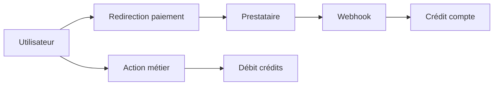

---

### Vue micro (technique)

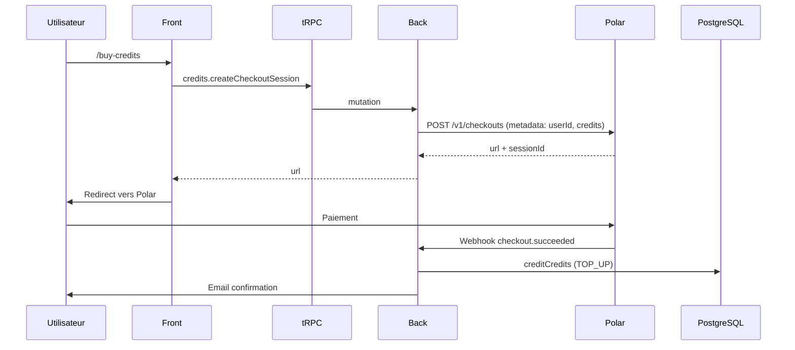

**Achat** : `credits.createCheckoutSession` (credits, amount) → Polar crée un checkout avec `metadata.userId` et `metadata.credits` → redirection vers l'URL Polar. Après paiement, Polar envoie un webhook à `/api/polar/webhook` → vérification signature → `creditService.creditCredits` → transaction TOP_UP → email de confirmation (Resend).

**Utilisation** : lors de `submitWorkshopRequest`, débit de 10 crédits (transaction atomique avec création de la demande).

---

## Flux messagerie

### Vue macro (généraliste)

Trois phases : initialisation (création conversation si absente), envoi (validation → persistance → notification → broadcast), temps réel (typing, réactions, lecture). Canal bidirectionnel pour la synchro live.

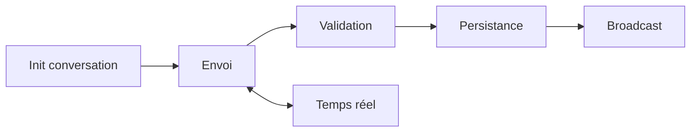

---

### Vue micro (technique)

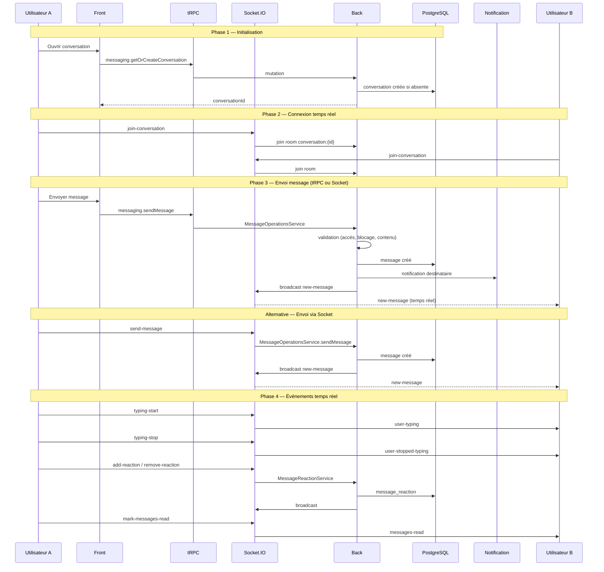

**Procédures tRPC** : `messaging.getOrCreateConversation`, `messaging.getConversations`, `messaging.getMessages`, `messaging.sendMessage`, `messaging.markMessagesAsRead`, `messaging.updateMessage`, `messaging.deleteMessage`.

**Événements Socket** : `join-conversation`, `leave-conversation`, `send-message`, `new-message`, `typing-start`, `typing-stop`, `user-typing`, `user-stopped-typing`, `add-reaction`, `remove-reaction`, `mark-messages-read`, `messages-read`.

**Envoi** : tRPC `messaging.sendMessage` ou Socket `send-message` → `MessageOperationsService` → validation (accès, blocage, contenu) → création message en DB → notification destinataire → broadcast Socket `new-message` aux participants de la room.

---

## Flux visio (Daily.co)

### Vue macro (généraliste)

Accès : utilisateur demande token → salle créée si absente → token généré → redirection vers player. Vie de la salle : webhooks (présence) et crons (nettoyage salles inactives).

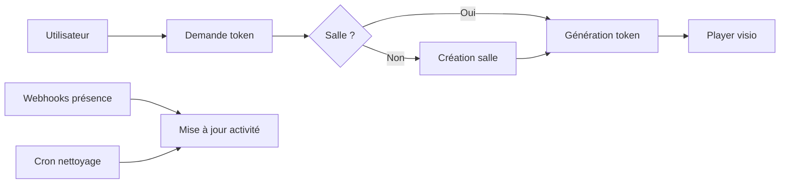

---

### Vue micro (technique)

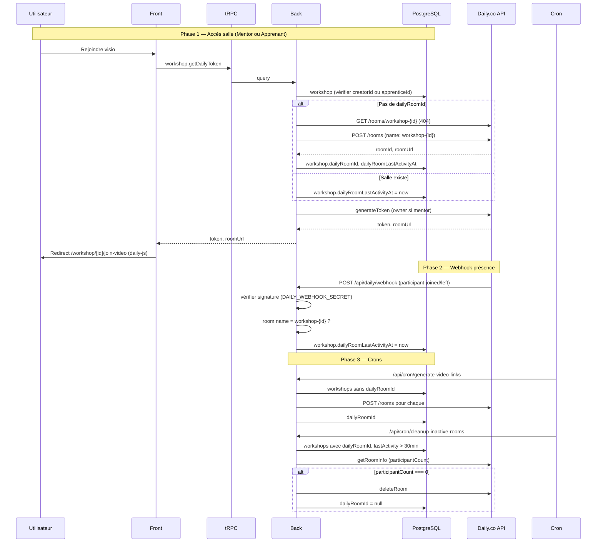

**Procédure tRPC** : `workshop.getDailyToken(workshopId)` — vérifie accès (mentor ou apprenant), crée salle Daily si absente (`workshop-{workshopId}`), génère token (owner pour mentor), met à jour `dailyRoomLastActivityAt`.

**Webhook** : POST `/api/daily/webhook` — événements `participant-joined` / `participant-left` → mise à jour `dailyRoomLastActivityAt` si room name = `workshop-{id}`.

**Crons** : `generate-video-links` (pré-création salles pour ateliers à venir), `cleanup-inactive-rooms` (fermeture salles inactives > 30 min, 0 participant).

---

## Flux suppression de compte

### Vue macro (généraliste)

Deux phases : demande (soft delete, désactivation auth, job planifié à J+30) et purge (cron exécute les jobs échus → anonymisation PII → suppression définitive). Rétention légale respectée.

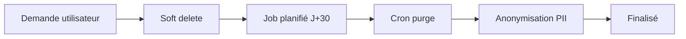

---

### Vue micro (technique)

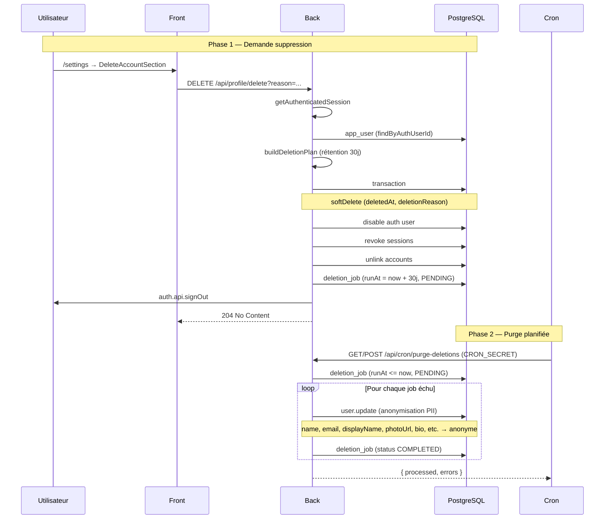

**Route** : DELETE `/api/profile/delete?reason=...` — `buildDeletionPlan` (rétention 30j) → `DeleteUserAccountService.execute` : soft delete (deletedAt, deletionReason), désactivation auth, révocation sessions, unlink accounts → création `deletion_job` (PENDING, runAt = now + 30 jours) → signOut.

**Cron** : GET/POST `/api/cron/purge-deletions` (CRON_SECRET) → `purgeScheduledDeletions` → jobs `runAt <= now` et `status = PENDING` → anonymisation PII (name, email, displayName, photoUrl, bio, qualifications, experience) → `deletion_job` COMPLETED.

---

## Flux crons (jobs planifiés)

### Vue macro (généraliste)

Planificateur externe (cron système, Vercel Cron, etc.) appelle les routes avec secret → exécution des jobs (vidéo, cashback, purge, etc.) → mise à jour des données.

```mermaid
flowchart LR
  P[Planificateur externe] --> R[Routes /api/cron/*]
  R --> J[Jobs]
  J --> V[Vidéo: salles, nettoyage]
  J --> C[Cashback]
  J --> D[Purge suppressions]
  J --> N[Notifications]
```

---

### Vue micro (technique)

Les routes sous `/api/cron/*` sont appelées par un planificateur externe avec `CRON_SECRET`.

| Route | Rôle |
|-------|------|
| `generate-video-links` | Crée les salles Daily pour les ateliers à venir (sans salle) |
| `cleanup-inactive-rooms` | Ferme les salles Daily inactives |
| `process-cashback-queue` | Traite la file de cashback (crédit apprenants après participation) |
| `retry-failed-cashbacks` | Retente les cashbacks en échec |
| `create-feedback-notifications` | Crée les notifications après soumission de feedback |
| `purge-deletions` | Exécute les `deletion_job` à échéance (anonymisation PII) |
| `check-cashback-integrity` | Vérifie l'intégrité des cashbacks |

Route `all` : exécute l'ensemble des jobs en une seule requête.

---

## Flux réseau (connexions)

### Vue macro (généraliste)

Demande de connexion entre utilisateurs : A envoie → B reçoit (PENDING) → B accepte ou rejette. Si accepté : messagerie et demandes d'atelier débloquées entre A et B.

```mermaid
flowchart LR
  A[Utilisateur A] --> D[Demande]
  D --> B[Utilisateur B]
  B --> R{Accepte ?}
  R -->|Oui| OK[Connexion active]
  R -->|Non| KO[Rejeté]
  OK --> M[Messagerie + ateliers]
```

---

### Vue micro (technique)

```mermaid
flowchart LR
  A[Apprenant] -->|sendConnectionRequest| B[user_connection PENDING]
  B --> C[Mentor]
  C -->|acceptConnectionRequest| D[ACCEPTED]
  C -->|rejectConnectionRequest| E[REJECTED]
  D --> F[Messagerie débloquée]
  D --> G[Demande atelier possible]
```

**Connexion** : `connection.sendConnectionRequest(otherUserId)` → `user_connection` PENDING. Mentor `acceptConnectionRequest` ou `rejectConnectionRequest`. Si ACCEPTED : messagerie et demandes d'atelier possibles entre les deux utilisateurs.

---

## Modèles de données (Prisma)

Schéma relationnel simplifié (principales entités et relations) :

```mermaid
erDiagram
  account ||--o| app_user : has
  app_user }o--o{ workshop : "mentor crée"
  workshop ||--o{ workshop_request : has
  workshop ||--o{ mentor_feedback : has
  workshop ||--o{ workshop_cashback_queue : has
  app_user ||--o{ workshop_cashback_queue : "participant"
  app_user ||--o{ user_connection : "from"
  app_user ||--o{ user_connection : "to"
  app_user ||--o{ conversation : participates
  conversation ||--o{ message : has
  message ||--o{ message_reaction : has
  app_user ||--o{ notification : receives
  app_user ||--o{ user_block : "blocker"
  app_user ||--o{ user_block : "blocked"
  app_user ||--o{ user_report : "reporter"
  app_user ||--o{ support_request : creates
  app_user ||--o{ credit_transaction : has
  app_user ||--o{ audit_log : "admin"
  app_user ||--o{ student_deal : "propose"
  app_user ||--o{ community_spot : "propose"
  app_user ||--o{ community_event : "propose"
  app_user ||--o{ community_poll : "propose"
  community_poll ||--o{ poll_vote : has
  app_user ||--o{ poll_vote : "votes"
  account {
    string accountId
    string email
    string password
  }
  app_user {
    string id
    string userId
    string name
    string email
    string role
    string status
    string title
    string bio
    string photoUrl
    boolean isPublished
  }
  workshop {
    string id
    string title
    string creatorId
    string apprenticeId
    string status
    datetime date
  }
  workshop_request {
    string id
    string mentorId
    string apprenticeId
    string status
  }
  conversation {
    string id
    string participant1Id
    string participant2Id
  }
  message {
    string id
    string conversationId
    string senderId
    string content
  }
  student_deal {
    string id
    string title
    string category
    string status
  }
  community_spot {
    string id
    string name
    string tags
    string status
  }
  community_event {
    string id
    string title
    datetime date
    string status
  }
  community_poll {
    string id
    string question
    boolean active
    string status
  }
  poll_vote {
    string id
    string pollId
    string userId
    string optionId
  }
```

Liste des modèles : `account`, `app_user`, `workshop`, `workshop_request`, `mentor_feedback`, `user_connection`, `conversation`, `message`, `message_reaction`, `notification`, `user_block`, `user_report`, `support_request`, `credit_transaction`, `audit_log`, `magic_link_token`, `workshop_cashback_queue`, `student_deal`, `community_spot`, `community_event`, `community_poll`, `poll_vote`. **Modèle physique (MPD)** : [mpd.md](mpd.md). Schéma source : `back/.prisma/schema/schema.prisma`.

---

## Démarrer

Installation, variables d’environnement et commandes : [README principal](../README.md).

- Détails front (pages, structure, stack, env) : [front.md](front.md).
- Détails back (routers, routes API, Prisma, crons, env) : [back.md](back.md).
