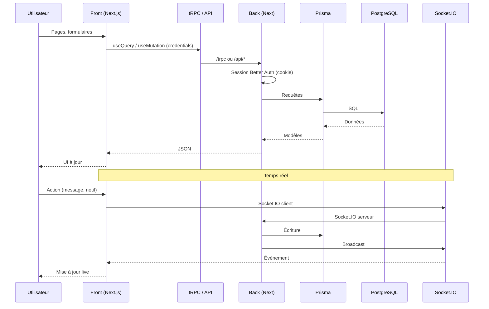
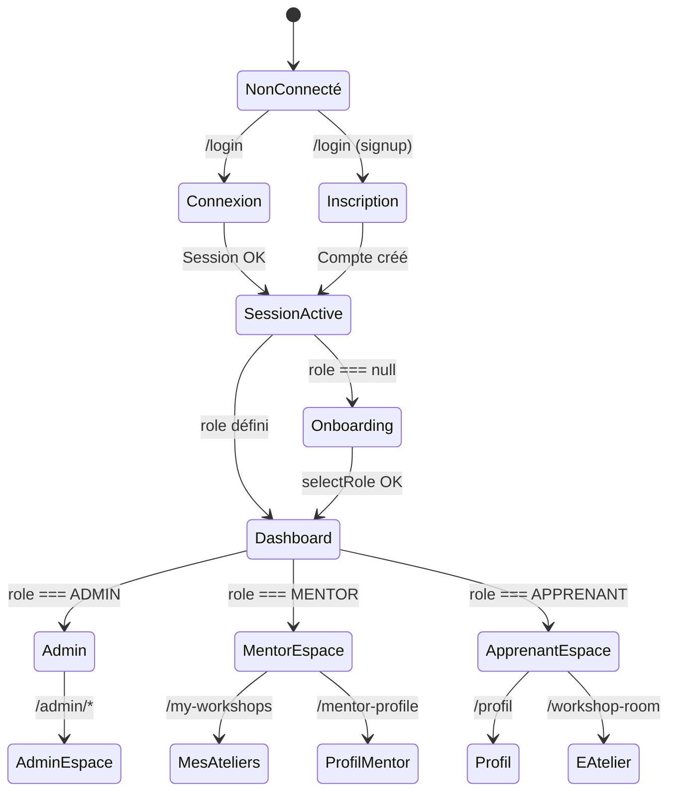
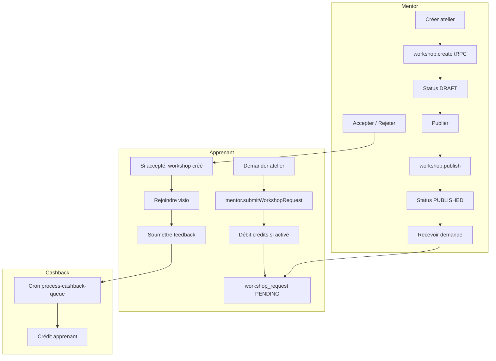
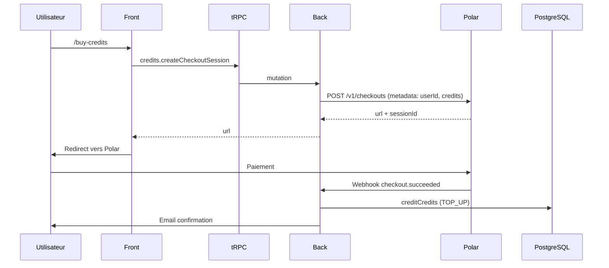
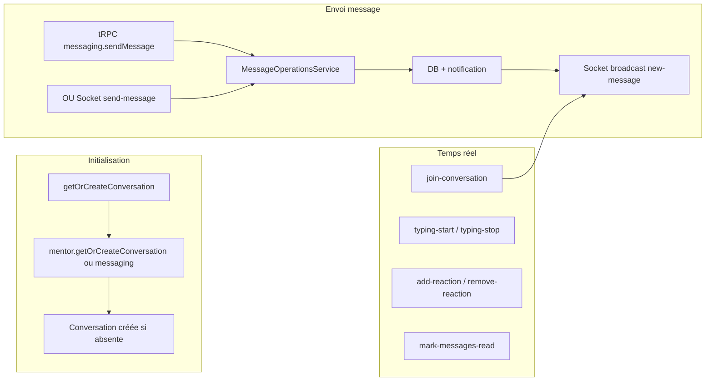
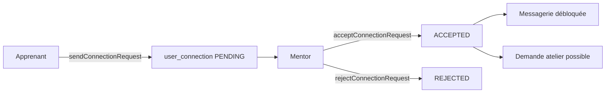
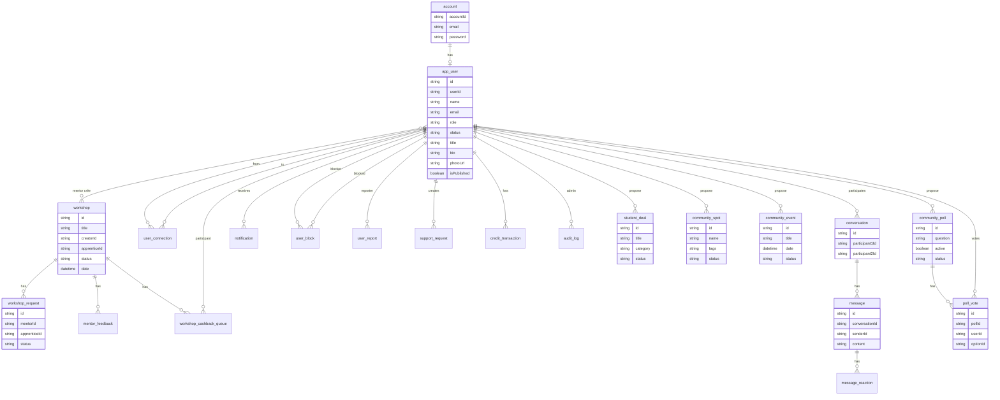

# Architecture LearnSup

Vue d’ensemble du monorepo : front, back et base de données.

---

## Schéma système

```mermaid
flowchart LR
  subgraph Front["Front (Next.js :3001)"]
    UI[Pages / UI]
    tRPC_C[tRPC client]
    AUTH_C[Better Auth client]
    FETCH[Fetch API]
    SOCKET_C[Socket.IO client]
  end

  subgraph Back["Back (Next.js :3000/4500)"]
    HTTP[Serveur HTTP + CORS]
    NEXT[Next.js handler]
    TRPC[/trpc]
    AUTH[/api/auth/*]
    API[/api/profile, sign-up, cron…]
    SOCKET_S[Socket.IO]
    PRISMA[Prisma]
  end

  subgraph DB[(PostgreSQL)]
  end

  UI --> tRPC_C
  UI --> AUTH_C
  UI --> FETCH
  UI --> SOCKET_C
  tRPC_C --> TRPC
  AUTH_C --> AUTH
  FETCH --> API
  SOCKET_C <--> SOCKET_S
  HTTP --> NEXT
  NEXT --> TRPC
  NEXT --> AUTH
  NEXT --> API
  NEXT --> SOCKET_S
  TRPC --> PRISMA
  AUTH --> PRISMA
  API --> PRISMA
  PRISMA --> DB
```

Vue simplifiée (ASCII) :

```
┌──────────────────────────────────────────────────────────────────┐
│  Monorepo (pnpm workspaces + Turborepo)                          │
├──────────────────────────────────────────────────────────────────┤
│  front/                 │  back/                                  │
│  Next.js (port 3001)    │  Next.js (port 3000 ou 4500 en dev)     │
│  App Router             │  Serveur HTTP monte Next + Socket.IO    │
│  tRPC client            ──────────────►  /trpc (API tRPC)         │
│  Better Auth client     ──────────────►  /api/auth/[...all]       │
│  Fetch (onboarding,     ──────────────►  /api/profile/*,           │
│   profile, upload)                      /api/sign-up, etc.        │
│  Socket.IO client       ◄─────────────►  Socket.IO (notifs,       │
│                         │                 messagerie)             │
│                         │  Prisma  ──────────►  PostgreSQL       │
└──────────────────────────────────────────────────────────────────┘
```

- **Front** : application React (Next.js 16), port 3001 en dev. Appels API via tRPC (procédures type-safe) et requêtes HTTP directes pour l’auth, l’onboarding et la gestion de profil (Better Auth + routes custom).
- **Back** : une seule app Next.js servie par un serveur HTTP Node qui ajoute CORS et monte Socket.IO. Routes : `/trpc` (tRPC), `/api/auth/*` (Better Auth), `/api/profile/*`, `/api/sign-up`, `/api/cron/*`, webhooks (Daily, Polar), etc. Prisma pour toute la persistance.
- **Base** : PostgreSQL. Schéma et migrations dans `back/prisma/schema/`.

---

## Ports et URLs en dev

- **Front** : `http://localhost:3001`
- **Back** : selon config (souvent `http://localhost:3000` ou `http://localhost:4500`). Le front doit pointer vers cette URL via `NEXT_PUBLIC_SERVER_URL`.
- **Socket.IO** : même origine que le back, path `/socket.io`.

---

## Fonctionnalités métier

- **Authentification** : Better Auth (email/mot de passe, magic link, sessions, cookies). Routes custom pour sign-up, onboarding (rôle MENTOR / APPRENANT), profil mentor (photo, bio, publication). Magic link : envoi d’un lien par email via tRPC `auth.requestMagicLink`, callback `/api/auth/magic-link-callback`.
- **Ateliers (workshops)** : création, édition, publication, inscriptions, demandes, feedbacks, cashback, analytics. Visio via Daily.co (liens générés côté back, webhooks).
- **Mentors / Apprenants** : profils mentors, catalogue, demandes d’ateliers, historique, connexions (réseau).
- **Messagerie** : conversations, messages, réactions. Temps réel via Socket.IO.
- **Notifications** : notifs in-app, lien avec Socket.IO et routers tRPC dédiés.
- **Crédits / Paiement** : crédits, achats (Polar), transactions. Webhook Polar côté back.
- **Modération** : blocage d’utilisateurs, signalements (user block, user report). Côté back : routers tRPC + éventuels crons.
- **Support** : formulaire de demande de support, pièces jointes, envoi d'emails (Resend).
- **Hub Communauté** : page `/community` — Events Hub (événements communautaires), ateliers mentorat, bons plans étudiants (student_deal), Spot Finder (lieux recommandés), sondage hebdomadaire (community_poll), annuaire membres. Propositions utilisateurs (events, deals, spots) avec modération admin.
- **Admin** : modération des feedbacks, signalements, support, onboarding, audit logs, notifications, paramètres (interface dédiée `/admin`, rôle ADMIN).
- **Métriques** : endpoint Prometheus (`/api/metrics`) pour monitoring.

---

## Flux principaux



1. **Utilisateur** : consulte et utilise l’app front (pages, formulaires, navigation).
2. **Données** : le front appelle l’API via **tRPC** (hooks `trpc.*.useQuery` / `useMutation`) et reçoit des données typées. Le client tRPC envoie les requêtes vers `NEXT_PUBLIC_SERVER_URL/trpc` avec `credentials: "include"`.
3. **Auth** : login / signup via Better Auth (`/api/auth/*`) et routes custom (`/api/sign-up`, onboarding, profil). La session (cookie) est utilisée par le back pour les procédures protégées.
4. **Temps réel** : le front se connecte au back en Socket.IO pour les notifications et la messagerie.
5. **Back** : exécute les routers tRPC, les routes API et les crons ; lit/écrit avec **Prisma** → PostgreSQL.

---

## Flux d'authentification

```mermaid
flowchart TB
  subgraph Inscription["Inscription"]
    A1[Page /login mode signup]
    A2[SignUpForm]
    A3[POST /api/sign-up]
    A4[Better Auth signUpEmail]
    A5[Création account + app_user]
    A6[Email bienvenue + lien onboarding]
    A1 --> A2 --> A3 --> A4 --> A5 --> A6
  end

  subgraph Connexion["Connexion"]
    B1[Page /login mode signin]
    B2[SignInForm]
    B2a[Email + mot de passe]
    B2b[Magic link tRPC]
    B3[Better Auth signIn / magic-link/verify]
    B4[Session cookie]
    B5[getUserRole → redirection]
    B1 --> B2
    B2 --> B2a
    B2 --> B2b
    B2a --> B3
    B2b --> B3
    B3 --> B4 --> B5
  end

  subgraph Récupération["Récupération compte"]
    C1[/forgot-password]
    C2[Better Auth sendResetPassword]
    C3[Email avec lien]
    C4[/reset-password?token=xxx]
    C5[Nouveau mot de passe]
    C1 --> C2 --> C3 --> C4 --> C5
  end

  subgraph Onboarding["Onboarding"]
    D1[Session OK + role null]
    D2[Redirection /onboarding]
    D3[selectRole MENTOR ou APPRENANT]
    D4[POST /api/onboarding/select-role]
    D5[app_user.role + app_user.status ACTIVE]
    D6[Redirection /dashboard]
    D1 --> D2 --> D3 --> D4 --> D5 --> D6
  end

  A6 -.->|"Utilisateur clique"| B1
  B5 -->|ADMIN| E1["/admin"]
  B5 -->|role null| D1
  B5 -->|MENTOR/APPRENANT| E2["/dashboard"]
```

Séquences détaillées :

**Inscription** : `/login` (mode signup) → `customAuthClient.signUpEmail` → POST `/api/sign-up` → Better Auth crée `account` + `user` (status PENDING, role null) → email bienvenue avec lien `/onboarding`.

**Connexion** : (1) **Email/mot de passe** : `authClient.signIn.email` → Better Auth `/api/auth/sign-in/email` → session cookie. (2) **Magic link** : `trpc.auth.requestMagicLink` → email avec lien → clic → `/api/auth/magic-link-callback` (redirect legacy) → `/api/auth/magic-link/verify` → session → redirect `/dashboard`.

**Récupération mot de passe** : `/forgot-password` → Better Auth `forgetPassword` → email → `/reset-password?token=xxx` → nouveau mot de passe.

**Changement email** : lien dans email → `/verify-email-change?token=xxx` (Better Auth).

**Onboarding** : si session OK et `app_user.role === null` → redirect `/onboarding` → choix MENTOR ou APPRENANT → POST `/api/onboarding/select-role` → `app_user.role` et `app_user.status = ACTIVE` → redirect `/dashboard`.

---

## Flux utilisateur



**Redirections selon le rôle** :

| Rôle | Redirection après login | Routes accessibles |
|------|-------------------------|---------------------|
| **ADMIN** | `/admin` | `/admin/*` uniquement (sidebar admin) |
| **MENTOR** | `/dashboard` | `/dashboard`, `/my-workshops`, `/mentor-profile`, `/workshop-editor`, etc. |
| **APPRENANT** | `/dashboard` | `/dashboard`, `/profil`, `/workshop-room`, etc. |
| **Sans rôle** | `/onboarding` | Choix MENTOR ou APPRENANT obligatoire |

**RoleGate** : composant qui redirige ADMIN hors des routes utilisateur (`/dashboard`, `/my-workshops`, etc.) vers `/admin`, et les utilisateurs non-ADMIN hors de `/admin` vers `/dashboard`.

**Sources du rôle** : `getUserRole()` (GET `/api/profile/role`) → cache TanStack Query `["userRole", session.user.id]` → utilisé par `useDashboard`, `RoleGate`, `UserMenu`, page d'accueil.

---

## Flux de données

```mermaid
flowchart TB
  subgraph Front["Front"]
    UI[Composants React]
    Hooks[trpc.*.useQuery / useMutation]
    QC[TanStack QueryClient]
    TC[trpcClient httpBatchLink]
    Auth[Better Auth useSession]
    Socket[Socket.IO client]
  end

  subgraph Back["Back"]
    TRPC[/trpc]
    Ctx[createContext]
    Session[auth.api.getSession]
    Proc[Procédures public / protected / mentor / admin]
    Prisma[Prisma]
    SockS[Socket.IO serveur]
  end

  subgraph DB[(PostgreSQL)]
  end

  UI --> Hooks
  Hooks --> QC
  QC --> TC
  TC -->|"POST batch, credentials: include"| TRPC
  TRPC --> Ctx
  Ctx --> Session
  Session --> Proc
  Proc --> Prisma
  Prisma --> DB

  UI --> Auth
  UI --> Socket
  Socket <--> SockS
  SockS --> Prisma
```

**Données via tRPC** :

1. **Requête** : `trpc.workshop.list.useQuery()` → TanStack Query (cache, `staleTime`, `refetchInterval`) → `httpBatchLink` envoie POST `/trpc` avec `credentials: "include"` (cookie session).
2. **Contexte** : `createContext` appelle `auth.api.getSession({ headers })` → `ctx.session` pour les procédures protégées.
3. **Procédures** : `publicProcedure` (pas de session), `protectedProcedure` (session requise), `mentorProcedure` (role MENTOR + status ACTIVE), `adminProcedure` (role ADMIN + audit log).
4. **Réponse** : JSON typé → cache QueryClient → composants.

**Données via API REST** : `fetch` avec `credentials: "include"` vers `/api/profile/*`, `/api/sign-up`, etc. Session lue via `getAuthenticatedSession(req)`.

**Données temps réel** : Socket.IO connecté au back → événements (messages, notifications) → mise à jour UI. Les écritures passent par tRPC ou API ; Socket.IO sert au broadcast.

**Invalidation** : `queryClient.invalidateQueries({ queryKey: ["userRole"] })` après login, `trpc.useUtils().invalidate()` après mutations. Les toasts d’erreur gèrent les erreurs tRPC (sauf UNAUTHORIZED sur `/login`).

---

## Flux atelier (workshop)



**Cycle de vie** : Mentor crée (DRAFT) → publie (PUBLISHED). Apprenant envoie une demande (`submitWorkshopRequest`) → débit de 10 crédits → `workshop_request` PENDING. Mentor accepte ou rejette. Si accepté : création du `workshop` lié (date, lieu, visio), notification. Apprenant rejoint la visio (Daily.co), participe, soumet un feedback. Cron `process-cashback-queue` crédite l'apprenant (cashback).

---

## Flux paiement / crédits



**Achat** : `credits.createCheckoutSession` (credits, amount) → Polar crée un checkout avec `metadata.userId` et `metadata.credits` → redirection vers l'URL Polar. Après paiement, Polar envoie un webhook à `/api/polar/webhook` → vérification signature → `creditService.creditCredits` → transaction TOP_UP → email de confirmation (Resend).

**Utilisation** : lors de `submitWorkshopRequest`, débit de 10 crédits (transaction atomique avec création de la demande).

---

## Flux messagerie



**Connexion Socket** : authentification via cookie session → `join-conversation` pour recevoir les messages d'une conversation. Événements : `send-message`, `new-message`, `typing-start`, `typing-stop`, `add-reaction`, `remove-reaction`, `mark-messages-read`, `messages-read`.

**Envoi** : tRPC `messaging.sendMessage` ou Socket `send-message` → validation (accès, blocage, contenu) → création message en DB → notification au destinataire → broadcast Socket `new-message` aux participants.

---

## Flux visio (Daily.co)

```mermaid
flowchart TB
  subgraph Accès["Accès salle"]
    A1[Mentor ou Apprenant]
    A2[workshop-video.getDailyToken]
    A3[Salle existe ?]
    A4[DailyService.getOrCreateRoomForWorkshop]
    A5[workshop-{id}]
    A6[generateToken]
    A7[Redirect /workshop/[id]/join-video]
  end

  subgraph Webhook["Webhook Daily"]
    W1[participant-joined / participant-left]
    W2[POST /api/daily/webhook]
    W3[room name = workshop-{id}]
    W4[update dailyRoomLastActivityAt]
  end

  subgraph Cron["Crons"]
    C1[generate-video-links]
    C2[cleanup-inactive-rooms]
  end

  A1 --> A2 --> A3
  A3 -->|Non| A4 --> A5
  A3 -->|Oui| A5
  A5 --> A6 --> A7
  W1 --> W2 --> W3 --> W4
  C1 --> A4
  C2 --> W4
```

**Token** : `workshop-video.getDailyToken(workshopId)` → si pas de `dailyRoomId`, création salle via API Daily (`workshop-{workshopId}`) → génération token (owner pour mentor) → front redirige vers `/workshop/[id]/join-video` avec daily-js.

**Webhook** : Daily envoie `participant-joined` / `participant-left` → back met à jour `dailyRoomLastActivityAt`. Cron `cleanup-inactive-rooms` ferme les salles inactives.

---

## Flux suppression de compte

```mermaid
flowchart TB
  subgraph Demande["Demande utilisateur"]
    D1[/settings → DeleteAccountSection]
    D2[DELETE /api/profile/delete]
    D3[buildDeletionPlan]
    D4[softDelete + disable auth]
    D5[deletion_job créé runAt +30j]
  end

  subgraph Purge["Purge planifiée"]
    P1[Cron purge-deletions]
    P2[Jobs runAt <= now]
    P3[Anonymisation PII]
    P4[name, email, bio → anonyme]
    P5[deletion_job COMPLETED]
  end

  D1 --> D2 --> D3 --> D4 --> D5
  P1 --> P2 --> P3 --> P4 --> P5
```

**Demande** : DELETE `/api/profile/delete?reason=...` → `buildDeletionPlan` (rétention 30j) → soft delete user, désactivation compte auth, révocation sessions → création `deletion_job` (status PENDING, runAt = now + 30 jours).

**Purge** : cron `purge-deletions` (CRON_SECRET) → jobs échus → anonymisation (name, email, displayName, photoUrl, bio, etc.) → status COMPLETED.

---

## Flux crons (jobs planifiés)

Les routes sous `/api/cron/*` sont appelées par un planificateur externe avec `CRON_SECRET`.

| Route | Rôle |
|-------|------|
| `generate-video-links` | Crée les salles Daily pour les ateliers à venir (sans salle) |
| `cleanup-inactive-rooms` | Ferme les salles Daily inactives |
| `process-cashback-queue` | Traite la file de cashback (crédit apprenants après participation) |
| `retry-failed-cashbacks` | Retente les cashbacks en échec |
| `create-feedback-notifications` | Crée les notifications après soumission de feedback |
| `purge-deletions` | Exécute les `deletion_job` à échéance (anonymisation PII) |
| `check-cashback-integrity` | Vérifie l'intégrité des cashbacks |

Route `all` : exécute l'ensemble des jobs en une seule requête.

---

## Flux réseau (connexions)



**Connexion** : `connection.sendConnectionRequest(otherUserId)` → `user_connection` PENDING. Mentor `acceptConnectionRequest` ou `rejectConnectionRequest`. Si ACCEPTED : messagerie et demandes d'atelier possibles entre les deux utilisateurs.

---

## Modèles de données (Prisma)

Schéma relationnel simplifié (principales entités et relations) :



Liste des modèles : `account`, `app_user`, `workshop`, `workshop_request`, `mentor_feedback`, `user_connection`, `conversation`, `message`, `message_reaction`, `notification`, `user_block`, `user_report`, `support_request`, `credit_transaction`, `audit_log`, `magic_link_token`, `workshop_cashback_queue`, `student_deal`, `community_spot`, `community_event`, `community_poll`, `poll_vote`. Détails dans `back/prisma/schema/schema.prisma`.

---

## Démarrer

Installation, variables d’environnement et commandes : [README principal](../README.md).

- Détails front (pages, structure, stack, env) : [front.md](front.md).
- Détails back (routers, routes API, Prisma, crons, env) : [back.md](back.md).
