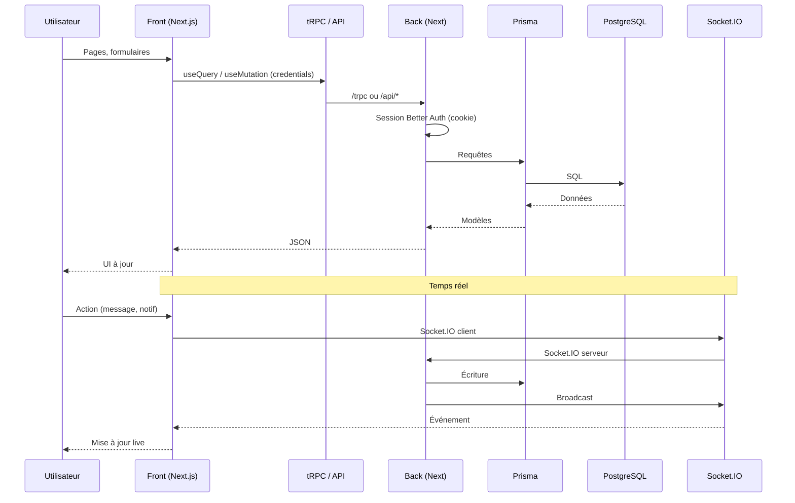
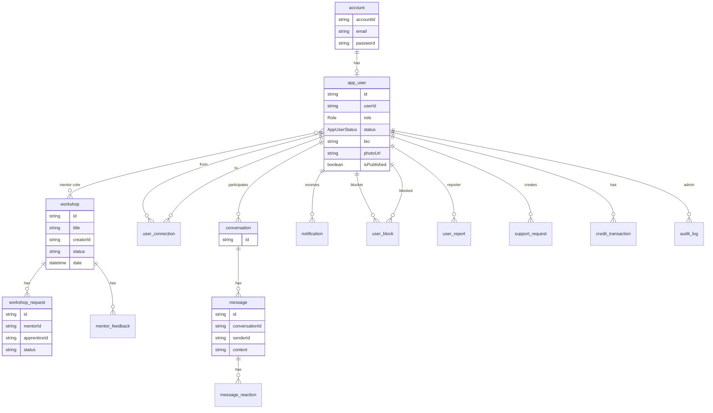

# Architecture LearnSup

Vue d’ensemble du monorepo : front, back et base de données.

---

## Schéma système

```mermaid
flowchart LR
  subgraph Front["Front (Next.js :3001)"]
    UI[Pages / UI]
    tRPC_C[tRPC client]
    AUTH_C[Better Auth client]
    FETCH[Fetch API]
    SOCKET_C[Socket.IO client]
  end

  subgraph Back["Back (Next.js :3000/4500)"]
    HTTP[Serveur HTTP + CORS]
    NEXT[Next.js handler]
    TRPC[/trpc]
    AUTH[/api/auth/*]
    API[/api/profile, sign-up, cron…]
    SOCKET_S[Socket.IO]
    PRISMA[Prisma]
  end

  subgraph DB[(PostgreSQL)]
  end

  UI --> tRPC_C
  UI --> AUTH_C
  UI --> FETCH
  UI --> SOCKET_C
  tRPC_C --> TRPC
  AUTH_C --> AUTH
  FETCH --> API
  SOCKET_C <--> SOCKET_S
  HTTP --> NEXT
  NEXT --> TRPC
  NEXT --> AUTH
  NEXT --> API
  NEXT --> SOCKET_S
  TRPC --> PRISMA
  AUTH --> PRISMA
  API --> PRISMA
  PRISMA --> DB
```

Vue simplifiée (ASCII) :

```
┌──────────────────────────────────────────────────────────────────┐
│  Monorepo (pnpm workspaces + Turborepo)                          │
├──────────────────────────────────────────────────────────────────┤
│  front/                 │  back/                                  │
│  Next.js (port 3001)    │  Next.js (port 3000 ou 4500 en dev)     │
│  App Router             │  Serveur HTTP monte Next + Socket.IO    │
│  tRPC client            ──────────────►  /trpc (API tRPC)         │
│  Better Auth client     ──────────────►  /api/auth/[...all]       │
│  Fetch (onboarding,     ──────────────►  /api/profile/*,           │
│   profile, upload)                      /api/sign-up, etc.        │
│  Socket.IO client       ◄─────────────►  Socket.IO (notifs,       │
│                         │                 messagerie)             │
│                         │  Prisma  ──────────►  PostgreSQL       │
└──────────────────────────────────────────────────────────────────┘
```

- **Front** : application React (Next.js 16), port 3001 en dev. Appels API via tRPC (procédures type-safe) et requêtes HTTP directes pour l’auth, l’onboarding et la gestion de profil (Better Auth + routes custom).
- **Back** : une seule app Next.js servie par un serveur HTTP Node qui ajoute CORS et monte Socket.IO. Routes : `/trpc` (tRPC), `/api/auth/*` (Better Auth), `/api/profile/*`, `/api/sign-up`, `/api/cron/*`, webhooks (Daily, Polar), etc. Prisma pour toute la persistance.
- **Base** : PostgreSQL. Schéma et migrations dans `back/prisma/schema/`.

---

## Ports et URLs en dev

- **Front** : `http://localhost:3001`
- **Back** : selon config (souvent `http://localhost:3000` ou `http://localhost:4500`). Le front doit pointer vers cette URL via `NEXT_PUBLIC_SERVER_URL`.
- **Socket.IO** : même origine que le back, path `/socket.io`.

---

## Fonctionnalités métier

- **Authentification** : Better Auth (email/mot de passe, magic link, sessions, cookies). Routes custom pour sign-up, onboarding (rôle MENTOR / APPRENANT), profil prof (photo, bio, publication). Magic link : envoi d’un lien par email via tRPC `auth.requestMagicLink`, callback `/api/auth/magic-link-callback`.
- **Ateliers (workshops)** : création, édition, publication, inscriptions, demandes, feedbacks, cashback, analytics. Visio via Daily.co (liens générés côté back, webhooks).
- **Mentors / Apprenants** : profils mentors, catalogue, demandes d’ateliers, historique, connexions (réseau).
- **Messagerie** : conversations, messages, réactions. Temps réel via Socket.IO.
- **Notifications** : notifs in-app, lien avec Socket.IO et routers tRPC dédiés.
- **Crédits / Paiement** : crédits, achats (Polar), transactions. Webhook Polar côté back.
- **Modération** : blocage d’utilisateurs, signalements (user block, user report). Côté back : routers tRPC + éventuels crons.
- **Support** : formulaire de demande de support, pièces jointes, envoi d’emails (Resend).
- **Admin** : modération des feedbacks, signalements, support, onboarding, audit logs, notifications, paramètres (interface dédiée `/admin`, rôle ADMIN).
- **Métriques** : endpoint Prometheus (`/api/metrics`) pour monitoring.

---

## Flux principaux



1. **Utilisateur** : consulte et utilise l’app front (pages, formulaires, navigation).
2. **Données** : le front appelle l’API via **tRPC** (hooks `trpc.*.useQuery` / `useMutation`) et reçoit des données typées. Le client tRPC envoie les requêtes vers `NEXT_PUBLIC_SERVER_URL/trpc` avec `credentials: "include"`.
3. **Auth** : login / signup via Better Auth (`/api/auth/*`) et routes custom (`/api/sign-up`, onboarding, profil). La session (cookie) est utilisée par le back pour les procédures protégées.
4. **Temps réel** : le front se connecte au back en Socket.IO pour les notifications et la messagerie.
5. **Back** : exécute les routers tRPC, les routes API et les crons ; lit/écrit avec **Prisma** → PostgreSQL.

---

## Modèles de données (Prisma)

Schéma relationnel simplifié (principales entités et relations) :



Liste des modèles : `account`, `app_user`, `workshop`, `workshop_request`, `mentor_feedback`, `user_connection`, `conversation`, `message`, `message_reaction`, `notification`, `user_block`, `user_report`, `support_request`, `credit_transaction`, `audit_log`, `magic_link_token`. Détails dans `back/prisma/schema/schema.prisma`.

---

## Démarrer

Installation, variables d’environnement et commandes : [README principal](../README.md).

- Détails front (pages, structure, stack, env) : [front.md](front.md).
- Détails back (routers, routes API, Prisma, crons, env) : [back.md](back.md).
