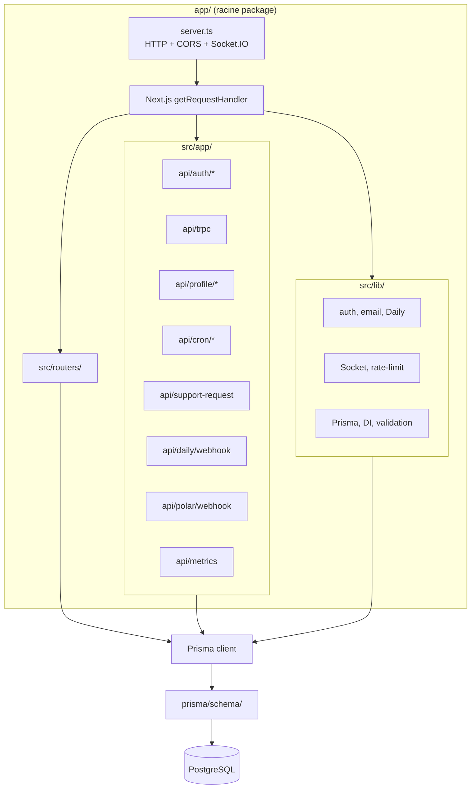
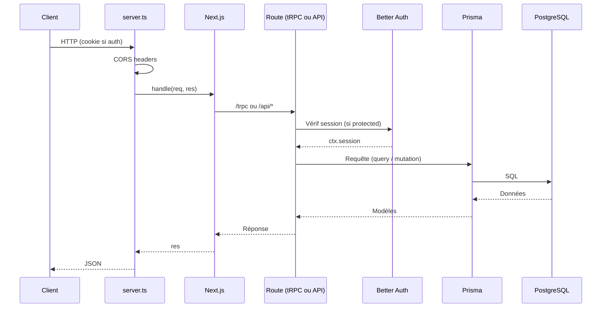
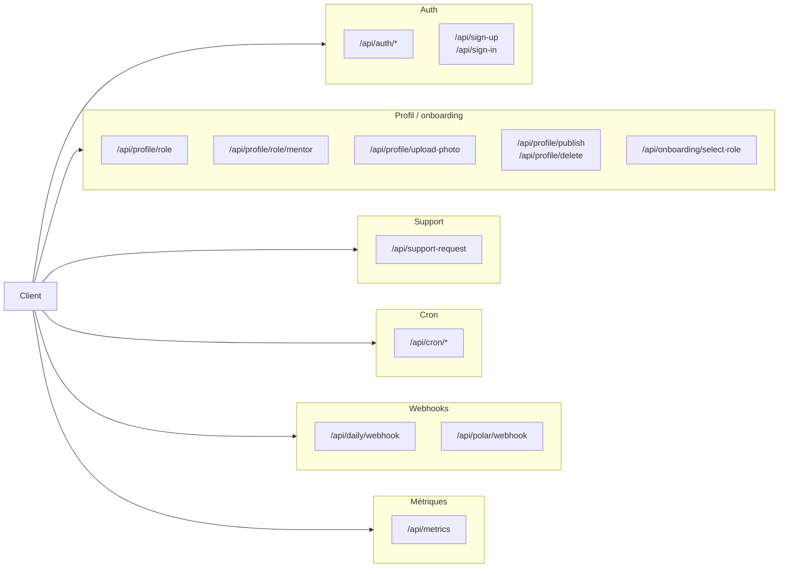

# API et serveur LearnSup

Toute l’API et le serveur HTTP vivent dans le **package `app/`** (Next.js App Router + `server.ts`). Ce document décrit l’entrée des requêtes, tRPC, Prisma, Better Auth, routes custom (profil, cron, webhooks), emails, Daily, métriques, Socket.IO.

---

## Schéma d’entrée des requêtes

```mermaid
flowchart TB
  Client[Client HTTP]
  Client --> Server["server.ts"]
  Server --> CORS[CORS headers]
  Server --> Socket["Socket.IO\n/socket.io"]
  Server --> Next[Next.js getRequestHandler]
  Next --> Route{Route ?}
  Route -->|/trpc| TRPC[api/trpc]
  Route -->|/api/auth/*| Auth[api/auth/[...all] + magic-link-callback]
  Route -->|/api/profile/*| Profile[api/profile/*]
  Route -->|/api/cron/*| Cron[api/cron/*]
  Route -->|/api/daily/webhook| Daily[api/daily/webhook]
  Route -->|/api/polar/webhook| Polar[api/polar/webhook]
  Route -->|/api/metrics| Metrics[api/metrics]
  Route -->|autres| Other[autres routes API]
  TRPC --> Prisma[Prisma]
  Auth --> Prisma
  Profile --> Prisma
  Cron --> Prisma
  Daily --> Prisma
  Polar --> Prisma
  Other --> Prisma
  Prisma --> DB[(PostgreSQL)]
```

Arborescence des routers tRPC (appRouter) :

```mermaid
flowchart TB
  appRouter[appRouter]
  appRouter --> healthCheck[healthCheck]
  appRouter --> privateData[privateData]
  appRouter --> auth[auth]
  appRouter --> workshop[workshop]
  appRouter --> workshopFeedback[workshopFeedback]
  appRouter --> cashbackAnalytics[cashbackAnalytics]
  appRouter --> mentor[mentor]
  appRouter --> apprentice[apprentice]
  appRouter --> connection[connection]
  appRouter --> community[community]
  appRouter --> messaging[messaging]
  appRouter --> notification[notification]
  appRouter --> userBlock[userBlock]
  appRouter --> userReport[userReport]
  appRouter --> credits[credits]
  appRouter --> user[user]
  appRouter --> accountSettings[accountSettings]
  appRouter --> admin[admin]
  appRouter --> support[support]
```



## Stack

- **Node** + **Next.js 16** — App Next (API routes, possible standalone). Le point d’entrée en prod est le serveur custom (`server.ts`), pas `next start` seul.
- **tRPC** (serveur) — API type-safe, procédures `publicProcedure` et `protectedProcedure` (session Better Auth).
- **Prisma** — ORM, client généré dans `app/prisma/generated/client`, schéma dans `app/prisma/schema/schema.prisma`.
- **PostgreSQL** — Base de données (URL via `DATABASE_URL`).
- **Better Auth** — Authentification (sessions, stratégies). Route : `app/api/auth/[...all]/route.ts`.
- **Zod** — Validation des entrées (routers, shared).
- **Resend** — Envoi d’emails (templates React Email dans `lib/email/templates/`).
- **Sharp** — Traitement d’images (photos de profil, upload).
- **Cloudinary** — Stockage cloud des images (si configuré, sinon repli sur stockage local).
- **Daily.co** — Création de salles / liens visio, webhooks. Service dans `lib/daily/`.
- **Socket.io** — Notifications et messagerie temps réel. Initialisation dans `lib/socket/server`, monté sur le même serveur HTTP que Next.
- **rate-limiter-flexible** — Limitation de requêtes (middleware / routes sensibles).
- **prom-client** — Métriques Prometheus exposées sur `/api/metrics`.
- **React Email** — Rendu des templates d’emails (Welcome, PasswordChange, etc.).
- **DOMPurify / jsdom** — Nettoyage de contenu HTML si utilisé.
- **Polar** — Webhook paiement (crédits). Route : `app/api/polar/webhook/route.ts`.

---

## Structure des dossiers



Flux typique (échanges) — une requête jusqu’à la base :



- **server.ts** (racine du package `app/`) — Serveur HTTP Node qui charge l’environnement, crée l’app Next, gère CORS, monte Socket.IO sur le même `http.Server`, et délègue les requêtes à Next (`getRequestHandler()`). Port : `process.env.PORT_BACKEND` ou équivalent selon `server.ts` et l’hébergeur.
- **src/app/** — Routes Next (App Router) :
  - `**api/auth/[...all]/route.ts**` — Better Auth.
  - `**api/auth/magic-link-callback/route.ts**` — Callback magic link (connexion sans mot de passe).
  - `**api/trpc/**` — Point d’entrée tRPC (procédures exposées sous `/trpc`).
  - `**api/sign-up**`, `**api/sign-in**` — Inscription / connexion custom si utilisé.
  - `**api/onboarding/select-role**` — Choix de rôle (MENTOR / APPRENANT).
  - `**api/profile/**` — role, role/mentor, upload-photo, photo/[filename], publish, delete.
  - `**api/support-request/**` — Demande de support + pièces jointes (`attachments/[filename]`).
  - `**api/cron/**` — Jobs planifiés : generate-video-links, cleanup-inactive-rooms, process-cashback-queue, retry-failed-cashbacks, create-feedback-notifications, purge-deletions, check-cashback-integrity.
  - `**api/daily/webhook**` — Webhook Daily.co.
  - `**api/polar/webhook**` — Webhook Polar (paiement).
  - `**api/metrics**` — Métriques Prometheus.
- `**src/routers/**` — Routers tRPC : `index.ts` (appRouter) agrège healthCheck, privateData, auth (magic link), workshop, workshopFeedback, cashbackAnalytics, mentor, apprentice, connection, community, messaging, notification, userBlock, userReport, credits, user, accountSettings, admin, support. Certains routers sont découpés en sous-fichiers :
  - `workshops/` — `workshop.router.ts` (CRUD principal), `workshop-attendance.router.ts` (présence), `workshop-video.router.ts` (liens visio), `workshop-feedback.router.ts`.
  - `social/` — `messaging.router.ts` (agrégation), `messaging-conversation.router.ts`, `messaging-message.router.ts`, `messaging-presence.router.ts`, `messaging-reaction.router.ts`.
  - `shared/router-helpers.ts` — Utilitaires partagés entre routers.
- `**src/lib/**` — Services métier, repositories, DI. Organisation modulaire :
  - `workshops/services/` — Découpé en sous-domaines : `lifecycle/` (création, publication, annulation), `query/` (recherche, listing), `scheduling/` (planification, détection de conflits), `attendance/` (présence, check-in), `feedback/` (feedbacks, modération), `rewards/` (cashback, calcul, file de traitement, pénalités no-show), `guards/` (contrôle d'accès), `email/` (templates d'emails atelier), `video/` (liens visio Daily, exposition `dailyRoomId`). `workshops/utils/` : helpers atelier + `workshop-public-dto.mapper` (filtrage visio cohérent sur les DTO).
  - `messaging/services/` — Découpé en : `core/` (conversation, message-operations, presence), `enrichment/` (enrichissement des messages), `reactions/` (réactions aux messages), `validation/` (validation des messages).
  - `mentors/services/workshops/` — `workshop-request.service.ts`, `workshop-request-query.service.ts`, `workshop-request-notification.service.ts`, `workshop-for-request.factory.ts`.
  - `users/services/connection/` — `user-connection.service.ts`, `user-info-enricher.ts`.
  - `socket/handlers/` — `message.handler.ts` (handler Socket.IO dédié messagerie).
  - `auth/services/magic-link/` — MagicLinkService (envoi lien par email).
  - `auth/`, `email/`, `daily/`, `di/`, `rate-limit/`, `logger/`, `metrics/` — Inchangés.
- `**src/shared/**` — Schémas et validation partagés avec le front (Zod, workshop, password, date, etc.).
- `**app/prisma/schema/schema.prisma**` — Schéma Prisma (generator client, datasource db). Modèles principaux : account, app_user, workshop, workshop_request, mentor_feedback, user_connection, conversation, message, message_reaction, notification, user_block, user_report, support_request, credit_transaction, audit_log, magic_link_token, workshop_cashback_queue, student_deal, community_spot, community_event, community_poll, poll_vote.

---

## Routers tRPC (API)

- **auth** — Magic link : `requestMagicLink` (envoi d’un lien de connexion par email).
- **workshop** — Ateliers (CRUD, publication, inscriptions, demandes). Découpé en sous-routers :
  - `workshop-attendance` — Gestion de la présence (check-in, statut).
  - `workshop-video` — Liens visio Daily (génération, accès).
- **workshopFeedback** — Feedbacks ateliers (soumission, modération). Modération : `getModerationQueue`, `approveFeedback`, `deleteFeedback`, `warnUser`.
- **cashbackAnalytics** — Analytics cashback.
- **mentor** — Profils mentors, catalogue, demandes.
- **apprentice** — Données apprenant.
- **connection** — Réseau : `checkConnectionStatus`, `sendConnectionRequest`, `acceptConnectionRequest`, `rejectConnectionRequest`, `removeConnection`.
- **messaging** — Conversations, messages, non-lus. Découpé en sous-routers :
  - `messaging-conversation` — CRUD conversations.
  - `messaging-message` — Envoi, édition, suppression de messages.
  - `messaging-presence` — Indicateurs de présence et de frappe.
  - `messaging-reaction` — Réactions aux messages.
- **notification** — Notifications in-app.
- **userBlock** / **userReport** — Modération (blocage, signalements).
- **credits** — Crédits, transactions.
- **user** — Données utilisateur.
- **accountSettings** — Paramètres de compte.
- **community** — Hub communauté : `getHubData`, `voteInPoll`, `proposeEvent`, `proposeDeal`, `proposeSpot`, `getPendingProposals`, `reviewProposal`, `bulkReviewProposals`, `createDeal`, `createEvent`, `createSpot`, `createPoll` (admin).
- **admin** — Administration : `getStats`, `getAnalytics` (BI), file d’onboarding (approbation/rejet), audit logs, modération communauté, `getUser360`, `updateUserCredits`, `bulkApproveUsers`, `bulkRejectUsers`, `sendBulkNotification`.
- **support** — Demandes de support (création, mise à jour, suivi threadé via `addMessage`).

Procédures protégées : utilisation de la session Better Auth (ctx.session). `protectedProcedure` (session requise), `mentorProcedure` (rôle MENTOR + statut ACTIVE), `adminProcedure` (rôle ADMIN + statut ACTIVE, avec audit log des mutations). Health check et données publiques en `publicProcedure`.

---

## Routes API (hors tRPC)



- **Auth** : `/api/auth/*` (Better Auth), `/api/auth/magic-link-callback` (connexion via magic link), `/api/sign-up`, `/api/sign-in`.
- **Onboarding** : `/api/onboarding/select-role`.
- **Profil** : GET/POST `/api/profile/role`, POST `/api/profile/role/mentor`, POST `/api/profile/upload-photo`, GET `/api/profile/photo/[filename]`, POST/DELETE `/api/profile/publish`, DELETE `/api/profile/delete`.
- **Support** : POST `/api/support-request`, GET `/api/support-request/attachments/[filename]`.
- **Cron** : routes sous `/api/cron/*` (à appeler par un planificateur externe avec CRON_SECRET).
- **Webhooks** : `/api/daily/webhook`, `/api/polar/webhook`.
- **Métriques** : GET `/api/metrics` (Prometheus).

---

## Variables d’environnement

Fichier : `app/.env` (voir `app/.env.example` + [metier-et-ops.md](metier-et-ops.md)).

- **CORS_ORIGIN** — Origine autorisée (ex. `http://localhost:3001`).
- **CRON_SECRET** — Secret pour sécuriser les appels aux routes cron.
- **DATABASE_URL** — URL PostgreSQL (obligatoire). Recommandé : ajouter `?sslmode=verify-full` pour garantir une connexion sécurisée et éviter les avertissements de dépréciation du pilote `pg`.
- **PRISMA_ACCELERATE_URL** — Optionnel (Prisma Accelerate).
- **BETTER_AUTH_SECRET** — Secret Better Auth (obligatoire).
- **BETTER_AUTH_URL** — URL publique de l’app (callback auth).
- **POLAR_API_KEY**, **POLAR_WEBHOOK_SECRET**, **POLAR_PRODUCT_ID**, **POLAR_API_URL** — Polar (paiement crédits)
- **RESEND_API_KEY**, **RESEND_FROM_EMAIL** — Resend (emails).
- **DAILY_API_KEY**, **DAILY_API_BASE_URL** — Daily.co (visio).
- **CLOUDINARY_CLOUD_NAME**, **CLOUDINARY_API_KEY**, **CLOUDINARY_API_SECRET** — Cloudinary (stockage images). Si absent, le système utilise le stockage local.

Le serveur utilise aussi `PORT_BACKEND` (ou défaut dans le code) et `HOSTNAME_BACKEND` pour l’écoute.

---

## Scripts (depuis la racine du repo)

- `pnpm dev` / `pnpm dev:app` — Démarre le workspace **`app`** (Next + socket selon `app/package.json`).
- `pnpm db:push` — Synchronise le schéma Prisma avec la DB (dev).
- `pnpm db:migrate` — Migrations Prisma (prod).
- `pnpm db:generate` — Régénère le client Prisma.
- `pnpm db:studio` — Ouvre Prisma Studio.

---

## Documentation

- [Architecture](architecture.md)
- [App](app.md)