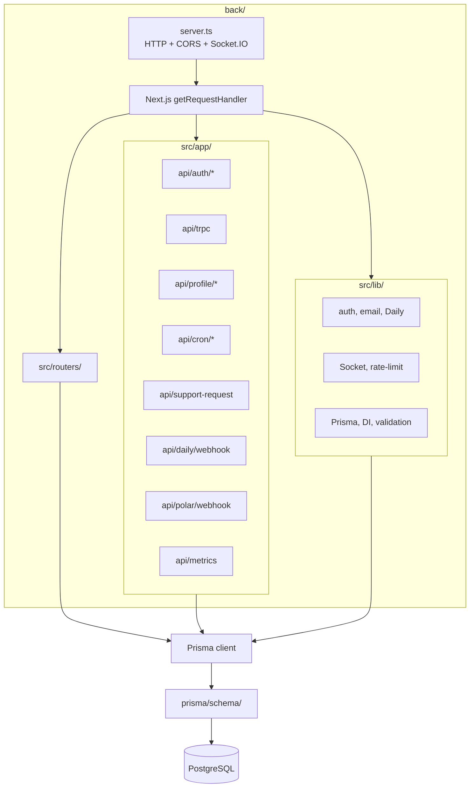
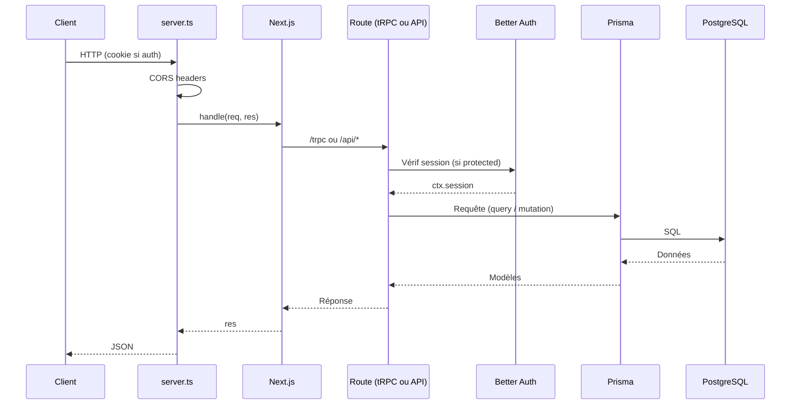
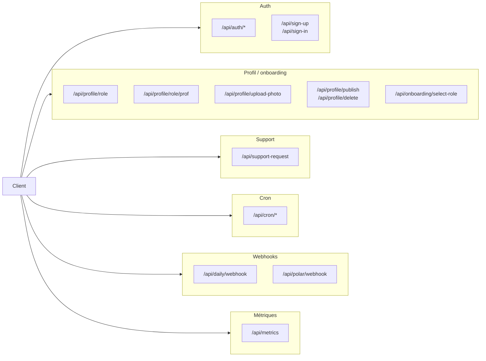

# Back — API et serveur LearnSup

Backend : une app Next.js servie par un serveur HTTP Node qui monte Socket.IO et ajoute CORS. API tRPC, Better Auth, routes API custom (profil, onboarding, cron, webhooks), Prisma, emails, visio Daily, métriques.

---

## Schéma d’entrée des requêtes

```mermaid
flowchart TB
  Client[Client HTTP]
  Client --> Server["server.ts"]
  Server --> CORS[CORS headers]
  Server --> Socket["Socket.IO\n/socket.io"]
  Server --> Next[Next.js getRequestHandler]
  Next --> Route{Route ?}
  Route -->|/trpc| TRPC[api/trpc]
  Route -->|/api/auth/*| Auth[api/auth/[...all]]
  Route -->|/api/profile/*| Profile[api/profile/*]
  Route -->|/api/cron/*| Cron[api/cron/*]
  Route -->|/api/daily/webhook| Daily[api/daily/webhook]
  Route -->|/api/polar/webhook| Polar[api/polar/webhook]
  Route -->|/api/metrics| Metrics[api/metrics]
  Route -->|autres| Other[autres routes API]
  TRPC --> Prisma[Prisma]
  Auth --> Prisma
  Profile --> Prisma
  Cron --> Prisma
  Daily --> Prisma
  Polar --> Prisma
  Other --> Prisma
  Prisma --> DB[(PostgreSQL)]
```

Arborescence des routers tRPC (appRouter) :

```mermaid
flowchart TB
  appRouter[appRouter]
  appRouter --> healthCheck[healthCheck]
  appRouter --> privateData[privateData]
  appRouter --> workshop[workshop]
  appRouter --> workshopFeedback[workshopFeedback]
  appRouter --> cashbackAnalytics[cashbackAnalytics]
  appRouter --> mentor[mentor]
  appRouter --> apprentice[apprentice]
  appRouter --> connection[connection]
  appRouter --> messaging[messaging]
  appRouter --> notification[notification]
  appRouter --> userBlock[userBlock]
  appRouter --> userReport[userReport]
  appRouter --> credits[credits]
  appRouter --> user[user]
  appRouter --> accountSettings[accountSettings]
```



## Stack

- **Node** + **Next.js 16** — App Next (API routes, possible standalone). Le point d’entrée en prod est le serveur custom (`server.ts`), pas `next start` seul.
- **tRPC** (serveur) — API type-safe, procédures `publicProcedure` et `protectedProcedure` (session Better Auth).
- **Prisma** — ORM, client généré dans `back/prisma/generated/client`, schéma dans `prisma/schema/schema.prisma`.
- **PostgreSQL** — Base de données (URL via `DATABASE_URL`).
- **Better Auth** — Authentification (sessions, stratégies). Route : `app/api/auth/[...all]/route.ts`.
- **Zod** — Validation des entrées (routers, shared).
- **Resend** — Envoi d’emails (templates React Email dans `lib/email/templates/`).
- **Sharp** — Traitement d’images (photos de profil, upload).
- **Daily.co** — Création de salles / liens visio, webhooks. Service dans `lib/daily/`.
- **Socket.io** — Notifications et messagerie temps réel. Initialisation dans `lib/socket/server`, monté sur le même serveur HTTP que Next.
- **rate-limiter-flexible** — Limitation de requêtes (middleware / routes sensibles).
- **prom-client** — Métriques Prometheus exposées sur `/api/metrics`.
- **React Email** — Rendu des templates d’emails (Welcome, PasswordChange, etc.).
- **DOMPurify / jsdom** — Nettoyage de contenu HTML si utilisé.
- **Polar** — Webhook paiement (crédits). Route : `app/api/polar/webhook/route.ts`.

---

## Structure des dossiers



Flux typique (échanges) — une requête jusqu’à la base :



- **server.ts** (racine back) — Serveur HTTP Node qui charge `dotenv`, crée l’app Next, gère CORS sur toutes les réponses, monte Socket.IO sur le même `http.Server`, et délègue les requêtes à Next (`app.getRequestHandler()`). Port : `process.env.PORT_BACKEND` (défaut `4500` dans le code) ; en pratique souvent `3000` selon README / env.
- **src/app/** — Routes Next (App Router) :
  - `**api/auth/[...all]/route.ts**` — Better Auth.
  - `**api/trpc/**` — Point d’entrée tRPC (procédures exposées sous `/trpc`).
  - `**api/sign-up**`, `**api/sign-in**` — Inscription / connexion custom si utilisé.
  - `**api/onboarding/select-role**` — Choix de rôle (MENTOR / APPRENANT).
  - `**api/profile/**` — role, role/prof, upload-photo, photo/[filename], publish, delete.
  - `**api/support-request/**` — Demande de support + pièces jointes (`attachments/[filename]`).
  - `**api/cron/**` — Jobs planifiés : generate-video-links, cleanup-inactive-rooms, process-cashback-queue, retry-failed-cashbacks, create-feedback-notifications, purge-deletions, check-cashback-integrity.
  - `**api/daily/webhook**` — Webhook Daily.co.
  - `**api/polar/webhook**` — Webhook Polar (paiement).
  - `**api/metrics**` — Métriques Prometheus.
- `**src/routers/**` — Routers tRPC : `index.ts` (appRouter) agrège healthCheck, privateData, workshop, workshopFeedback, cashbackAnalytics, mentor, apprentice, connection, messaging, notification, userBlock, userReport, credits, user, accountSettings.
- `**src/lib/**` — Services métier, repositories, auth (Better Auth config, signin, user-helpers), email (templates, render), Daily, Socket (server), rate-limit, DI (container), Prisma client commun, validation, logger, métriques.
- `**src/shared/**` — Schémas et validation partagés avec le front (Zod, workshop, password, date, etc.).
- `**prisma/schema/schema.prisma**` — Schéma Prisma (generator client, datasource db). Modèles principaux : account, user, session, app_user, workshop, workshop_request, mentor_feedback, workshop_cashback_queue, user_connection, conversation, message, message_reaction, conversation_pin, notification, user_block, user_report, support_request, credit_transaction, audit_log, deletion_job, verification.

---

## Routers tRPC (API)

- **workshop** — Ateliers (CRUD, publication, inscriptions, demandes).
- **workshopFeedback** — Feedbacks ateliers.
- **cashbackAnalytics** — Analytics cashback.
- **mentor** — Profils mentors, catalogue, demandes.
- **apprentice** — Données apprenant.
- **connection** — Réseau (connexions entre utilisateurs).
- **messaging** — Conversations, messages, non-lus.
- **notification** — Notifications in-app.
- **userBlock** / **userReport** — Modération (blocage, signalements).
- **credits** — Crédits, transactions.
- **user** — Données utilisateur.
- **accountSettings** — Paramètres de compte.

Procédures protégées : utilisation de la session Better Auth (ctx.session). Health check et données publiques en `publicProcedure`.

---

## Routes API (hors tRPC)



- **Auth** : `/api/auth/*` (Better Auth), `/api/sign-up`, `/api/sign-in`.
- **Onboarding** : `/api/onboarding/select-role`.
- **Profil** : GET/POST `/api/profile/role`, POST `/api/profile/role/prof`, POST `/api/profile/upload-photo`, GET `/api/profile/photo/[filename]`, POST/DELETE `/api/profile/publish`, DELETE `/api/profile/delete`.
- **Support** : POST `/api/support-request`, GET `/api/support-request/attachments/[filename]`.
- **Cron** : routes sous `/api/cron/*` (à appeler par un planificateur externe avec CRON_SECRET).
- **Webhooks** : `/api/daily/webhook`, `/api/polar/webhook`.
- **Métriques** : GET `/api/metrics` (Prometheus).

---

## Variables d’environnement

Fichier : `back/.env` (voir `back/.env.example`).

- **CORS_ORIGIN** — Origine autorisée (ex. `http://localhost:3001`).
- **CRON_SECRET** — Secret pour sécuriser les appels aux routes cron.
- **DATABASE_URL** — URL PostgreSQL (obligatoire).
- **PRISMA_ACCELERATE_URL** — Optionnel (Prisma Accelerate).
- **BETTER_AUTH_SECRET** — Secret Better Auth (obligatoire).
- **BETTER_AUTH_URL** — URL publique du back (ex. `http://localhost:3000`).
- **STRIPE_SECRET_KEY**, **STRIPE_WEBHOOK_SECRET** — Optionnel (Stripe).
- **RESEND_API_KEY**, **RESEND_FROM_EMAIL** — Resend (emails).
- **DAILY_API_KEY**, **DAILY_API_BASE_URL** — Daily.co (visio).

Le serveur utilise aussi `PORT_BACKEND` (ou défaut dans le code) et `HOSTNAME_BACKEND` pour l’écoute.

---

## Scripts (depuis la racine du repo)

- `pnpm dev:back` — Démarre le back (serveur Next + Socket.IO selon la config du package back).
- `pnpm db:push` — Synchronise le schéma Prisma avec la DB (dev).
- `pnpm db:migrate` — Migrations Prisma (prod).
- `pnpm db:generate` — Régénère le client Prisma.
- `pnpm db:studio` — Ouvre Prisma Studio.

---

## Documentation

- [Architecture](architecture.md)
- [Front](front.md)

