# Schéma et procédure de déploiement

Documentation du déploiement LearnSup : architecture, Docker, CI/CD et procédures.

---

## Récapitulatif des schémas

| Schéma | Public | Description |
| ------ | ------ | ----------- |
| [Vue simplifiée](#vue-simplifiée-pour-non-techniques) | Tous | Infrastructure en 1 coup d'œil |
| [Flux de déploiement](#flux-de-déploiement-pour-non-techniques) | Tous | Mise à jour du site |
| [Déploiement production](#schéma-de-déploiement-production--technique) | Technique | Traefik, Docker, services |
| [Docker production](#schéma-docker-production) | Technique | Conteneurs et ports |
| [Environnements](#schéma-des-environnements) | Tous | Dev vs Prod |
| [Flux requête](#flux-dune-requête-production) | Technique | Parcours d'une action |
| [CI/CD](#schéma-des-flux-cicd-technique) | Technique | Pipeline GitHub Actions |
| [Routage Traefik](#schéma-de-routage-traefik) | Technique | URLs → services |
| [Crons](#schéma-des-crons) | Technique | Tâches planifiées |
| [Build Docker](#schéma-du-build-docker) | Technique | Code → conteneur |
| [Webhooks entrants](#schéma-des-webhooks-entrants) | Technique | Polar, Daily → Backend |
| [Variables d'environnement](#schéma-des-variables-denvironnement) | Technique | Répartition Front / Back / Traefik |
| [Réseau Docker](#schéma-du-réseau-docker-production) | Technique | Conteneurs sur vps-mds |
| [Flux d'intégration](#flux-dintégration) | Technique | PR, tests, merge, release |

---

## Flux d'intégration

*Intégration = merge du code. Déploiement = étape séparée, déclenchée par un tag.*

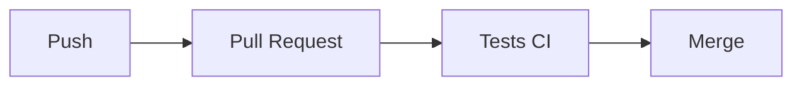

| Phase | Déclencheur | Action |
| ----- | ----------- | ------ |
| Intégration | Push / PR | Tests, merge |
| Deploy | Tag (manuel) | Build, déploiement |

## Vue simplifiée (pour non-techniques)

*Comment LearnSup fonctionne côté infrastructure — schéma lisible par tous.*

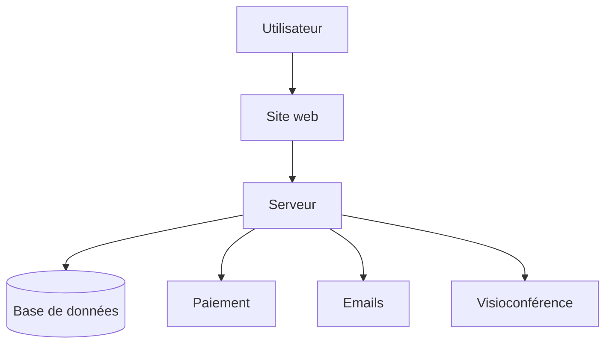

**En résumé** : L'utilisateur utilise le site dans son navigateur. Le site dialogue avec le serveur, qui stocke tout dans la base de données et s'appuie sur des services externes (paiement, emails, visio).

---

## Flux de déploiement (pour non-techniques)

*Que se passe-t-il quand on met à jour LearnSup ?*

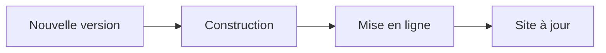

**En résumé** : Le développeur valide une version → le système construit et met en ligne automatiquement → les utilisateurs voient la nouvelle version.

---

## Schéma de déploiement (production) — technique

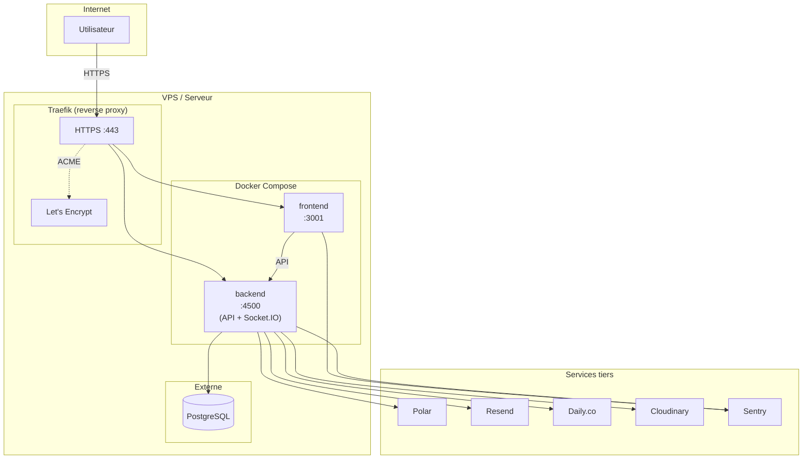

---

## Schéma Docker (production)

*Disposition des conteneurs sur le serveur.*

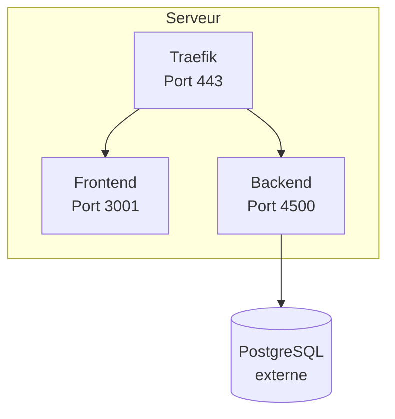

---

## Schéma des environnements

*Comparaison Dev local, Dev Docker et Production.*

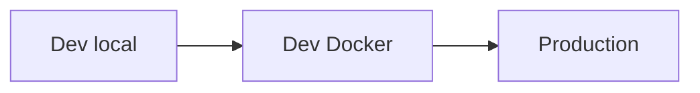

| Environnement | Front | Back | Base | Accès |
| ------------- | ----- | ---- | ---- | ----- |
| Dev local | :3001 | :4500 | Local | localhost |
| Dev Docker | :3001 | :3000 | .env | localhost |
| Production | :3001 | :4500 | Externe | HTTPS |

---

## Architecture des services

| Service | Image | Port interne | Rôle |
| ------- | ----- | ------------ | ---- |
| **frontend** | `miho11/front_ls:latest` | 3001 | Application Next.js (client) |
| **backend** | `miho11/back_ls:latest` | 4500 | API tRPC, REST, Socket.IO, Prisma |
| **traefik** | `traefik:v3.2.1` | 80, 443 | Reverse proxy, TLS, routage |

**Backend** : un seul processus sert l’API HTTP et Socket.IO (même port 4500, path `/socket.io`).

---

## Environnements

### Développement local

- **Commande** : `pnpm dev` (Turborepo)
- **Front** : `http://localhost:3001`
- **Back** : `http://localhost:4500` (ou 3000 selon config)
- **Socket.IO** : même URL que le back (`/socket.io`)
- **Base** : PostgreSQL local (`pnpm db:push`)

### Développement Docker

- **Fichier** : `infra/docker/Docker-compose-dev.yml`
- **Services** : frontend, backend, Prometheus, Grafana
- **Réseau** : `app-network`
- **Commandes** : `docker compose -f Docker-compose-dev.yml up -d`

### Production (Docker)

- **Fichier** : `infra/docker/docker-compose-prod.yml`
- **Services** : frontend, backend, traefik
- **Réseau** : `vps-mds` (externe)
- **Images** : Docker Hub `miho11/front_ls`, `miho11/back_ls`

---

## Flux d'une requête (production)

*Parcours d'une action utilisateur jusqu'à la base de données.*

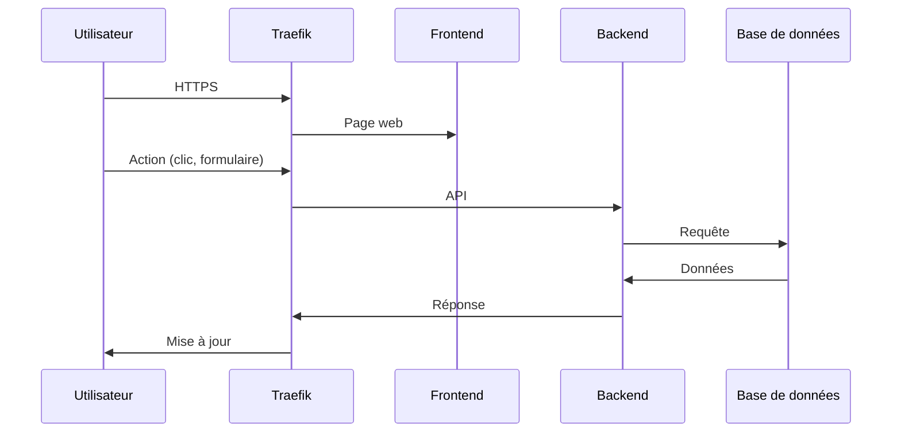

---

## Schéma des flux CI/CD (technique)

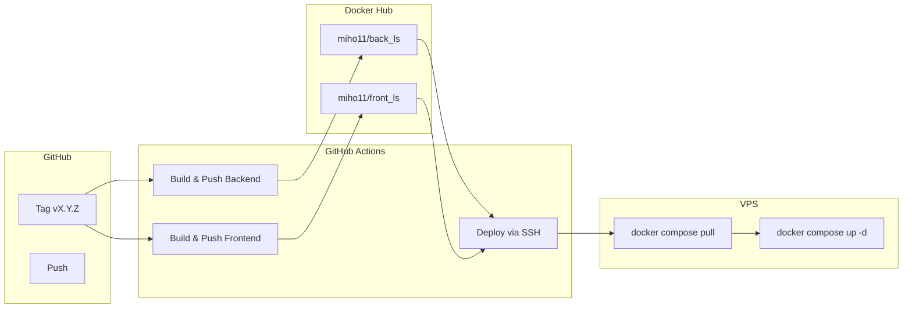

**Déclencheur** : push d’un tag `X.Y.Z` (ex. `5.1.1`).

---

## Schéma du build Docker

*De la source au conteneur en production.*

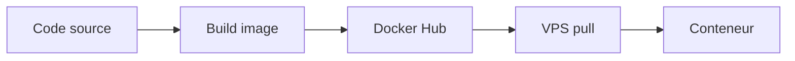

---

## Pipeline de déploiement

| Étape | Workflow | Action |
| ----- | -------- | ------ |
| 1 | `release.yml` | Déclenché par tag `[0-9]+.[0-9]+.[0-9]+` |
| 2 | Build Backend | Build Docker `infra/docker/back/prod/Dockerfile` → push `miho11/back_ls:latest` |
| 3 | Build Frontend | Build Docker `infra/docker/front/prod/Dockerfile` → push `miho11/front_ls:latest` |
| 4 | Deploy | SSH vers VPS → `git pull` → `docker compose -f docker-compose-prod.yml up -d` |

**Secrets GitHub** : `DOCKER_USERNAME`, `DOCKER_PASSWORD`, `SSH_HOST`, `SSH_USERNAME`, `SSH_PASSWORD`.

---

## Variables d'environnement (production)

### Frontend

| Variable | Description |
| -------- | ----------- |
| `NEXT_PUBLIC_SERVER_URL` | URL publique du backend (ex. `https://api.learnsup.example.com`) |
| `NEXT_PUBLIC_SOCKET_URL` | URL du backend (Socket.IO sur le même host) |
| `NEXT_PUBLIC_SENTRY_DSN` | DSN Sentry (optionnel) |
| `SENTRY_AUTH_TOKEN` | Token Sentry pour upload sourcemaps (build) |

### Backend

| Variable | Description |
| -------- | ----------- |
| `DATABASE_URL` | URL PostgreSQL |
| `CORS_ORIGIN` | Origine autorisée (URL du front) |
| `CRON_SECRET` | Secret pour les routes `/api/cron/*` |
| `BETTER_AUTH_SECRET` | Secret Better Auth (min 32 caractères) |
| `BETTER_AUTH_URL` | URL publique du backend |
| `PORT_BACKEND` | 4500 |
| `HOSTNAME_BACKEND` | `0.0.0.0` |
| `RESEND_API_KEY`, `RESEND_FROM_EMAIL` | Emails (Resend) |
| `SEND_EMAILS` | `true` / `false` |
| `DAILY_API_KEY`, `DAILY_DOMAIN`, `DAILY_WEBHOOK_SECRET` | Visio (Daily.co) |
| `CLOUDINARY_*` | Stockage images |
| `POLAR_*` | Paiement (Polar) |

### Traefik / Compose

| Variable | Description |
| -------- | ----------- |
| `FRONTEND_URL` | Host du front (ex. `app.learnsup.example.com`) |
| `BACKEND_URL` | Host du back (ex. `api.learnsup.example.com`) |

---

## Fichiers de déploiement

| Fichier | Rôle |
| ------- | ---- |
| `infra/docker/docker-compose-prod.yml` | Compose production (front, back, traefik) |
| `infra/docker/Docker-compose-dev.yml` | Compose dev (front, back, Prometheus, Grafana) |
| `infra/docker/back/prod/Dockerfile` | Image backend production |
| `infra/docker/front/prod/Dockerfile` | Image frontend production |
| `infra/docker/back/Dockerfile.dev` | Image backend dev |
| `infra/docker/front/Dockerfile.dev` | Image frontend dev |
| `.github/workflows/release.yml` | CI/CD : build, push, deploy |
| `back/start.sh` | Script de démarrage back (migrations + serveur) |

---

## Procédure de déploiement manuel

### 1. Déployer une nouvelle version (tag)

```bash
# Créer et pousser un tag
git tag 5.2.0
git push origin 5.2.0
```

Le workflow `release.yml` se lance automatiquement.

### 2. Déploiement manuel sur le VPS

```bash
# Sur le VPS
cd /home/root/projects/learnsup-app/ls_app/infra/docker
git pull
docker compose -f docker-compose-prod.yml pull
docker compose -f docker-compose-prod.yml up -d --remove-orphans
```

### 3. Vérifier les migrations

Le script `back/start.sh` exécute `prisma migrate deploy` au démarrage du backend. Les migrations sont appliquées automatiquement.

### 4. Crons

Configurer un planificateur (cron système ou GitHub Actions) pour appeler les routes `/api/cron/*` avec le header `CRON_SECRET`. Voir [procedure.md](procedure.md#crons-jobs-planifiés).

---

## Schéma de routage Traefik

*Comment les URLs sont dirigées vers les bons services.*

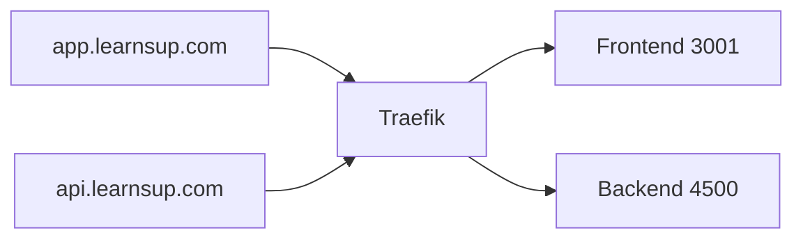

---

## Schéma des crons

*Les tâches planifiées appelées par un planificateur externe.*

```mermaid
flowchart TB
  P[Planificateur\ncron / GitHub Actions] --> C[/api/cron/*]
  C --> J1[Cashback]
  C --> J2[Purge suppressions]
  C --> J3[Notifications feedback]
  C --> J4[Nettoyage visio]
```

---

## Schéma des webhooks entrants

*Flux des callbacks envoyés par les services externes vers le backend.*

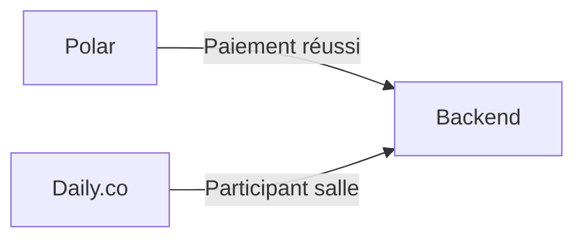

| Webhook | URL | Événement | Action |
| ------- | --- | --------- | ------ |
| Polar | `/api/polar/webhook` | Paiement réussi | Crédit du compte |
| Daily.co | `/api/daily/webhook` | Participant rejoint/quitte | Mise à jour activité salle |

---

## Schéma des variables d'environnement

*Répartition des variables par service.*

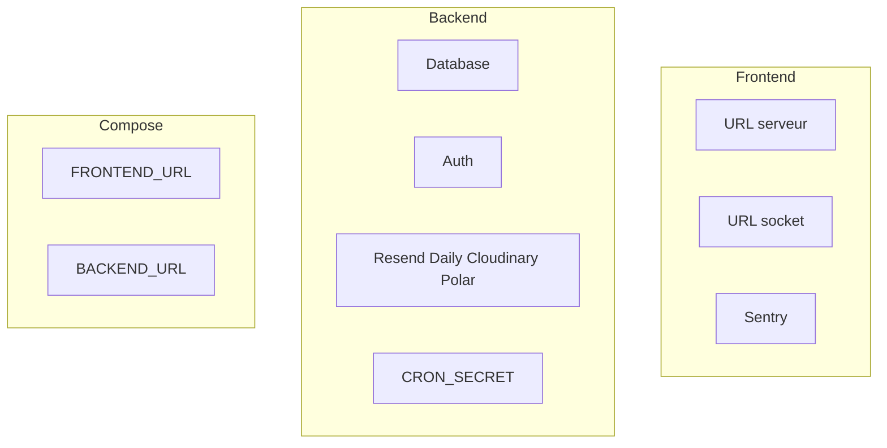

---

## Schéma du réseau Docker (production)

*Conteneurs sur le réseau vps-mds et liens entre eux.*

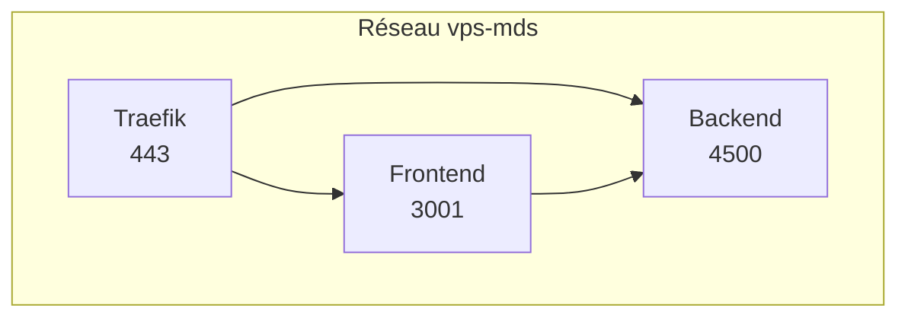

Le compose prod utilise le réseau externe `vps-mds`. Créer le réseau si nécessaire :

```bash
docker network create vps-mds
```

---

## Références

- [Procédure](procedure.md) — Démarrage, DB, auth, crons
- [Architecture](architecture.md) — Flux et schémas
- [Back](back.md) — API et variables d’env
