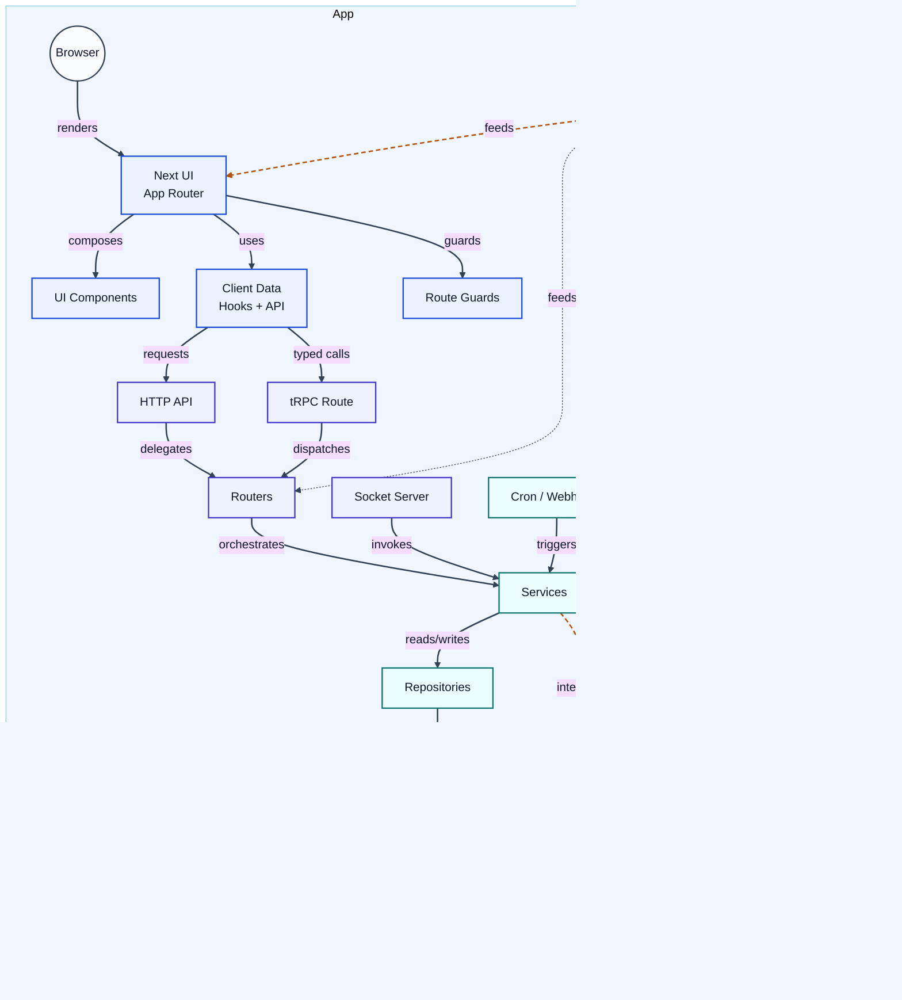

# Diagramme d'architecture

```mermaid
%%{init: {'theme':'base','themeVariables':{
'fontFamily':'Inter,system-ui,-apple-system,Segoe UI,Roboto,Arial,sans-serif',
'fontSize':'16px',
'lineColor':'#334155',
'primaryTextColor':'#0f172a',
'clusterBkg':'#ffffff',
'clusterBorder':'#94a3b8'
}}}%%
flowchart TD

subgraph group_app["App"]
  direction TB
  node_browser(("Browser"))
  node_next_ui["Next UI<br/>App Router"]
  node_domain_ui["UI Components"]
  node_client_data["Client Data<br/>Hooks + API"]
  node_authz["Route Guards"]
  node_api_surface["HTTP API"]
  node_trpc["tRPC Route"]
  node_socket_server["Socket Server"]
  node_router_layer["Routers"]
  node_service_layer["Services"]
  node_repo_layer["Repositories"]
  node_cron_webhooks["Cron / Webhooks"]
end

subgraph group_shared["Shared"]
  direction TB
  node_contracts["Shared Contracts<br/>Types + Schemas"]
end

subgraph group_infra["Infra"]
  direction TB
  node_prisma[("Prisma ORM")]
  node_postgres[("PostgreSQL")]
  node_external["External Services"]
end

node_browser -->|"renders"| node_next_ui
node_next_ui -->|"composes"| node_domain_ui
node_next_ui -->|"uses"| node_client_data
node_next_ui -->|"guards"| node_authz
node_client_data -->|"typed calls"| node_trpc
node_client_data -->|"requests"| node_api_surface
node_api_surface -->|"delegates"| node_router_layer
node_trpc -->|"dispatches"| node_router_layer
node_router_layer -->|"orchestrates"| node_service_layer
node_socket_server -->|"invokes"| node_service_layer
node_cron_webhooks -->|"triggers"| node_service_layer
node_service_layer -->|"reads/writes"| node_repo_layer
node_repo_layer -->|"uses"| node_prisma
node_prisma -->|"stores"| node_postgres
node_service_layer -->|"integrates"| node_external
node_contracts -.->|"feeds"| node_next_ui
node_contracts -.->|"feeds"| node_service_layer
node_contracts -.->|"feeds"| node_router_layer

click node_next_ui "https://github.com/alice-444/ls_app/tree/main/app/src/app"
click node_domain_ui "https://github.com/alice-444/ls_app/tree/main/app/src/components"
click node_client_data "https://github.com/alice-444/ls_app/tree/main/app/src/hooks"
click node_authz "https://github.com/alice-444/ls_app/tree/main/app/src/components/shared/layout"
click node_api_surface "https://github.com/alice-444/ls_app/tree/main/app/src/app/api"
click node_trpc "https://github.com/alice-444/ls_app/blob/main/app/src/app/trpc/[trpc]/route.ts"
click node_socket_server "https://github.com/alice-444/ls_app/blob/main/app/server.ts"
click node_router_layer "https://github.com/alice-444/ls_app/tree/main/app/src/routers"
click node_service_layer "https://github.com/alice-444/ls_app/tree/main/app/src/lib"
click node_repo_layer "https://github.com/alice-444/ls_app/tree/main/app/src/lib"
click node_contracts "https://github.com/alice-444/ls_app/tree/main/shared/src"
click node_prisma "https://github.com/alice-444/ls_app/tree/main/app/prisma"
click node_cron_webhooks "https://github.com/alice-444/ls_app/tree/main/app/src/app/api/cron"

classDef toneNeutral fill:#f8fafc,stroke:#334155,stroke-width:1.8px,color:#0f172a
classDef toneBlue fill:#eaf2ff,stroke:#1d4ed8,stroke-width:1.8px,color:#0f172a
classDef toneAmber fill:#fff7e6,stroke:#b45309,stroke-width:1.8px,color:#0f172a
classDef toneMint fill:#ecfdf3,stroke:#15803d,stroke-width:1.8px,color:#0f172a
classDef toneIndigo fill:#eef2ff,stroke:#4338ca,stroke-width:1.8px,color:#0f172a
classDef toneTeal fill:#ecfeff,stroke:#0f766e,stroke-width:1.8px,color:#0f172a
class node_browser toneNeutral
class node_next_ui,node_domain_ui,node_client_data,node_authz toneBlue
class node_api_surface,node_trpc,node_socket_server,node_router_layer toneIndigo
class node_service_layer,node_repo_layer,node_cron_webhooks toneTeal
class node_contracts toneAmber
class node_prisma,node_postgres,node_external toneMint
style group_app fill:#eff6ff,stroke:#93c5fd,stroke-width:1px
style group_shared fill:#fff7ed,stroke:#fdba74,stroke-width:1px
style group_infra fill:#ecfdf5,stroke:#86efac,stroke-width:1px
linkStyle 0,1,2,3,4,5,6,7,8,9,10,11,12 stroke:#334155,stroke-width:2px
linkStyle 13,14,15 stroke:#b45309,stroke-width:2px,stroke-dasharray: 6 4
```
