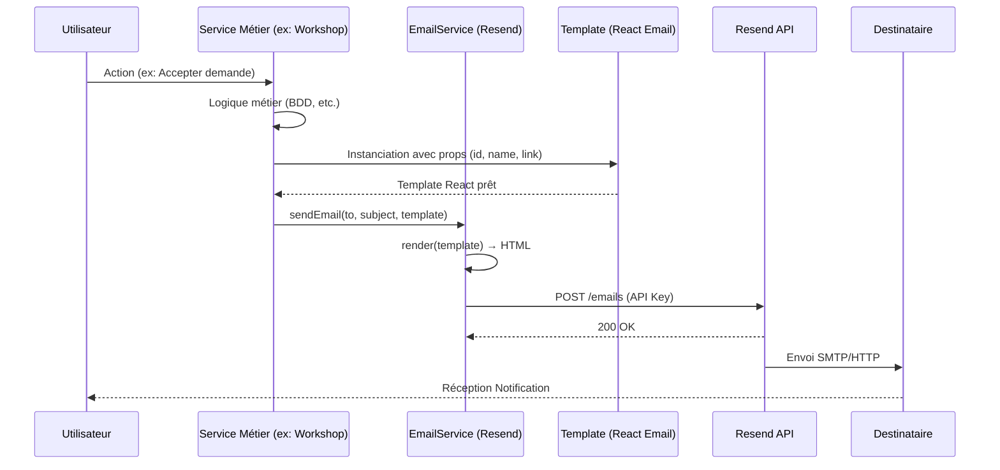
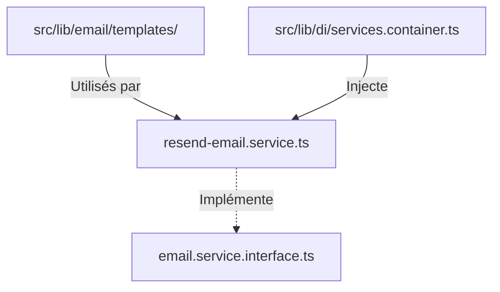

# Architecture des Emails — LearnSup

Ce document détaille le fonctionnement de l'envoi d'emails dans LearnSup, de la création du template à l'expédition finale.

---

## 🛠️ Stack Technique

| Outil | Rôle |
|-------|------|
| **Resend** | Fournisseur de service (API) pour l'envoi des emails. |
| **React Email** | Bibliothèque permettant de coder les templates en React/TypeScript. |
| **Tailwind CSS** | Utilisé à l'intérieur des templates pour le stylisage. |

---

## 🔄 Flux d'envoi d'un email (Cycle de vie)

Ce diagramme illustre le parcours d'une notification email, du déclencheur métier à l'expédition finale.

---

## 🏗️ Structure du Code

L'architecture est centralisée dans `back/src/lib/email/` :

### 1. Templates (`/templates`)
Tous les emails héritent d'un composant commun `EmailLayout.tsx` qui assure la cohérence visuelle (Header, Footer, Polices, Couleurs).

### 2. Service (`/services`)
Le `ResendEmailService` est le moteur d'envoi. Il gère :
- L'initialisation de l'API Resend.
- La simulation d'envoi en mode développement (log dans la console si `SEND_EMAIL !== 'true'`).
- La validation des destinataires et du contenu.

### 3. Injection de Dépendances (DI)
Le service d'email est injecté dans les autres services métier via le `ServicesContainer`.
*Exemple :* `WorkshopService`, `AuthService`, `ExportDataService`.

---

## 🔄 Flux d'envoi d'un email

Voici comment un email est envoyé (ex: Export de données) :

1.  **Action** : L'utilisateur clique sur "Exporter" dans le front.
2.  **Service Métier** : `ExportDataService.sendExportEmail()` est appelé.
3.  **Rendu** : Le service utilise `render()` de `@react-email/components` pour transformer le template React en HTML.
4.  **Expédition** : `EmailService.sendEmail()` est appelé avec le HTML généré.

---

## 📝 Liste des Templates

| Fichier | Déclencheur |
|---------|-------------|
| `WelcomeEmail` | Inscription d'un nouvel utilisateur. |
| `AuthMagicLinkEmail` | Demande de connexion sans mot de passe. |
| `AuthPasswordResetEmail` | Demande de réinitialisation de mot de passe. |
| `WorkshopReminder` | Rappel 24h avant un atelier (Cron job). |
| `WorkshopRequestAccepted` | Un mentor accepte une demande de participation. |
| `WorkshopRequestReceived` | Notification au mentor lors d'une nouvelle demande. |
| `MentorProfileStatus` | Approbation ou refus du profil mentor par l'admin. |
| `TippingReceived` | Notification au mentor lors de la réception d'un pourboire. |
| `AccountDeletionConfirmed` | Confirmation finale de suppression de compte (RGPD). |
| `UserDataExportEmail` | Export RGPD prêt pour le téléchargement. |
| `CreditPurchaseConfirmation` | Achat de crédits réussi (Webhook Polar). |
| `NewMessageEmail` | Notification de nouveau message (si hors ligne). |

---

## 🔒 Sécurité & Bonnes Pratiques

1.  **Variables d'environnement** : `RESEND_API_KEY` et `RESEND_FROM_EMAIL` doivent être configurées.
2.  **Mode Simulation** : En développement, réglez `SEND_EMAIL=false` pour voir le contenu des mails dans les logs sans consommer de quota Resend.
3.  **RGPD** : Les liens sensibles (export, reset password) doivent avoir une expiration courte (gérée en base de données).
4.  **Images** : Les images dans les emails doivent être hébergées sur un CDN public (Cloudinary).

---

## 🚀 Comment ajouter un nouveau template ?

1.  Créer le fichier `.tsx` dans `lib/email/templates/` en utilisant `EmailLayout`.
2.  Ajouter les props nécessaires à l'interface du template.
3.  Importer le template dans le service métier concerné.
4.  Utiliser `render(React.createElement(MonTemplate, { ...props }))` pour générer le HTML.
5.  Appeler `emailService.sendEmail()`.
