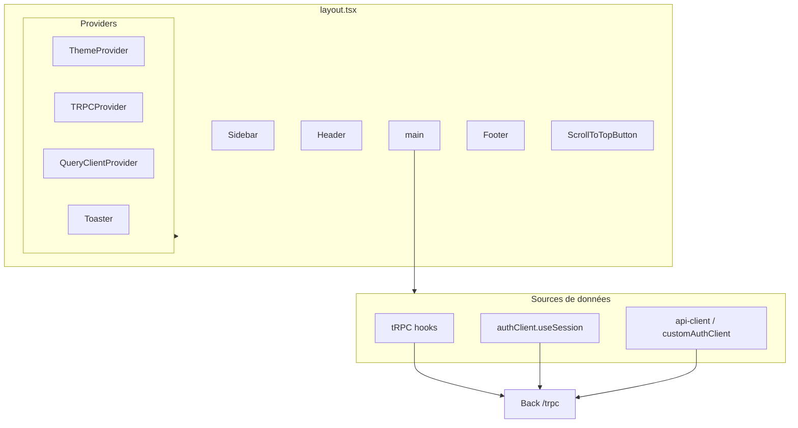
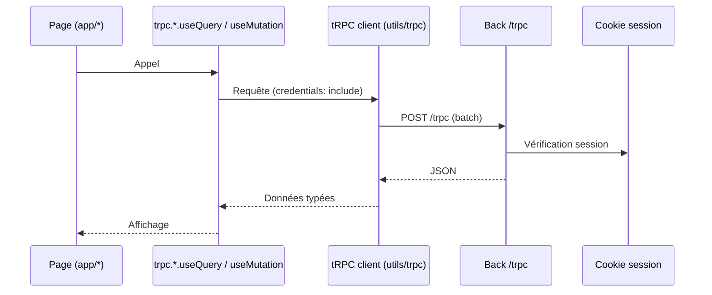
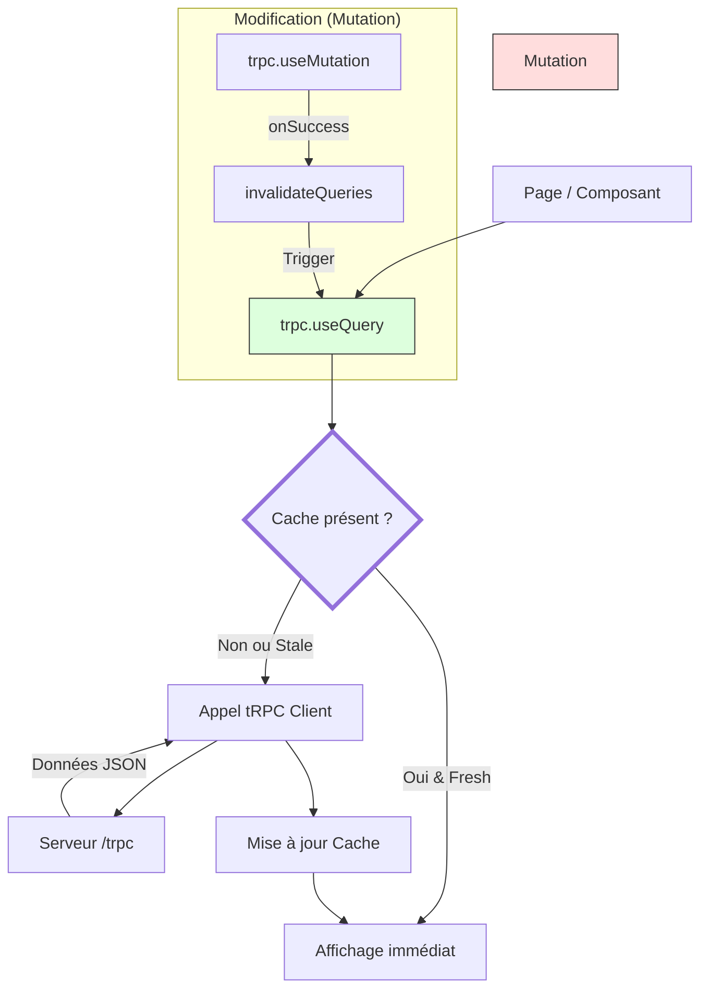
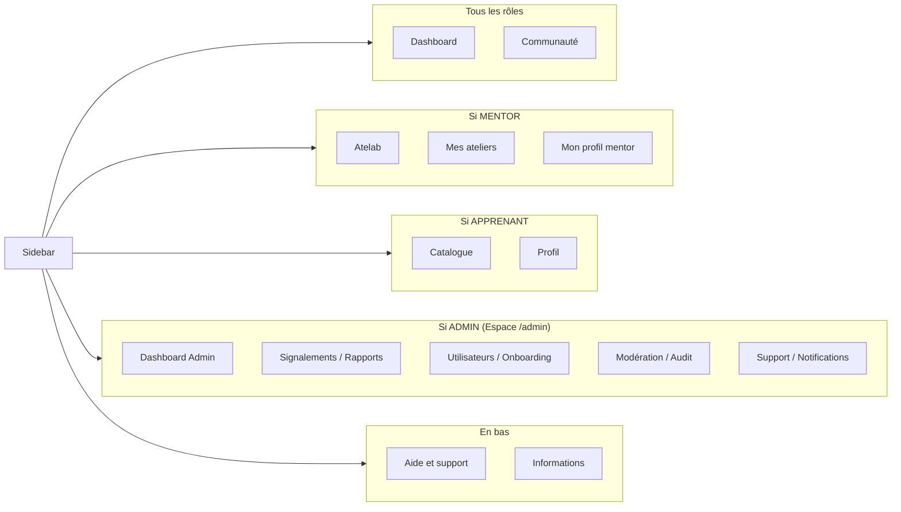
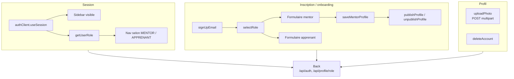
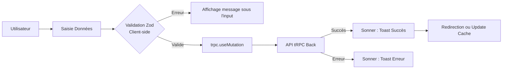
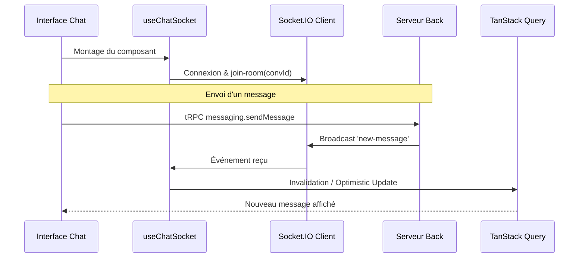

# Front — Application LearnSup

Application Next.js (client) : pages, UI, appels API via tRPC, authentification Better Auth et routes custom (onboarding, profil).

---

## Schéma de l’application



Flux typique (échanges) :



---

## 🔄 Cycle de vie des données (Cache & Mutations)

L'application utilise **TanStack Query** piloté par **tRPC** pour synchroniser l'état du serveur avec l'interface utilisateur.



---

## Stack

- **Next.js 16** (App Router)
- **React 19**
- **tRPC** (client) + **TanStack Query** — appels API type-safe, cache, toasts d’erreur sur échec
- **Better Auth** — client d’authentification (session, login) ; basePath `/api/auth`
- **Tailwind CSS 4** — styles (variables CSS `--primary-orange`, `--primary-purple`, etc.)
- **shadcn/ui** (Radix) — boutons, cartes, dialogs, dropdowns, inputs, etc.
- **Lucide React** — icônes
- **Zod** — validation (formulaires, schémas partagés avec le back dans `shared/`)
- **Daily.co** (daily-js) — visio pour les ateliers (rejoindre une salle)
- **Socket.io client** — temps réel (notifications, messagerie)
- **React Hook Form** + **TanStack Form** — formulaires
- **next-themes** — thème clair/sombre (classe `dark` sur la racine)
- **Sonner** — toasts
- **Police** : Omnes (chargée dans `index.css`)

Le client tRPC pointe vers `NEXT_PUBLIC_SERVER_URL/trpc` avec `credentials: "include"`. Le type du router est importé depuis un stub local `@/types/trpc-router` (pas d’import direct depuis le back pour le build).

---

## Structure des dossiers

- **`src/app/`** — Routes (App Router). Chaque route = un dossier avec `page.tsx` ; `layout.tsx` à la racine enveloppe toute l’app (Providers, Sidebar, Header, Footer, ScrollToTopButton). Onboarding : `onboarding/` avec composants (RoleSelectionStep, ProfFormStep, ApprenantCompleteStep), hooks (`useOnboarding`), schémas. Pages d’erreur : `not-found.tsx` (404), `error.tsx` (500), `forbidden.tsx` (403), `405/page.tsx` (405).
- **`src/components/`** — Composants organisés par domaine :
  - `ui/` — Design system shadcn (boutons, cartes, dialogs, inputs, avatar, tabs, etc.).
  - `layout/` — PageContainer, PageHeader, PageCard, SectionSidebar.
  - `header.tsx`, `sidebar.tsx`, `footer.tsx`, `back-button.tsx` — Shell de l'app.
  - `apprentice/` — Dashboard et ateliers apprenant (ApprenticeSidebar, UpcomingWorkshopsCard, AvailableWorkshopsGrid, ApprenticeWorkshopDashboard).
  - `dashboard/` — Dashboards (ApprenantDashboard, ApprenantDashboardSidebar, MentorDashboard, FloatingAddButton).
  - `messaging/` — Messagerie (ChatWindow, ChatHeader, ConversationList, ConversationRow, NewConversationDialog, ReplyPreview, MessageReactions).
  - `mentor/` — Dialogues et feedbacks mentor (ContactMentorDialog, RequestWorkshopDialog, RequestWorkshopParticipationDialog, MentorFeedbacks, MentorWorkshopsList).
  - `mentor-profile/` — Formulaire profil mentor (BasicInformationSection, SocialMediaSection, TagListSection, PublicationSection, schema/constantes).
  - `profil/` — Formulaire profil apprenant (ProfilePhotoUpload, ProfilePreviewCard, IceBreakerTagsSection).
  - `settings/` — Sections paramètres (PersonalInformationSection, ChangePasswordSection, ChangeEmailSection, BlockedUsersSection, DeleteAccountSection, NotificationsSection, SystemSettingsSection, etc.).
  - `my-workshops/` — Gestion ateliers mentor (CalendarSection, NextWorkshopBanner, WorkshopFiltersBar).
  - `workshop/`, `workshop-editor/` — Détail et éditeur d'atelier.
  - `user/` — Composants transversaux (BlockUserDialog, ReportUserDialog).
  - `community/` — Hub communauté : DealsGrid, EventsHubGrid, EventsTabs, MemberDirectory, ProposeDealForm, ProposeEventForm, ProposeSpotForm, SpotFinder, CommunityPoll, ImpactStats.
  - `network/`, `faq/` — Réseau et FAQ.
- **`src/lib/`** — Clients et config : `auth-client.ts` (Better Auth + customAuthClient pour sign-up, onboarding, profil mentor, upload photo, suppression de compte), `api-client.ts` (API_BASE_URL, authenticatedFetch, getMentorProfile, getUserRole), `utils.ts` (cn, etc.).
- **`src/utils/trpc.ts`** — Création du client tRPC et du QueryClient (gestion des erreurs auth, toasts).
- **`src/components/providers.tsx`** — ThemeProvider, TRPCProvider, QueryClientProvider, Toaster.
- **`src/shared/`** — Validation et constantes partagées avec le back (Zod, password, workshop, file, date).
- **`src/hooks/`** — Hooks React : `useDashboard` (données dashboard apprenant/mentor, rôles, ateliers), `useMentorProfile` (formulaire profil mentor), `useMyWorkshops` (gestion ateliers mentor), `useChatSocket` (socket.io messagerie), `useOnboarding` (onboarding), `use-password-form`, `use-photo-upload`.
- **`src/types/`** — Types TS (workshop, trpc-router stub).

---

## Routes (pages) principales

- **Publiques** : `/` (accueil), `/login` (email/mot de passe ou magic link), `/forgot-password`, `/reset-password`, `/verify-email-change`, `/legal`, `/terms`, `/privacy`, `/help`, `/info`.
- **Auth / onboarding** : `/onboarding` (choix de rôle, formulaire mentor ou apprenant).
- **Espace utilisateur** : `/dashboard`, `/my-profile`, `/profil`, `/mentor-profile`, `/settings` (profil, mot de passe, email, blocages, suppression de compte).
- **Ateliers** : `/workshops`, `/workshop/[id]`, `/workshop/[id]/join-video`, `/workshop-editor`, `/my-workshops`, `/catalog`, `/paliers`, `/buy-credits`.
- **Mentors / catalogue** : `/mentors`, `/mentors/[mentorId]` (profil public avec connexion réseau, demande d’atelier, feedbacks, liste d’ateliers), `/apprentice/[userId]`.
- **Communauté** : `/community` (Hub : Events Hub, ateliers mentorat, bons plans, Spot Finder, sondage, annuaire membres).
- **Réseau & messagerie** : `/network`, `/inbox`, `/inbox/[conversationId]`.
- **Notifications** : `/notifications`.
- **Support** : `/support-request`.
- **Admin** : `/admin` (dashboard), `/admin/users` (gestion avec bulk actions), `/admin/users/[id]` (Fiche 360°), `/admin/community` (modération propositions et création directe), `/admin/feedback-moderation`, `/admin/audit-logs`, `/admin/user-reports`, `/admin/support` (threadé), `/admin/onboarding`, `/admin/notifications`, `/admin/notifications/bulk` (moteur de segmentation), `/admin/settings`.
- **Erreurs** : 404 (not-found), 500 (error), 403 (forbidden), 405 (`/405`).

Navigation connectée (sidebar) selon le rôle — entrées de menu :



- **ADMIN** : la sidebar principale (utilisateur) est masquée ; les admins accèdent à l’interface admin via `/admin` qui possède sa propre configuration de sidebar (`ADMIN_NAV_ITEMS`). Elle regroupe : Dashboard, Signalements, Modération, Utilisateurs, Support, Communauté.
- **Catalogue** (APPRENANT) : sous-navigation Live (`/catalog/live`), Replay (`/catalog/replay`), Prochains ateliers (`/catalog/upcoming`). Ces sous-routes peuvent rediriger vers la page principale selon l’implémentation.

Voir `src/components/sidebar.tsx` et `src/app/admin/layout.tsx`.

---

## Authentification et profil



- **Session** : `authClient.useSession()` (Better Auth). Si pas de session (ou sur `/login`), la sidebar ne s’affiche pas.
- **Magic link** : `trpc.auth.requestMagicLink.useMutation` envoie un lien par email ; l’utilisateur clique et est redirigé vers `/api/auth/magic-link-callback` puis `/dashboard`.
- **Rôle** : `getUserRole()` (api-client) → `"MENTOR" | "APPRENANT" | "ADMIN" | null`. Utilisé pour la nav et l’affichage conditionnel. Si ADMIN, redirection vers `/admin` et sidebar principale masquée.
- **Inscription / onboarding** : `customAuthClient.signUpEmail`, `customAuthClient.selectRole`, puis formulaires spécifiques (mentor ou apprenant). Mentor : `customAuthClient.saveMentorProfile`, `customAuthClient.publishProfile` / `unpublishProfile`.
- **Photo de profil** : `customAuthClient.uploadPhoto` (POST multipart vers le back).
- **Suppression de compte** : `customAuthClient.deleteAccount(reason?)`.

---

## 🧭 Flux d'Onboarding (Activation de compte)

Ce diagramme illustre le parcours d'un nouvel utilisateur jusqu'à l'accès à son dashboard.

```mermaid
flowchart TD
    Start[Inscription /login] --> Session[Session Créée]
    Session --> CheckRole{Rôle présent ?}
    CheckRole -->|Non| Onboarding[/onboarding]
    Onboarding --> Selection[Sélection MENTOR ou APPRENANT]
    Selection --> Form[Formulaire spécifique profil]
    Form --> Submit[Soumission API]
    Submit --> Success[Statut ACTIVE & Rôle fixé]
    Success --> Dashboard[/dashboard]
    CheckRole -->|Oui| Dashboard
```

---

## 📝 Pattern de Formulaire (Validation & Soumission)

L'application suit un pattern strict pour tous les formulaires (Profil, Ateliers, Paramètres).



---

## 💬 Flux Messagerie & Temps Réel (Socket.IO)

Comment l'interface réagit aux événements live sans rechargement.



---

## Variables d’environnement

Fichier : `front/.env` (voir `front/.env.example`).

- **`NEXT_PUBLIC_SERVER_URL`** — URL du back (ex. `http://localhost:3000`). Utilisée par le client tRPC et par `auth-client` / `api-client` pour les appels API. Obligatoire en prod.

---

## Scripts (depuis la racine du repo)

- `pnpm dev:front` — Démarre le front en dev (port 3001).
- `pnpm dev` — Démarre front et back (Turborepo).

Build : `pnpm build` (à la racine lance le build des workspaces).

---

## Documentation

- [Architecture](architecture.md)
- [Back](back.md)
