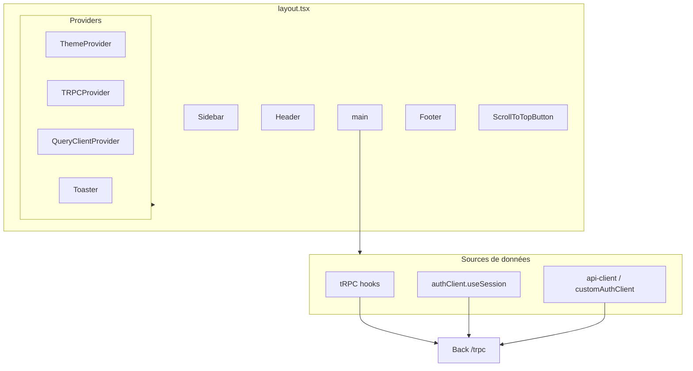
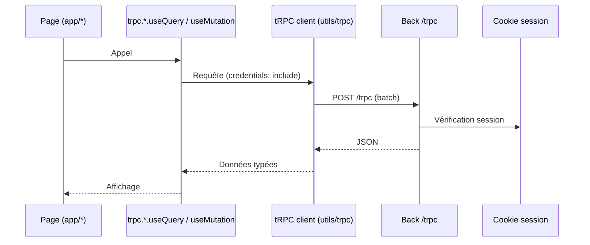
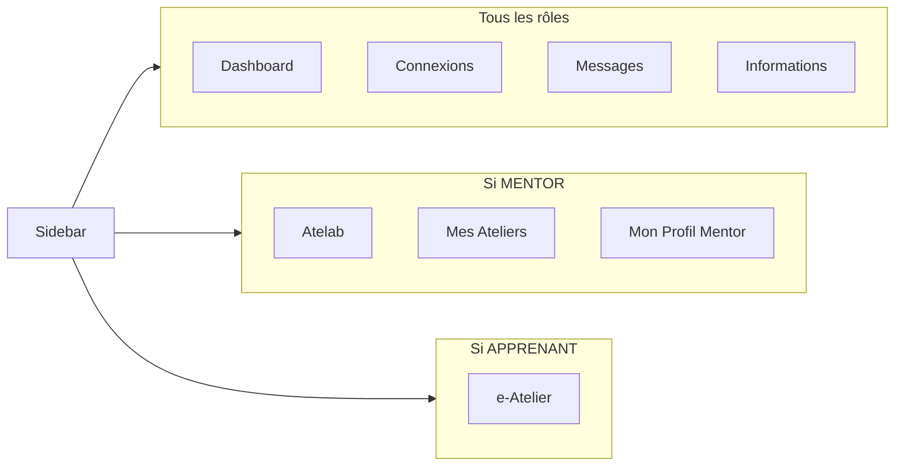
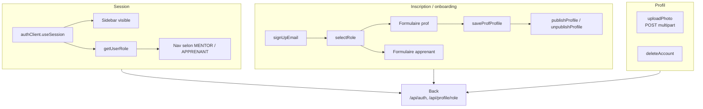

# Front — Application LearnSup

Application Next.js (client) : pages, UI, appels API via tRPC, authentification Better Auth et routes custom (onboarding, profil).

---

## Schéma de l’application

Flux typique (échanges) :

---

## Stack

- **Next.js 16** (App Router)
- **React 19**
- **tRPC** (client) + **TanStack Query** — appels API type-safe, cache, toasts d’erreur sur échec
- **Better Auth** — client d’authentification (session, login) ; basePath `/api/auth`
- **Tailwind CSS 4** — styles (variables CSS `--primary-orange`, `--primary-purple`, etc.)
- **shadcn/ui** (Radix) — boutons, cartes, dialogs, dropdowns, inputs, etc.
- **Lucide React** — icônes
- **Zod** — validation (formulaires, schémas partagés avec le back dans `shared/`)
- **Daily.co** (daily-js) — visio pour les ateliers (rejoindre une salle)
- **Socket.io client** — temps réel (notifications, messagerie)
- **React Hook Form** + **TanStack Form** — formulaires
- **next-themes** — thème clair/sombre (classe `dark` sur la racine)
- **Sonner** — toasts
- **Police** : Omnes (chargée dans `index.css`)

Le client tRPC pointe vers `NEXT_PUBLIC_SERVER_URL/trpc` avec `credentials: "include"`. Le type du router est importé depuis un stub local `@/types/trpc-router` (pas d’import direct depuis le back pour le build).

---

## Structure des dossiers

- **`src/app/`** — Routes (App Router). Chaque route = un dossier avec `page.tsx` ; `layout.tsx` à la racine enveloppe toute l’app (Providers, Sidebar, Header, Footer, ScrollToTopButton). Pages d’erreur : `not-found.tsx` (404), `error.tsx` (500), `forbidden.tsx` (403), `405/page.tsx` (405).
- **`src/components/`** — Composants : `ui/` (design system shadcn), `layout/` (PageContainer, PageHeader), `header.tsx`, `sidebar.tsx`, `footer.tsx`, composants métier (workshop, messaging, dashboard, mentor, settings, etc.).
- **`src/lib/`** — Clients et config : `auth-client.ts` (Better Auth + customAuthClient pour sign-up, onboarding, profil prof, upload photo, suppression de compte), `api-client.ts` (API_BASE_URL, authenticatedFetch, getProfProfile, getUserRole), `utils.ts` (cn, etc.).
- **`src/utils/trpc.ts`** — Création du client tRPC et du QueryClient (gestion des erreurs auth, toasts).
- **`src/components/providers.tsx`** — ThemeProvider, TRPCProvider, QueryClientProvider, Toaster.
- **`src/shared/`** — Validation et constantes partagées avec le back (Zod, password, workshop, file, date).
- **`src/hooks/`** — Hooks React (ex. use-password-form).
- **`src/types/`** — Types TS (workshop, trpc-router stub).

---

## Routes (pages) principales

- **Publiques** : `/` (accueil), `/login`, `/forgot-password`, `/reset-password`, `/verify-email-change`, `/legal`, `/terms`, `/privacy`, `/help`, `/info`.
- **Auth / onboarding** : `/onboarding` (choix de rôle, formulaire prof ou apprenant).
- **Espace utilisateur** : `/dashboard`, `/my-profile`, `/profil`, `/mentor-profile`, `/settings` (profil, mot de passe, email, blocages, suppression de compte).
- **Ateliers** : `/workshops`, `/workshop/[id]`, `/workshop/[id]/join-video`, `/workshop-editor`, `/my-workshops`, `/workshop-room`, `/paliers`, `/buy-credits`.
- **Mentors / catalogue** : `/mentors`, `/mentors/[id]`, `/apprentice/[userId]`.
- **Réseau & messagerie** : `/network`, `/inbox`, `/inbox/[conversationId]`.
- **Notifications** : `/notifications`.
- **Support** : `/support-request`.
- **Admin** : `/admin/feedback-moderation`.
- **Erreurs** : 404 (not-found), 500 (error), 403 (forbidden), 405 (`/405`).

Navigation connectée (sidebar) selon le rôle — entrées de menu :

Voir `src/components/sidebar.tsx`.

---

## Authentification et profil

- **Session** : `authClient.useSession()` (Better Auth). Si pas de session (ou sur `/login`), la sidebar ne s’affiche pas.
- **Rôle** : `getUserRole()` (api-client) → `"MENTOR" | "APPRENANT" | null`. Utilisé pour la nav et l’affichage conditionnel.
- **Inscription / onboarding** : `customAuthClient.signUpEmail`, `customAuthClient.selectRole`, puis formulaires spécifiques (prof ou apprenant). Prof : `customAuthClient.saveProfProfile`, `customAuthClient.publishProfile` / `unpublishProfile`.
- **Photo de profil** : `customAuthClient.uploadPhoto` (POST multipart vers le back).
- **Suppression de compte** : `customAuthClient.deleteAccount(reason?)`.

---

## Variables d’environnement

Fichier : `front/.env` (voir `front/.env.example`).

- **`NEXT_PUBLIC_SERVER_URL`** — URL du back (ex. `http://localhost:3000`). Utilisée par le client tRPC et par `auth-client` / `api-client` pour les appels API. Obligatoire en prod.

---

## Scripts (depuis la racine du repo)

- `pnpm dev:front` — Démarre le front en dev (port 3001).
- `pnpm dev` — Démarre front et back (Turborepo).

Build : `pnpm build` (à la racine lance le build des workspaces).

---

## Documentation

- [Architecture](architecture.md)
- [Back](back.md)
