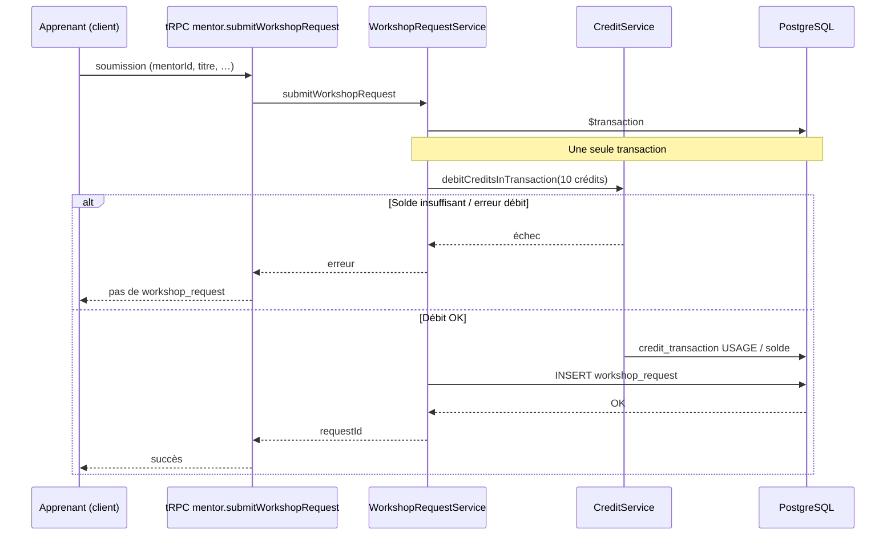
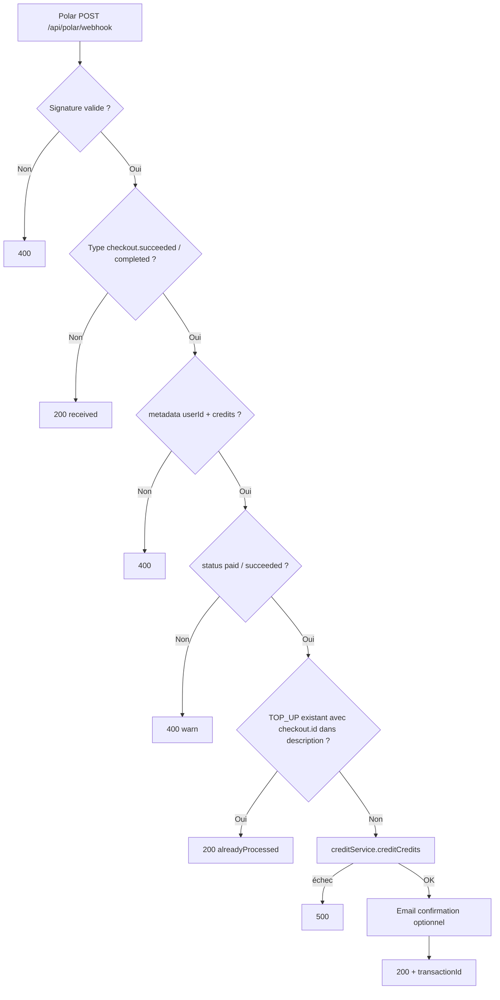
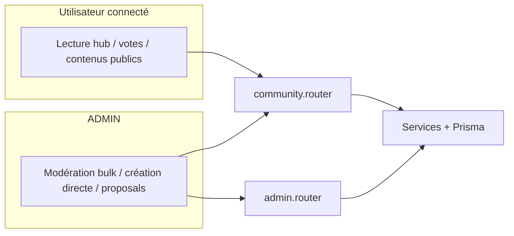
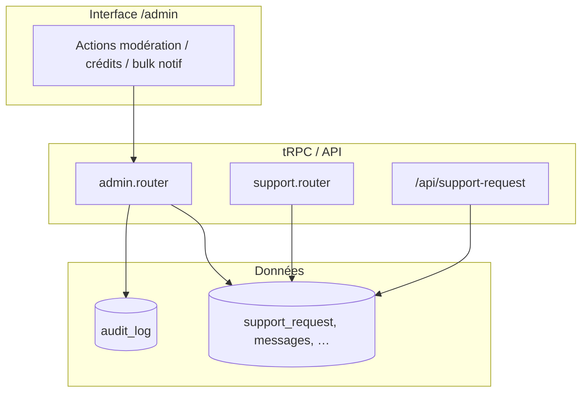
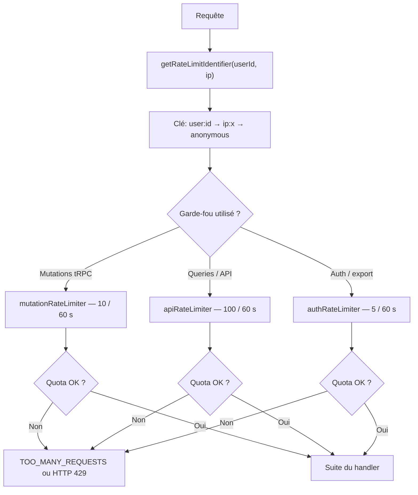

# Métier, limites et exploitation

Complément à [architecture.md](architecture.md) et [reference.md](reference.md) : règles métier utiles au debug, intégrations externes, rate limiting et pistes de dépannage. Le code vit dans le package **`app/`** (Next.js + tRPC + Prisma).

---

## Crédits et demandes d’atelier

- **Coût d’une demande** : **10 crédits** débités en transaction lors de la soumission (`WorkshopRequestService`, constante `WORKSHOP_REQUEST_COST`). Échec du débit → pas de création de `workshop_request`.
- **Remboursements / ajustements** : logique dispersée dans les services atelier et crédits (rejet de demande, annulation, etc.) — voir `CreditService` et flux `mentor.rejectRequest` / annulation dans le code.
- **Paiement Polar → crédits** : webhook `POST /api/polar/webhook` — événements `checkout.succeeded` / `checkout.completed`. Métadonnées requises sur le checkout : **`userId`**, **`credits`** (montant entier > 0). Statut checkout attendu : `paid` ou `succeeded`.
- **Idempotence Polar** : avant crédit, recherche d’une transaction `TOP_UP` existante dont la description contient l’**id du checkout** ; si trouvée → réponse `alreadyProcessed: true` (évite un double crédit si Polar renvoie le même webhook).
- **Échecs** : signature invalide → 400 ; métadonnées manquantes → 400 ; `creditService.creditCredits` en échec → 500 (à surveiller en logs).

### Schéma — soumission demande d’atelier (débit 10 crédits)

### Schéma — webhook Polar → crédit compte (idempotence)

---

## Communauté (`community` tRPC)

- Router : `app/src/routers/social/community.router.ts` — hub, votes, propositions, modération (dont actions bulk côté admin).
- **Rôles** : la plupart des actions nécessitent une session ; création / modération avancée réservée aux **ADMIN** selon les procédures (voir `adminProcedure` dans les routers admin).
- Pour le détail des procédures exposées : [reference.md](reference.md) § API (tRPC).

### Schéma — accès simplifié (communauté vs admin)

---

## Admin, audit et support

- **Admin** : router `app/src/routers/admin/admin.router.ts` — stats, onboarding, utilisateurs, Fiche 360°, crédits, notifications segmentées, bulk, etc.
- **Audit** : actions sensibles enregistrées via `AuditLogService` (voir schéma `audit_log`).
- **Support** : router `support` + routes `/api/support-request` — fils threadés côté produit.

### Schéma — pistes d’audit et support

---

## Rate limiting (tRPC et API)

- Implémentation : `app/src/lib/rate-limit/` — `rate-limiter-flexible`, stockage **PostgreSQL** si pool disponible, sinon **mémoire** (dev).
- **Mutations tRPC** (`rateLimitMutation`) : **10** requêtes / **60 s** par identifiant (`user:{id}` ou `ip:…`).
- **Requêtes lourdes / API** (`rateLimitQuery`) : **100** / **60 s**.
- **Auth / export** (`authRateLimiter` dans `rate-limit.ts`) : **5** / **60 s** — utilisé sur les flux sensibles (voir [security.md](security.md)).
- Réponse typique : erreur tRPC `TOO_MANY_REQUESTS` avec délai conseillé ; routes REST peuvent renvoyer **429** avec en-têtes `X-RateLimit-*` (`applyRateLimit`).

### Schéma — identifiant puis bon limiteur (fenêtre 60 s)

Même **clé** (`user:…`, `ip:…` ou `anonymous`) pour tous les limiteurs ; selon la route, un seul limiteur est consulté.

---

## Variables d’environnement (rappel)

- **Source de vérité commitée** : `app/.env.example` (variables publiques front). Les secrets (`DATABASE_URL`, `BETTER_AUTH_*`, `CRON_SECRET`, `DAILY_*`, `POLAR_*`, `RESEND_*`, `CLOUDINARY_*`, etc.) sont documentés dans l’équipe / hébergeur — ne pas les commiter.
- **CORS** : `CORS_ORIGIN` doit inclure l’origine du front (ex. `http://localhost:3001` en dev).

---

## Dépannage rapide

| Symptôme | Pistes |
|----------|--------|
| Pas de salle Daily / pas de `dailyRoomId` | Cron `GET/POST /api/cron/generate-video-links` (secret `CRON_SECRET`) ; atelier **virtuel**, **publié**, sans salle, début dans les **12 h** ; clés `DAILY_*` valides. |
| Visio “accès refusé” sur Daily | Vérifier **`nbf` / `exp`** de la room (créneau atelier) ; rooms anciennes peuvent avoir une config obsolète jusqu’à recréation. |
| Crédits Polar non attribués | Logs webhook ; signature `polar-signature` / `x-polar-signature` ; métadonnées `userId` + `credits` ; doublon idempotent (déjà traité). |
| 429 sur tRPC | Rate limit — espacer les appels ou authentifier (identifiant user). |
| Migrations prod | `app/start.sh` exécute `prisma migrate deploy` si `NODE_ENV=production`. |

---

## Tests (Vitest)

- Les tests unitaires actuels sont principalement sous **`app/__tests__/units/`** (pas de dossier `back/__tests__` dans ce monorepo).
- Lancer : `pnpm test` ou `pnpm test:coverage` à la racine (Turborepo → workspace `app`).

---

## Liens

- [Arborescence](arborescence.md) — chemins `app/src/…`
- [Procédures](procedure.md) — DB, crons, déploiement
- [Back (API)](back.md) — entrée HTTP, routers, stack
