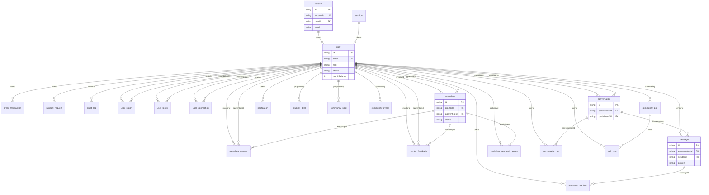

# Modèle Physique de Données (MPD)

Modèle physique PostgreSQL — tables, colonnes, types, clés et index.

**Emplacement du schéma** : `back/.prisma/schema/schema.prisma` (configuré dans `back/package.json`).

---

## Schéma visuel (ER)

---

## Vue d'ensemble

| Table                    | Rôle principal                                      |
| ------------------------ | --------------------------------------------------- |
| `account`                | Comptes auth (Better Auth)                          |
| `session`                | Sessions utilisateur                               |
| `user`                   | Utilisateurs (profil, rôle, crédits)               |
| `credit_transaction`     | Historique crédits (TOP_UP, USAGE, REFUND)         |
| `support_request`        | Demandes support                                   |
| `audit_log`              | Logs admin                                          |
| `user_report`            | Signalements utilisateurs                          |
| `user_block`             | Blocages entre utilisateurs                        |
| `user_connection`        | Connexions mentor-apprenant                        |
| `workshop`               | Ateliers (créés par mentor)                         |
| `workshop_request`       | Demandes d'atelier                                  |
| `mentor_feedback`        | Feedbacks après atelier                             |
| `conversation`           | Conversations messagerie                             |
| `message`                | Messages                                            |
| `message_reaction`       | Réactions sur messages                              |
| `notification`           | Notifications in-app                                |
| `magic_link_token`       | Tokens magic link                                   |
| `deletion_job`           | Jobs de suppression (rétention 30j)                 |
| `workshop_cashback_queue`| File cashback                                       |
| `conversation_pin`       | Épinglages conversation                             |
| `student_deal`           | Bons plans communauté                               |
| `community_spot`         | Lieux recommandés                                  |
| `community_event`        | Événements communauté                               |
| `community_poll`         | Sondages communauté                                 |
| `poll_vote`              | Votes sondages                                      |

---

## Tables détaillées

### Auth (Better Auth)

**account**
| Colonne                 | Type      | Contraintes        | Description                    |
| ----------------------- | --------- | ------------------- | ------------------------------ |
| id                      | String    | PK                  | CUID                           |
| accountId               | String    | UNIQUE              | Identifiant Better Auth        |
| userId                  | String    | FK → user.id        | Utilisateur lié                |
| providerId              | String    | DEFAULT 'credential'|                                |
| email                   | String?   | UNIQUE              |                                |
| isEmailVerified         | Boolean   | DEFAULT false       |                                |
| password                | String?   |                     | Hash mot de passe              |
| failedLoginAttempts     | Int       | DEFAULT 0           |                                |
| isLocked                | Boolean   | DEFAULT false       |                                |
| lockoutTime             | DateTime? |                     |                                |
| lastLogin               | DateTime  | DEFAULT now()       |                                |
| createdAt, updatedAt    | DateTime  |                     |                                |
| emailChangeToken, emailChangeNewEmail, emailChangeTimestamp | | | |
| passwordResetToken, passwordResetTimestamp | | | |

Index : `userId`

---

**session**
| Colonne     | Type      | Contraintes | Description |
| ----------- | --------- | ----------- | ----------- |
| id          | String    | PK          | CUID        |
| expiresAt   | DateTime  |             |             |
| token       | String    | UNIQUE      |             |
| createdAt, updatedAt | DateTime | | |
| ipAddress, userAgent | String? | | |
| userId      | String    | FK → user.id | |

Index : `userId`

---

### Utilisateurs

**user**
| Colonne              | Type      | Contraintes | Description                    |
| -------------------- | --------- | ----------- | ------------------------------ |
| id                   | String    | PK          | CUID                           |
| userId               | String?   | UNIQUE      | Identifiant métier             |
| name                 | String    |             |                                |
| email                | String    | UNIQUE      |                                |
| emailVerified        | Boolean   | DEFAULT false |                              |
| image                | String?   |             |                                |
| username, displayUsername | String? | UNIQUE (username) |           |
| onboardingStep       | Int       | DEFAULT 0   |                                |
| role                 | String?   |             | MENTOR, APPRENANT, ADMIN       |
| status               | String    | DEFAULT PENDING | PENDING, ACTIVE, BLOCKED   |
| creditBalance        | Int       | DEFAULT 0   |                                |
| title                 | String    | DEFAULT Explorer |                         |
| isOnline             | Boolean   | DEFAULT false |                              |
| lastSeen             | DateTime? |             |                                |
| deletionReason       | String?   |             |                                |
| photoUrl, displayName, bio | String? | | Profil mentor              |
| domain, areasOfExpertise, mentorshipTopics | | | |
| qualifications, experience | String? | | |
| socialMediaLinks     | Json?     |             |                                |
| calendlyLink         | String?   |             |                                |
| studyDomain, studyProgram | String? | | Apprenant                 |
| iceBreakerTags       | String[]  |             |                                |
| isPublished          | Boolean   | DEFAULT false | Profil publié              |
| publishedAt          | DateTime? |             |                                |
| emailNotifications, inAppNotifications | Boolean | DEFAULT true | |
| createdAt, updatedAt | DateTime  |             |                                |
| deletedAt, deletionRequestedAt | DateTime? | | Soft delete            |

Index : `userId`

---

### Crédits et support

**credit_transaction**
| Colonne   | Type   | Contraintes | Description              |
| --------- | ------ | ----------- | ------------------------ |
| id        | String | PK          | CUID                     |
| userId    | String | FK → user   |                          |
| amount    | Int    |             | Positif ou négatif       |
| description | String |           |                          |
| type      | Enum   |             | TOP_UP, USAGE, REFUND    |
| createdAt | DateTime |           |                          |

Index : `userId`

---

**support_request**
| Colonne     | Type    | Contraintes | Description        |
| ----------- | ------- | ----------- | ------------------ |
| id          | String  | PK          | CUID               |
| userId      | String? | FK → user   |                    |
| email       | String  |             |                    |
| subject     | String  |             |                    |
| description | String  |             |                    |
| problemType | String  |             |                    |
| status      | String  | DEFAULT PENDING | PENDING, IN_PROGRESS, RESOLVED, CLOSED |
| attachments | Json?   |             |                    |
| createdAt, updatedAt | DateTime | |              |

Index : `userId`

---

### Modération

**audit_log**
| Colonne   | Type    | Contraintes | Description |
| --------- | ------- | ----------- | ----------- |
| id        | String  | PK          | CUID        |
| action    | String  |             |             |
| adminId   | String  | FK → user   |             |
| targetId  | String? |             |             |
| details   | Json    |             |             |
| createdAt | DateTime |           |             |

Index : `adminId`

---

**user_report**
| Colonne        | Type    | Contraintes | Description                    |
| -------------- | ------- | ----------- | ------------------------------ |
| id             | String  | PK          | CUID                           |
| reporterUserId | String  | FK → user   |                                |
| reportedUserId | String  | FK → user   |                                |
| reason         | String  |             |                                |
| details        | String? |             |                                |
| messageId      | String? |             |                                |
| status         | String  | DEFAULT PENDING | PENDING, REVIEWED, RESOLVED, DISMISSED |
| adminNotes     | String? |             |                                |
| reviewedAt     | DateTime? |           |                                |
| reviewedById   | String? | FK → user   |                                |
| createdAt, updatedAt | DateTime | |                        |

Index : `reporterUserId`, `reportedUserId`, `reviewedById`

---

**user_block**
| Colonne  | Type    | Contraintes | Description |
| -------- | ------- | ----------- | ----------- |
| id       | String  | PK          | CUID        |
| blockerId | String | FK → user   |             |
| blockedId | String | FK → user   |             |
| createdAt | DateTime |           |             |

UNIQUE : `(blockerId, blockedId)`

---

### Connexions et ateliers

**user_connection**
| Colonne    | Type    | Contraintes | Description              |
| ---------- | ------- | ----------- | ------------------------ |
| id         | String  | PK          | CUID                     |
| requesterId | String | FK → user   |                          |
| receiverId | String  | FK → user   |                          |
| status     | String  | DEFAULT PENDING | PENDING, ACCEPTED, REJECTED |
| createdAt, updatedAt | DateTime | |                  |

UNIQUE : `(requesterId, receiverId)`

---

**workshop**
| Colonne   | Type    | Contraintes | Description                    |
| --------- | ------- | ----------- | ------------------------------ |
| id        | String  | PK          | CUID                           |
| creatorId | String  | FK → user   | Mentor                         |
| title     | String  |             |                                |
| description, domain, topic | String? | |                         |
| materialsNeeded | String? | |                         |
| status    | String  | DEFAULT DRAFT | DRAFT, PUBLISHED, CANCELLED, COMPLETED |
| creditCost | Int   | DEFAULT 0   |                                |
| maxParticipants | Int  | DEFAULT 10  |                                |
| createdAt, updatedAt, publishedAt | DateTime | |           |
| date, time | DateTime?, String? | |                         |
| duration  | Int?    |             | Minutes                        |
| location  | String? |             |                                |
| isVirtual | Boolean? |            |                                |
| apprenticeId | String? | FK → user | Apprenant assigné           |
| apprenticeAttendanceStatus | String? | |                         |
| dailyRoomId, dailyRoomName, dailyRoomUrl | String? | | Daily.co |
| dailyRoomLastActivityAt | DateTime? | |                         |

Index : `creatorId`, `apprenticeId`

---

**workshop_request**
| Colonne   | Type    | Contraintes | Description              |
| --------- | ------- | ----------- | ------------------------ |
| id        | String  | PK          | CUID                     |
| apprenticeId | String | FK → user   |                          |
| mentorId  | String  | FK → user   |                          |
| workshopId | String? |             | Atelier créé si accepté   |
| title, description, message | String | |                    |
| preferredDate | DateTime? | |                    |
| preferredTime | String? | |                    |
| status    | String  | DEFAULT PENDING | PENDING, ACCEPTED, REJECTED |
| rejectionReason | String? | |                    |
| createdAt, updatedAt | DateTime | |                  |

Index : `apprenticeId`, `mentorId`

---

**mentor_feedback**
| Colonne      | Type    | Contraintes | Description                    |
| ------------ | ------- | ----------- | ------------------------------ |
| id           | String  | PK          | CUID                           |
| mentorId     | String  | FK → user   |                                |
| apprenticeId | String  | FK → user   |                                |
| workshopId   | String  | FK → workshop |                              |
| rating       | Int     |             | 1-5                            |
| comment      | String? |             |                                |
| isAnonymous  | Boolean | DEFAULT false |                             |
| status       | String  | DEFAULT ACTIVE | ACTIVE, UNDER_REVIEW, DELETED |
| reportedAt, reportedBy, reportReason | | | Signalement |
| createdAt, updatedAt | DateTime | |                        |

Index : `mentorId`, `apprenticeId`, `workshopId`

---

### Messagerie

**conversation**
| Colonne        | Type    | Contraintes | Description |
| -------------- | ------- | ----------- | ----------- |
| id             | String  | PK          | CUID        |
| participant1Id | String  | FK → user   |             |
| participant2Id | String  | FK → user   |             |
| workshopId     | String? |             | Contexte atelier |
| createdAt, updatedAt | DateTime | |         |

UNIQUE : `(participant1Id, participant2Id)`

---

**message**
| Colonne       | Type    | Contraintes | Description |
| ------------- | ------- | ----------- | ----------- |
| id            | String  | PK          | CUID        |
| conversationId | String | FK → conversation |     |
| senderId      | String  | FK → user   |             |
| content       | String  |             |              |
| isRead        | Boolean | DEFAULT false |           |
| readAt        | DateTime? |           |             |
| createdAt, updatedAt | DateTime | |         |

Index : `conversationId`

---

**message_reaction**
| Colonne   | Type    | Contraintes | Description |
| --------- | ------- | ----------- | ----------- |
| id        | String  | PK          | CUID        |
| messageId | String | FK → message |            |
| userId    | String  | FK → user   |             |
| emoji     | String  |             |             |
| createdAt | DateTime |           |             |

UNIQUE : `(messageId, userId, emoji)`

---

**notification**
| Colonne   | Type    | Contraintes | Description |
| --------- | ------- | ----------- | ----------- |
| id        | String  | PK          | CUID        |
| userId    | String  | FK → user   |             |
| senderId  | String? |             |             |
| type      | String  |             |             |
| title     | String  |             |             |
| message   | String  |             |             |
| actionUrl | String? |             |             |
| isRead    | Boolean | DEFAULT false |           |
| createdAt, updatedAt | DateTime | |         |

Index : `(userId, createdAt)`, `(userId, type, createdAt)`

---

### Autres

**magic_link_token**
| Colonne   | Type    | Contraintes | Description |
| --------- | ------- | ----------- | ----------- |
| id        | String  | PK          | CUID        |
| userId    | String  |             |             |
| token     | String  | UNIQUE      |             |
| expiresAt | DateTime |           |             |
| createdAt | DateTime |           |             |

Index : `userId`

---

**deletion_job**
| Colonne   | Type    | Contraintes | Description        |
| --------- | ------- | ----------- | ------------------ |
| id        | String  | PK          | CUID                |
| userId    | String  |             |                     |
| runAt     | DateTime |           | Date d'exécution    |
| status    | String  | DEFAULT PENDING | PENDING, COMPLETED, ERROR |
| createdAt, updatedAt | DateTime | |             |

Index : `userId`, `(status, runAt)`

---

**workshop_cashback_queue**
| Colonne            | Type    | Contraintes | Description     |
| ------------------ | ------- | ----------- | --------------- |
| id                 | String  | PK          |                 |
| workshopId         | String  | FK → workshop |               |
| participantUserId  | String  | FK → user   |                 |
| cashbackAmount     | Int     |             |                 |
| workshopEndTime    | DateTime |           |                 |
| status             | Enum    | DEFAULT PENDING | PENDING, PROCESSED, FAILED |
| processedAt        | DateTime? |         |                 |
| createdAt, updatedAt | DateTime | |             |
| retryCount         | Int     | DEFAULT 0   |                 |
| errorMessage       | String? |             |                 |
| lastRetryAt        | DateTime? |           |                 |

Index : `(status, workshopEndTime)`, `workshopId`, `participantUserId`

---

**conversation_pin**
| Colonne        | Type    | Contraintes | Description |
| -------------- | ------- | ----------- | ----------- |
| id             | String  | PK          | CUID        |
| conversationId | String  | FK → conversation |     |
| userId         | String  | FK → user   |             |
| createdAt      | DateTime |           |             |

UNIQUE : `(conversationId, userId)`. Index : `userId`

---

### Communauté

**student_deal**, **community_spot**, **community_event**, **community_poll**
| Colonnes communes | Type    | Description                    |
| ---------------- | ------- | ------------------------------ |
| id               | String  | PK CUID                        |
| proposedById     | String? | FK → user (SetNull)            |
| status           | String  | PENDING, APPROVED, REJECTED   |
| createdAt, updatedAt | DateTime | |                    |

Colonnes spécifiques : title/name, description, category/link/address/date, etc.

---

**poll_vote**
| Colonne   | Type    | Contraintes | Description |
| --------- | ------- | ----------- | ----------- |
| id        | String  | PK          | CUID        |
| pollId    | String  | FK → community_poll |     |
| userId    | String  | FK → user   |             |
| optionId  | String  |             |             |
| createdAt | DateTime |           |             |

UNIQUE : `(pollId, userId)`

---

## Enums

| Enum                  | Valeurs                              |
| --------------------- | ------------------------------------ |
| CreditTransactionType | TOP_UP, USAGE, REFUND                |
| CashbackStatus        | PENDING, PROCESSED, FAILED           |
| FeedbackStatus        | ACTIVE, UNDER_REVIEW, DELETED        |

---

## Références

- Schéma source : `back/.prisma/schema/schema.prisma`
- Diagramme relationnel (ER) : [architecture.md](architecture.md#modèles-de-données-prisma)
- Migrations : `pnpm db:migrate`, `pnpm db:push`
