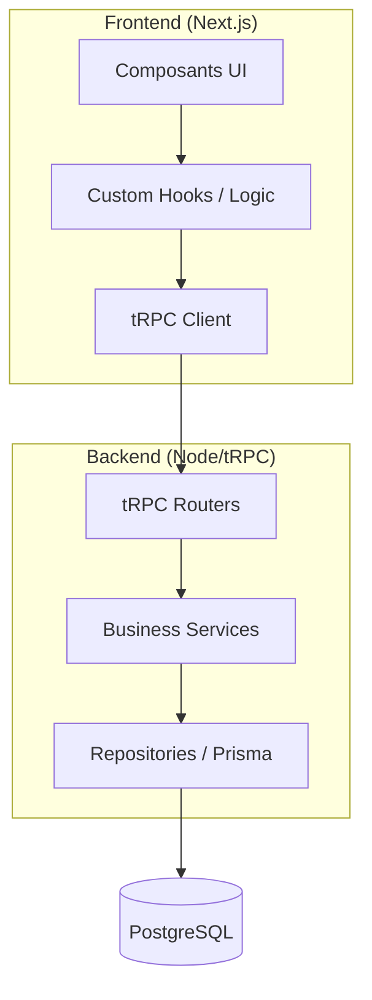
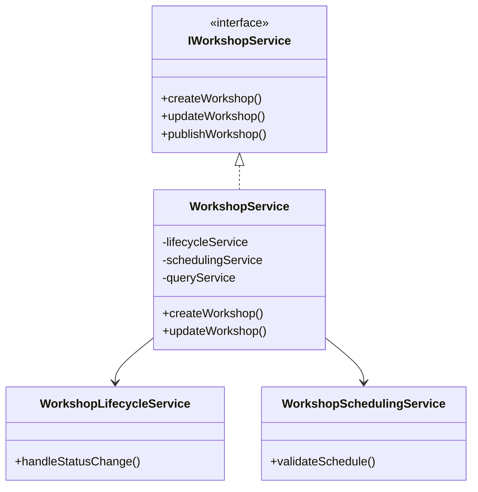
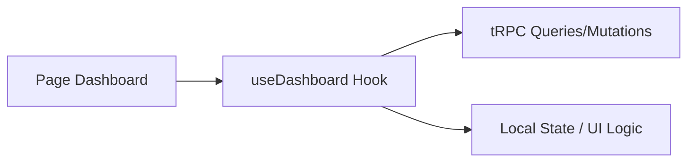
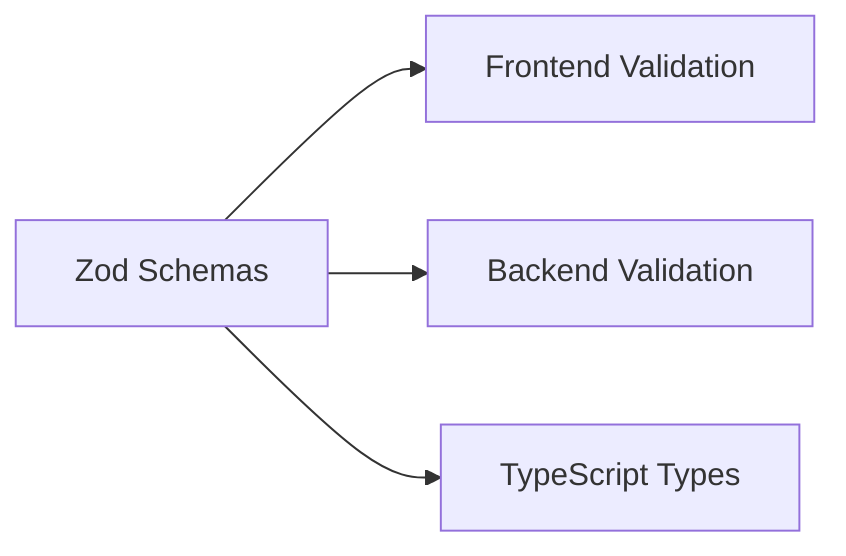

# Design Patterns & Principes de Conception

Ce document répertorie les patterns d'architecture et de conception utilisés dans le projet LearnSup pour assurer sa robustesse, sa testabilité et sa maintenabilité.

---

## 🏗️ Architecture Globale

### Monorepo (Turbo/pnpm)
Gestion unifiée du `front` et du `back` permettant le partage de types TypeScript et de schémas de validation (Zod) entre le client et le serveur.

### Layered Architecture (Architecture en couches)
Séparation stricte des responsabilités :

---

## ⚙️ Patterns Backend

### Facade Pattern (Façade)
Le `WorkshopService` sert de façade unique. Il expose une interface simple au routeur tRPC tout en déléguant la complexité interne à des sous-services spécialisés, respectant ainsi le **SRP (Single Responsibility Principle)**.

### Dependency Injection (DI) & Container
Utilisation d'un conteneur de dépendances (`di/container.ts`) pour l'inversion de contrôle. Les services et repositories sont injectés via leurs interfaces.

### Repository Pattern
Abstraction de la couche de données derrière des interfaces (ex: `IWorkshopRepository`). Cela découple la logique métier de l'implémentation spécifique de la base de données (Prisma/PostgreSQL).

### Result Pattern
Gestion des erreurs de manière fonctionnelle via un objet de retour standardisé (ex: `{ success: true, data: ... }` ou `{ success: false, error: ... }`), traité par le helper `unwrapResult`.

---

## 🎨 Patterns Frontend

### Custom Hooks Pattern
Extraction de la logique d'état et des effets dans des hooks spécialisés (ex: `useDashboard`).

### Component Composition
Construction d'interfaces complexes par assemblage de composants atomiques issus de `src/components/ui`.

### Adapter Pattern
Transformation des données brutes du serveur en formats adaptés à la consommation par l'interface utilisateur.

### Provider Pattern
Utilisation de contextes React pour diffuser des configurations transversales (Auth, Thème, tRPC) sans "prop drilling".

---

## 🔄 Communication & Validation

### RPC (Remote Procedure Call) via tRPC
Communication type-safe de bout en bout entre le front et le back.

### Schema-first Validation (Zod)
Définition de schémas de validation uniques partagés, servant à la fois de validateurs à l'exécution et de définitions de types statiques.

