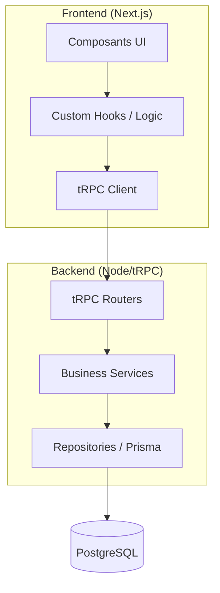
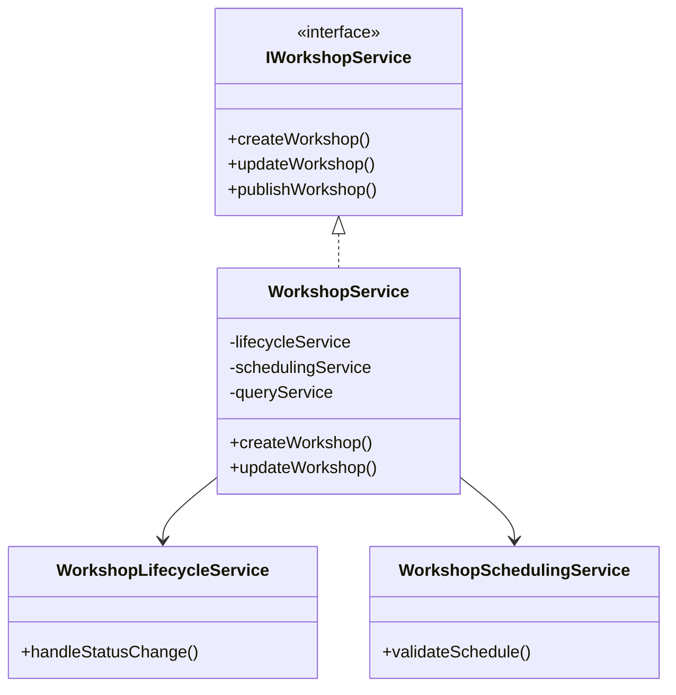
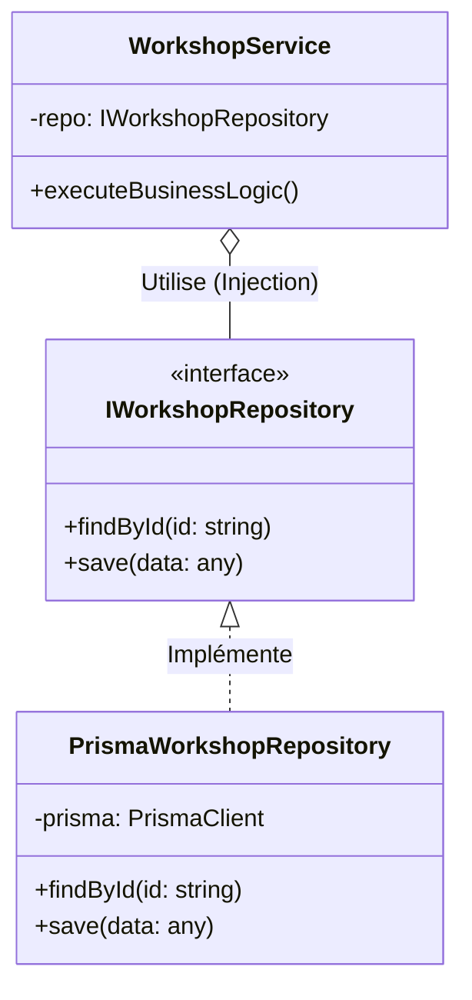
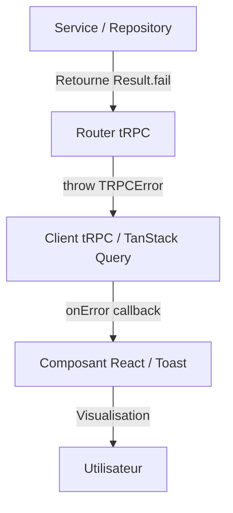
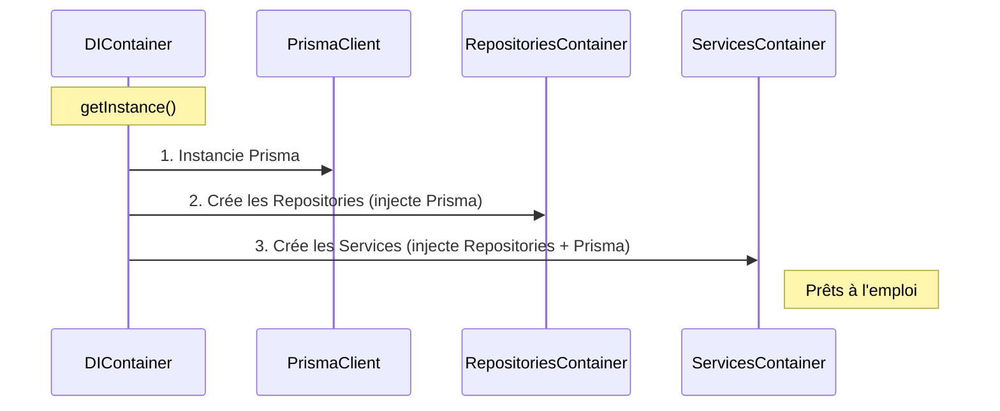
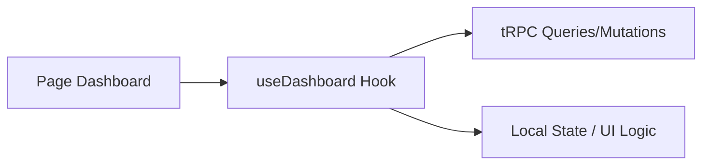
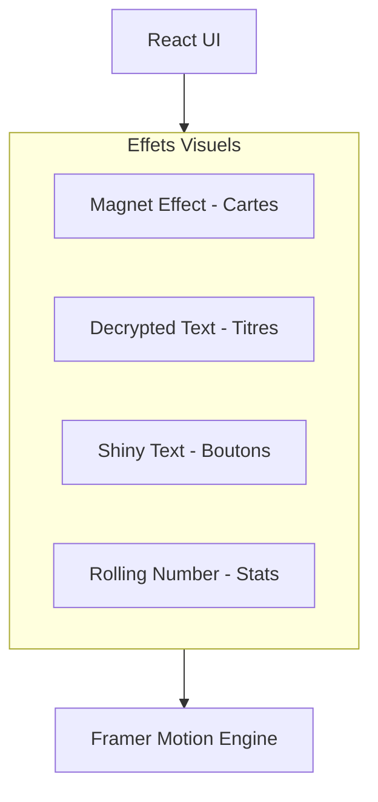
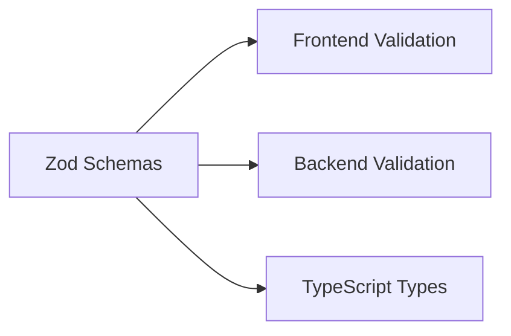

# Design Patterns & Principes de Conception

Ce document répertorie les patterns d'architecture et de conception utilisés dans le projet LearnSup pour assurer sa robustesse, sa testabilité et sa maintenabilité.

---

## Principes SOLID

**Pourquoi SOLID ?** Ces principes structurent le code pour limiter le couplage et faciliter l'évolution. Un domaine métier riche (ateliers, messagerie, crédits, communauté) multiplie les cas particuliers ; sans découpage clair, les services deviennent monolithiques et difficiles à tester ou modifier. SOLID permet d'ajouter des fonctionnalités (ex. nouveau type de notification) sans toucher au code existant, de remplacer une implémentation (ex. Prisma par un autre ORM) via les interfaces, et de tester chaque brique isolément avec des mocks. Le coût initial (interfaces, DI, sous-services) est compensé par une maintenance plus simple et des régressions moins fréquentes.

| Principe | Application dans LearnSup                                                                 |
| -------- | ------------------------------------------------------------------------------------------ |
| **S** — Single Responsibility | `WorkshopService` délègue à des sous-services (lifecycle, scheduling, query). `WorkshopCard` délègue le rendu à `WorkshopDetails` et les actions à `WorkshopDropdownMenu`. Chaque service/repository a une responsabilité unique. |
| **O** — Open/Closed | Repositories exposés via interfaces : on peut ajouter de nouvelles implémentations (ex. cache, mock) sans modifier le code existant. Procédures tRPC extensibles par composition de routers. |
| **L** — Liskov Substitution | Les implémentations Prisma (`PrismaWorkshopRepository`, etc.) sont interchangeables avec leurs interfaces (`IWorkshopRepository`). Les tests utilisent des mocks conformes aux mêmes contrats. |
| **I** — Interface Segregation | Interfaces ciblées par domaine : `IWorkshopRepository`, `IMessageRepository`, `IWorkshopRequestService`, etc. Pas d'interface « god » regroupant tout. |
| **D** — Dependency Inversion | Services dépendent d'interfaces, pas d'implémentations. Le conteneur DI (`container.ts`) injecte les dépendances. Les routers appellent `container.workshopService` sans connaître l'implémentation. |

---

## 🏗️ Architecture Globale

### Monorepo (Turbo/pnpm)
Gestion unifiée du `front` et du `back` permettant le partage de types TypeScript et de schémas de validation (Zod) entre le client et le serveur.

### Layered Architecture (Architecture en couches)
Séparation stricte des responsabilités :



---

## ⚙️ Patterns Backend

### Facade Pattern (Façade)
Le `WorkshopService` sert de façade unique. Il expose une interface simple au routeur tRPC tout en déléguant la complexité interne à des sous-services spécialisés, respectant ainsi le **SRP (Single Responsibility Principle)**.



### Dependency Injection (DI) & Container
Utilisation d'un conteneur de dépendances (`di/container.ts`) pour l'inversion de contrôle. Les services et repositories sont injectés via leurs interfaces.

### Repository Pattern
Abstraction de la couche de données derrière des interfaces (ex: `IWorkshopRepository`). Cela découple la logique métier de l'implémentation spécifique de la base de données (Prisma/PostgreSQL).



### Result Pattern
Gestion des erreurs de manière fonctionnelle via un objet de retour standardisé (ex: `{ success: true, data: ... }` ou `{ success: false, error: ... }`), traité par le helper `unwrapResult`.

---

## ❌ Gestion des erreurs

### Flux de propagation
Ce diagramme montre comment une erreur est transportée du backend jusqu'à l'utilisateur.



### tRPC Errors
Pour les erreurs interrompant le flux (auth, permissions, validation), nous utilisons `TRPCError` avec les codes standard :

- `UNAUTHORIZED` : Session absente ou invalide.
- `FORBIDDEN` : Rôle insuffisant (ex: non-admin accédant à `/admin`).
- `NOT_FOUND` : Ressource inexistante.
- `BAD_REQUEST` : Validation échouée ou logique métier invalide.
- `INTERNAL_SERVER_ERROR` : Erreur imprévue (Prisma, crash service).

```tsx
// Exemple dans un router
if (!workshop) {
  throw new TRPCError({
    code: "NOT_FOUND",
    message: "L'atelier demandé n'existe pas.",
  });
}
```

---

## ✅ Validation (Zod)

### Localisation des schémas
- **@ls-app/shared** : Tous les schémas partagés entre front et back (onboarding, profil, ateliers, validation de mot de passe). C'est la source de vérité.
- **Local au Router** : Uniquement pour les schémas très spécifiques à une procédure backend qui n'ont aucune utilité côté front.

### Pattern de validation
Nous utilisons `z.object()` pour les entrées de procédures (`input()`) et l'inférence de types pour garantir la cohérence :
`export type UpdateProfileInput = z.infer<typeof updateProfileSchema>;`

---

## 🏗️ Injection de Dépendances (DI)

Le projet utilise un **Singleton Container** (`back/src/lib/di/container.ts`) pour gérer le cycle de vie des services et repositories.

### Séquence d'instanciation
L'ordre est critique pour que les dépendances soient disponibles au bon moment.



### Fonctionnement
1. **Instanciation** : Le `DIContainer` instancie Prisma, puis les Repositories, puis les Services (qui reçoivent les repositories en paramètres).
2. **Accès** : Partout dans le backend (principalement dans les routers), on accède aux services via l'export `container`.

```tsx
// Utilisation dans un router
import { container } from "@/lib/di/container";

export const workshopRouter = router({
  create: protectedProcedure
    .input(createWorkshopSchema)
    .mutation(async ({ input, ctx }) => {
      return await container.workshopService.createWorkshop(input, ctx.session.user.id);
    }),
});
```

### Avantages
- **Testabilité** : On peut facilement remplacer un service par un mock dans les tests.
- **Découplage** : Le router ne sait pas *comment* le service est construit, il l'utilise simplement.
- **Cohérence** : Une seule instance de Prisma et des services est partagée dans toute l'application.

---

## 🎨 Patterns Frontend

### Custom Hooks Pattern
Extraction de la logique d'état et des effets dans des hooks spécialisés (ex: `useDashboard`).



### Component Composition
Construction d'interfaces complexes par assemblage de composants atomiques issus de `src/components/ui`.

### Adapter Pattern
Transformation des données brutes du serveur en formats adaptés à la consommation par l'interface utilisateur.

### Provider Pattern
Utilisation de contextes React pour diffuser des configurations transversales (Auth, Thème, tRPC) sans "prop drilling".

### Safe-Hydration Pattern (Hydratation Sécurisée)
Utilisation d'un état `mounted` pour éviter les erreurs d'hydratation Next.js sur les composants dépendant de données client-side (session, pathname, localStorage). Le composant affiche un squelette ou un état neutre sur le serveur et ne bascule vers le rendu dynamique qu'après le montage côté client.

```tsx
export default function SafeComponent() {
  const [mounted, setMounted] = useState(false);
  useEffect(() => setMounted(true), []);
  if (!mounted) return <Skeleton />;
  return <RealContent />;
}
```

### Polished Loader Pattern (Animations)
Utilisation de **Framer Motion** pour des états de chargement immersifs. Le composant `Loader` centralise :
- **Anneaux de pulsation** : Effets visuels concentriques aux couleurs de la marque.
- **Messages contextuels** : Texte dynamique ("Récupération de vos ateliers...") avec effet de brillance.
- **Cohérence globale** : Appliqué sur toutes les transitions de pages et vérifications de sessions.

### Micro-interactions & Animations (React Bits)
L'interface utilise des patterns d'animation avancés basés sur **Framer Motion** pour améliorer l'engagement utilisateur :

---

## 📈 Observabilité & Monitoring

### Full-stack Observability (Sentry)
Surveillance unifiée du frontend et du backend pour une résolution rapide des bugs :

- **Error Tracking** : Capture automatique des exceptions (JS, React errors, tRPC, Prisma).
- **Performance Tracing** : Analyse de la latence (Next.js server side, API routes, DB queries).
- **Session Replay** : Reproduction vidéo des sessions utilisateur lors d'une erreur.
- **Tunneling Pattern** : Routage des requêtes Sentry via `/api/sentry` pour éviter les bloqueurs de publicité et garantir 100% de visibilité.

---

## 🔄 Communication & Validation



- **Magnet Effect** : Utilisé sur les cartes interactives pour simuler une attraction physique au survol.
- **Decrypted Text** : Effet visuel de "décryptage" pour l'apparition des titres importants.
- **Shiny Text** : Effet de brillance dynamique sur les boutons d'appel à l'action (CTA).
- **Rolling Number** : Animation fluide des compteurs numériques (ex: solde de crédits).

---

## 🔄 Communication & Validation

### RPC (Remote Procedure Call) via tRPC
Communication type-safe de bout en bout entre le front et le back.

### Schema-first Validation (Zod)
Définition de schémas de validation uniques partagés, servant à la fois de validateurs à l'exécution et de définitions de types statiques.


