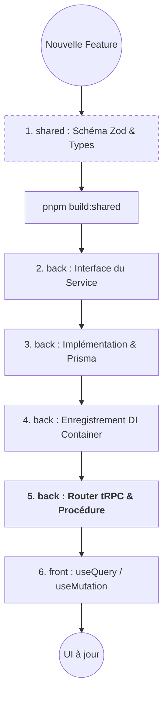

# Recettes de développement (How-To)

Ce guide propose des étapes concrètes pour les tâches courantes de développement sur LearnSup.

---

## 🗺️ Synthèse : Flux de développement

Voici le parcours standard pour ajouter une fonctionnalité métier (ex: CRUD, Action, Logic).



---

## 🚀 Ajouter une nouvelle fonctionnalité (A à Z)

Pour ajouter une nouvelle fonctionnalité (ex: "Mes favoris"), suivez ces étapes dans l'ordre pour garantir la cohérence tRPC et la sécurité.

### 1. Définir le Schéma (Shared)
Modifiez `shared/src/validation/user.schemas.ts` (ou créez-en un nouveau) pour définir l'entrée (input) de votre API.
```tsx
export const toggleFavoriteSchema = z.object({
  workshopId: z.string(),
});
export type ToggleFavoriteInput = z.infer<typeof toggleFavoriteSchema>;
```
N'oubliez pas de lancer `pnpm --filter @ls-app/shared build`.

### 2. Définir l'Interface du Service (Backend)
Dans `back/src/lib/users/services/`, créez une interface pour votre nouvelle logique métier.
```tsx
export interface IFavoriteService {
  toggleFavorite(userId: string, input: ToggleFavoriteInput): Promise<void>;
}
```

### 3. Implémenter le Service
Créez l'implémentation concrète (ex: `FavoriteService.ts`) en utilisant Prisma.
```tsx
export class FavoriteService implements IFavoriteService {
  constructor(private readonly prisma: PrismaClient) {}
  // ... implémentation
}
```

### 4. Enregistrer dans le Conteneur DI
Ajoutez votre service dans `back/src/lib/di/services.container.ts` et exposez-le dans `container.ts`.

### 5. Créer/Mettre à jour le Router tRPC
Utilisez votre service dans un router existant ou nouveau.
```tsx
export const userRouter = router({
  toggleFavorite: protectedProcedure
    .input(toggleFavoriteSchema)
    .mutation(async ({ input, ctx }) => {
      return await container.favoriteService.toggleFavorite(ctx.session.user.id, input);
    }),
});
```

### 6. Consommer dans le Frontend
Dans votre composant React :
```tsx
const toggleFavorite = trpc.user.toggleFavorite.useMutation({
  onSuccess: () => {
    // Invalider le cache ou afficher un toast
    toast.success("Favori mis à jour !");
  }
});
```

---

## 🗃️ Ajouter une Migration Prisma

1. Modifiez `back/.prisma/schema/schema.prisma`.
2. Générez la migration SQL :
   ```bash
   pnpm db:migrate --name add-favorites-table
   ```
3. Testez localement avec `pnpm db:push`.
4. La migration sera appliquée automatiquement en prod lors du prochain déploiement.

---

## 📧 Créer un nouveau template d'Email

1. Créez un composant React dans `back/src/lib/email/templates/`.
2. Utilisez les composants de `@react-email/components`.
3. Ajoutez une méthode dans `EmailService` pour envoyer cet email via Resend.
4. Utilisez le service dans votre logique métier (via DI).

---

## 🖼️ Ajouter un composant UI (shadcn)

1. Utilisez la commande shadcn (si disponible) ou copiez le composant dans `front/src/components/ui/`.
2. Personnalisez le style avec Tailwind CSS.
3. Exportez-le pour l'utiliser dans vos pages.
