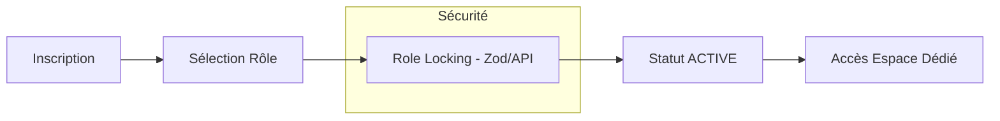

# Sécurité & Protection des Données

Ce document détaille les mesures de sécurité, le contrôle d'accès et la conformité RGPD mis en œuvre dans LearnSup.

---

## 🔐 Contrôle d'Accès (RBAC)

Le système utilise **tRPC** pour gérer les autorisations de manière granulaire via des middlewares.

### Hiérarchie des Procédures
- **`publicProcedure`** : Accès libre (ex: consultation du catalogue des mentors).
- **`protectedProcedure`** : Requiert une session active via Better Auth.
- **`mentorProcedure`** : Requiert une session active + rôle `MENTOR` + statut `ACTIVE`.
- **`adminProcedure`** : Requiert une session active + rôle `ADMIN` + statut `ACTIVE`.

### Audit Logging (Admin)
Toutes les actions de modification effectuées via une `adminProcedure` sont automatiquement enregistrées dans une table d'audit. Le middleware `adminLogger` capture :
- L'ID de l'administrateur.
- L'action effectuée (basée sur le chemin tRPC).
- Les données d'entrée (input) de la requête.

---

## 🛡️ Protection contre les Abus

### Onboarding & Découverte
Le parcours d'onboarding est isolé de l'espace de travail principal pour maximiser la sécurité et la clarté :

- **Activation Instantanée** : Les utilisateurs (Mentors et Apprenants) reçoivent le statut `ACTIVE` immédiatement après la sélection de leur rôle pour réduire la friction.
- **Role Locking** : Une fois le rôle choisi et validé, il ne peut plus être modifié via l'API d'onboarding, prévenant les tentatives de changement de privilèges non autorisés.
- **Adaptabilité UI** : Les Dashboards utilisent des données synchronisées avec la base de données (et non uniquement la session) pour afficher les actions et alertes pertinentes selon le statut réel de l'utilisateur.

### Sécurité de l'Authentification
- **Vérification d'Email** : Obligatoire pour activer le compte.
- **Verrouillage de compte** : Better Auth gère automatiquement l'échec des tentatives de connexion (failedLoginAttempts, lockoutTime).
- **Trusted Origins** : Les requêtes sont limitées aux origines définies dans `CORS_ORIGIN`.

---

## ⚖️ Conformité RGPD

### Gestion des Données Sensibles
- **Anonymisation** : Lors de la suppression d'un compte, les données personnelles (PII) sont remplacées par des valeurs anonymes au lieu d'être simplement supprimées, afin de préserver l'intégrité des statistiques et des historiques de transactions.
- **Délai de Rétention** : Un délai de 30 jours est appliqué avant la purge définitive via un `deletion_job`.

### Droit à l'Effacement
Le flux de suppression est le suivant :
1. L'utilisateur demande la suppression (DELETE `/api/profile/delete`).
2. Le compte est "Soft Deleted" (accès bloqué immédiatement).
3. Un job de suppression planifié est créé.
4. Après 30 jours, un script cron (`purge-deletions`) anonymise les données :
   - `name`, `email`, `displayName`, `bio` sont réinitialisés.
   - Les fichiers uploadés (photos) sont supprimés.

### Transparence
Toutes les données collectées sont visibles par l'utilisateur via son profil et ses paramètres. L'utilisateur peut demander un export de ses données (implémenté via les services de profil).

---

## 🛠️ Sécurité du Code & Infrastructure

### Filtrage des Données Sortantes (Anti-Leakage)
Pour prévenir les fuites de données sensibles (mots de passe, tokens, emails internes), le projet applique deux niveaux de filtrage :
- **Au niveau tRPC** : Les procédures utilisent systématiquement la clause `select` de Prisma pour ne renvoyer que les champs strictement nécessaires à l'UI.
- **Au niveau de la Session** : L'objet `ctx.session.user` fourni par Better Auth est pré-filtré par le framework pour ne contenir que les informations publiques de la session (id, name, email, image).

### Sécurité des Uploads
Le point d'entrée `/api/support-request` implémente une politique de sécurité stricte pour la gestion des fichiers :
- **Validation MIME** : Seuls les types `image/*`, `application/pdf`, `text/plain` et les formats Office (`.doc`, `.docx`) sont autorisés via une liste blanche (`Set`).
- **Limites de taille** : Max **10 Mo** par fichier et maximum **5 fichiers** par requête.
- **Assainissement (Sanitization)** : Les noms de fichiers sont générés via `randomUUID()` et les extensions sont nettoyées pour empêcher toute exécution de script ou injection de chemin (`path traversal`).
- **Stockage** : Actuellement stockés localement dans `/uploads/support/` avec un accès contrôlé. *Note : Une migration vers un stockage S3 avec URLs pré-signées est recommandée pour une isolation totale.*

### Configuration CORS
Le serveur (`server.ts`) implémente une gestion dynamique des headers CORS :
- **En Développement** : Accepte l'origine par défaut `http://localhost:3001`.
- **En Production** : Utilise la variable d'environnement `CORS_ORIGIN`. 
*Note de sécurité : Il est crucial de ne jamais utiliser `*` en production pour garantir que seul le frontend officiel peut communiquer avec l'API.*

### Headers de Sécurité (Recommandations)
Le serveur HTTP principal ajoute manuellement les en-têtes essentiels pour la protection des échanges (Credentials, Allowed Methods). Pour une protection renforcée (CSP, HSTS), l'intégration de `Helmet.js` est prévue dans la roadmap de sécurisation.
