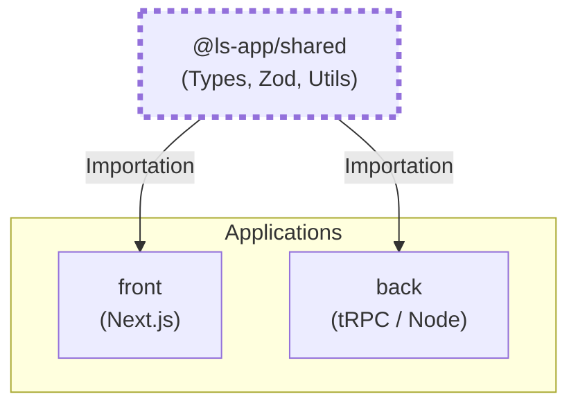

# Package Shared (@ls-app/shared)

Le package `@ls-app/shared` est la **source de vérité** unique du monorepo. Il contient tout ce qui doit être cohérent entre le frontend et le backend : schémas de validation, types TypeScript, constantes métier et utilitaires communs.

---

## 🏗️ Architecture du Monorepo

Le package `shared` agit comme le socle commun sur lequel s'appuient les applications `front` et `back`.



---

## 📂 Structure du dossier

- `src/validation/` : Schémas Zod (workshop, auth, profile, etc.) et constantes de validation.
- `src/types/` : Définitions de types TypeScript (ex: énumérations de statuts).
- `src/utils/` : Fonctions utilitaires partagées (ex: formateurs de dates).
- `src/index.ts` : Point d'entrée exportant tous les éléments publics.

---

## 🛠️ Ajouter une nouvelle ressource

### Flux de propagation des changements
Lorsqu'un changement est effectué dans `shared`, il doit être "compilé" pour être visible par les autres packages du monorepo.

```mermaid
flowchart LR
    Source[Modif Code\nshared/src/...] --> Build[pnpm build\n(tsc)]
    Build --> Dist[shared/dist/...]
    Dist --> Consumption[Utilisation dans\nfront/ ou back/]
    
    subgraph Turbo["Turborepo Cache"]
        Build
    end
```

Pour ajouter un nouveau schéma ou type, suivez cette procédure :

1.  **Création du fichier** : Créez un nouveau fichier dans le dossier approprié (ex: `src/validation/my-feature.schemas.ts`).
2.  **Exportation locale** : Exportez vos schémas et types.
3.  **Exportation globale** : Ajoutez un export dans `src/index.ts`.
4.  **Propagation (Build)** : Comme c'est un package local, vous devez le re-builder pour que le front et le back voient les changements.

### Commande de build
À la racine du monorepo :
```bash
pnpm --filter @ls-app/shared build
```
Ou en mode "watch" pendant le développement :
```bash
pnpm --filter @ls-app/shared dev
```

---

## 💡 Bonnes Pratiques

- **Pas de dépendances Node** : Le package `shared` est utilisé dans le navigateur (front). Ne jamais y importer de modules Node.js (`fs`, `path`, `crypto`).
- **Validation-First** : Préférez définir un schéma Zod et inférer le type (`z.infer<typeof schema>`) plutôt que de définir une interface manuelle.
- **Constantes Centralisées** : Les limites (ex: taille max d'un fichier, longueur d'une bio) doivent être définies ici pour être affichées sur les formulaires front et vérifiées sur l'API back.
